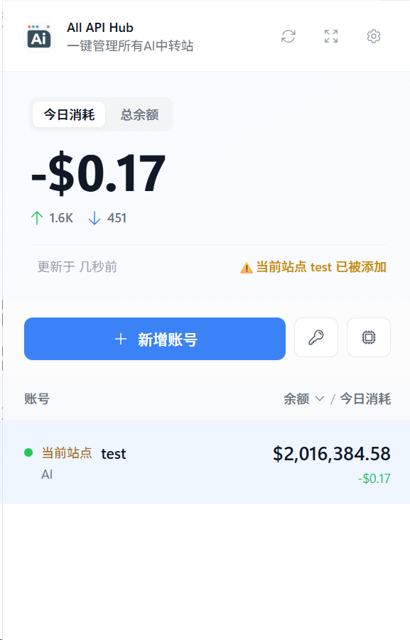
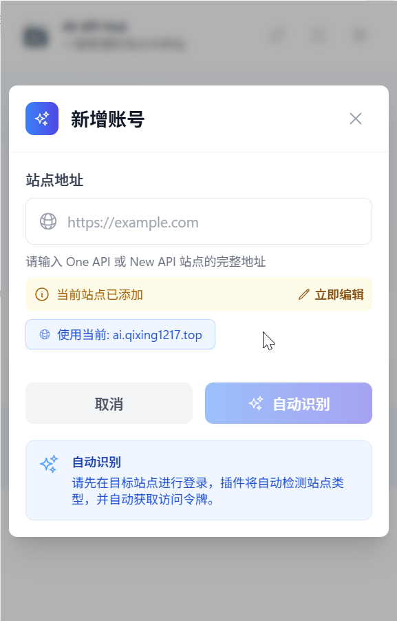
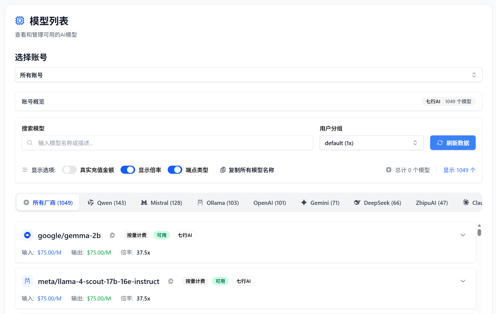
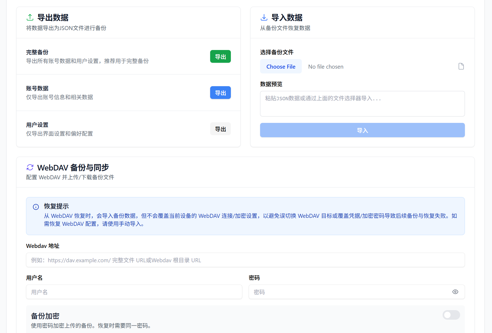
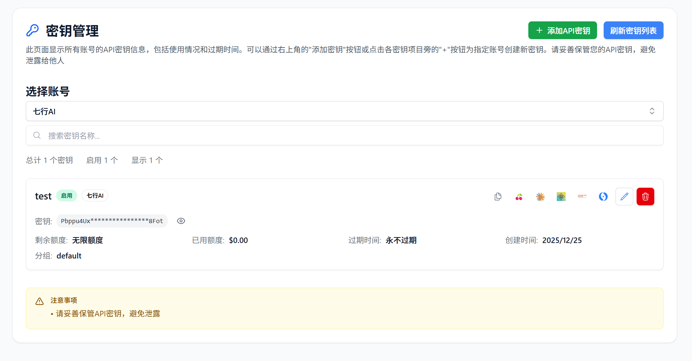

<h4 align="center">
简体中文 | <a href="./README_EN.md">English</a>
</h4>

<hr/>

<div align="center">
  

# 中转站管理器 - All API Hub

**一个开源的浏览器插件，聚合管理所有中转站账号的余额、模型和密钥，告别繁琐登录。**

<p align="center">
<a href="https://github.com/qixing-jk/all-api-hub/releases">
  
</a>
<a href="https://addons.mozilla.org/firefox/addon/{bc73541a-133d-4b50-b261-36ea20df0d24}">
  
</a>
<a href="https://chromewebstore.google.com/detail/lapnciffpekdengooeolaienkeoilfeo">
  
</a>
<a href="https://microsoftedge.microsoft.com/addons/detail/pcokpjaffghgipcgjhapgdpeddlhblaa">
  
</a>
</p>

**[文档教程](https://qixing-jk.github.io/all-api-hub/) | [常见问题](https://qixing-jk.github.io/all-api-hub/faq.html)**

</div>

---

> [!NOTE]  
> 本项目为开源项目，在[One API Hub](https://github.com/fxaxg/one-api-hub)的基础上进行二次开发

## 📖 介绍

目前市面上有太多 AI-API 中转站点，每次查看余额和支持模型列表等信息都非常麻烦，需要逐个登录查看。

本插件可以便捷的对基于以下项目的AI 中转站账号进行整合管理：

- [one-api](https://github.com/songquanpeng/one-api)
- [new-api](https://github.com/QuantumNous/new-api)
- [Veloera](https://github.com/Veloera/Veloera)
- [one-hub](https://github.com/MartialBE/one-hub)
- [done-hub](https://github.com/deanxv/done-hub)
- [VoAPI](https://github.com/VoAPI/VoAPI)
- [Super-API](https://github.com/SuperAI-Api/Super-API)

## 🧬 功能变化

- 🌐 **更多站点支持** - 新增对 VoAPI、Super-API 等站点的支持
- 🚀 **快速导出站点** - 支持一键将站点API配置导出到 [CherryStudio](https://github.com/CherryHQ/cherry-studio) 和 [New API](https://github.com/QuantumNous/new-api)，简化API使用流程
- ✅ **站点签到状态检测** - 支持检测站点是否支持签到和签到状态
- 🔄 **站点重复检测** - 防止重复添加相同站点，并快速修改当前已添加的站点
- ️🏷️ **智能获取站点名称** - 多方式获取真实站点名称，域名方式作为最后的手段
- ☁️ **WebDav 数据备份** - 支持通过 WebDav 备份和恢复所有账号与设置，保障数据安全，可跨设备同步
- 📝 **手动添加** - 支持手动添加任意中转站点，防止只能自动识失败无法添加
- 🌓 **深色模式** - 支持根据系统主题自动切换
- ⚙️ **火狐支持** - 现在可以在 Firefox 浏览器中使用该插件
- 📱 **移动端支持** - 通过 Kiwi或手机版Firefox 浏览器在 移动端设备上使用，完整功能体验

> [!NOTE]
> 与[One API Hub](https://github.com/fxaxg/one-api-hub)的数据兼容，可以直接导入使用

## ✨ 功能特性

- 🔍 **自动识别中转站点** - 自动创建系统访问 token 并添加到插件的站点列表中
- 💰 **自动识别中转站充值比例** - 智能解析站点配置信息
- 👥 **多账号管理** - 每个站点可添加多个账号，支持账号分组与切换
- 📊 **余额与日志查看** - 账号的余额、使用日志一目了然
- 🔑 **令牌(key)管理** - 便捷的密钥查看与管理
- 🤖 **模型信息查看** - 站点支持模型信息和渠道查看
- ⚙️ **数据导入导出** - 支持 JSON 格式的数据备份与恢复
- 🔒 **完全离线** - 插件无需联网，保护隐私安全

## 🖥️ 截图展示


<div style="display: flex; justify-content: center; gap: 20px; box-sizing: border-box; flex-wrap: wrap;">
  <figure>
    
    
    <figcaption style="text-align:center;">站点重复检测</figcaption>
  </figure>
</div>
  <figure>
    
    <figcaption style="text-align:center;">模型列表</figcaption>
  </figure>
  <figure>
    
    <figcaption style="text-align:center;">数据导入导出</figcaption>
  </figure>
  <figure>
    
    <figcaption style="text-align:center;">密钥列表</figcaption>
  </figure>
  <figure>
    
    <figcaption style="text-align:center;">账户管理</figcaption>
  </figure>

## 🚀 安装使用

### Chrome 应用商店（推荐）
[🔗 前往下载](https://chromewebstore.google.com/detail/lapnciffpekdengooeolaienkeoilfeo)

### Edge 应用商店（推荐）
[🔗 前往下载](https://microsoftedge.microsoft.com/addons/detail/pcokpjaffghgipcgjhapgdpeddlhblaa)

### FireFox 应用商店（推荐）
[🔗 前往下载](https://addons.mozilla.org/firefox/addon/%E4%B8%AD%E8%BD%AC%E7%AB%99%E7%AE%A1%E7%90%86%E5%99%A8-all-api-hub/)

### 手动安装

1. 下载最新版本的扩展包
2. 打开 Chrome 浏览器，进入 `chrome://extensions/`
3. 开启 "开发者模式"
4. 点击 "加载已解压的扩展程序"
5. 选择解压后的扩展文件夹

## 🛠️ 开发指南

### 环境要求

- Node.js 20+
- pnpm

### 本地开发

```bash
# 克隆项目
git clone https://github.com/username/all-api-hub.git
cd all-api-hub

# 安装依赖
pnpm install

# 启动开发服务器
pnpm dev
```

然后在浏览器中加载 `.output/chrome-mv3-dev` 目录作为扩展程序。

### 测试

Vitest 已集成用于单元测试与组件测试，默认在 jsdom 环境中运行。

```bash
# 运行全部测试
pnpm test

# 在 watch 模式下运行测试
pnpm test:watch

# 在 CI 中运行并生成覆盖率
pnpm test:ci
```

GitHub Actions 会在每次 Pull Request 上自动运行 `pnpm test:ci` 并上传覆盖率报告。

### Git Hooks

项目使用 [Husky](https://typicode.github.io/husky) 管理 Git Hooks，自动执行基础工作流。

- **pre-commit**：运行 `pnpm format:check` 和 `pnpm lint`
  - 如果存在格式或 lint 问题，会尝试自动修复，并阻止提交，提示开发者手动确认与暂存变更
- **pre-push**：在推送前执行 `pnpm test:ci` 和 `pnpm compile`，确保测试与类型检查通过

> 初次克隆仓库后执行 `pnpm install` 会自动触发 Husky 的安装（通过 `prepare` 脚本）。

常用命令：

```bash
# 手动检查格式
pnpm format:check

# 自动格式化
pnpm format

# 运行 eslint
pnpm lint
pnpm lint:fix

# 运行测试与类型检查
pnpm test:ci
pnpm compile
```

### 构建生产版本

```bash
pnpm build
```

这将在 `.output` 目录中创建生产版本的扩展包。


## 🏗️ 技术栈

- **框架**: [WXT](https://wxt.dev)
- **UI 库**: [React](https://reactjs.org)
- **样式**: [Tailwind CSS](https://tailwindcss.com)
- **组件**: [Headless UI](https://headlessui.com)
- **图标**: [Heroicons](https://heroicons.com)
- **状态管理**: React Context API
- **类型检查**: [TypeScript](https://typescriptlang.org)

## 📄 许可证

本项目采用 MIT 许可证 - 查看 [LICENSE](LICENSE) 文件了解详情。

## 🙏 致谢

- [WXT](https://wxt.dev) - 现代化的浏览器扩展开发框架

---

<div align="center">
  <strong>⭐ 如果这个项目对你有帮助，请考虑给它一个星标！</strong>
</div>