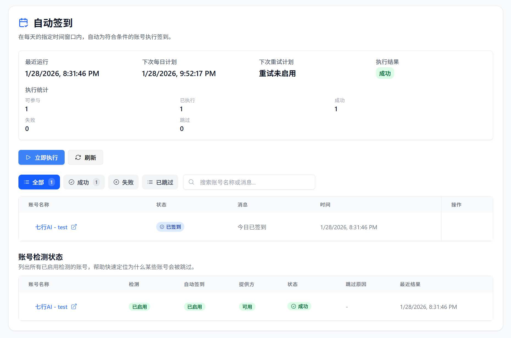
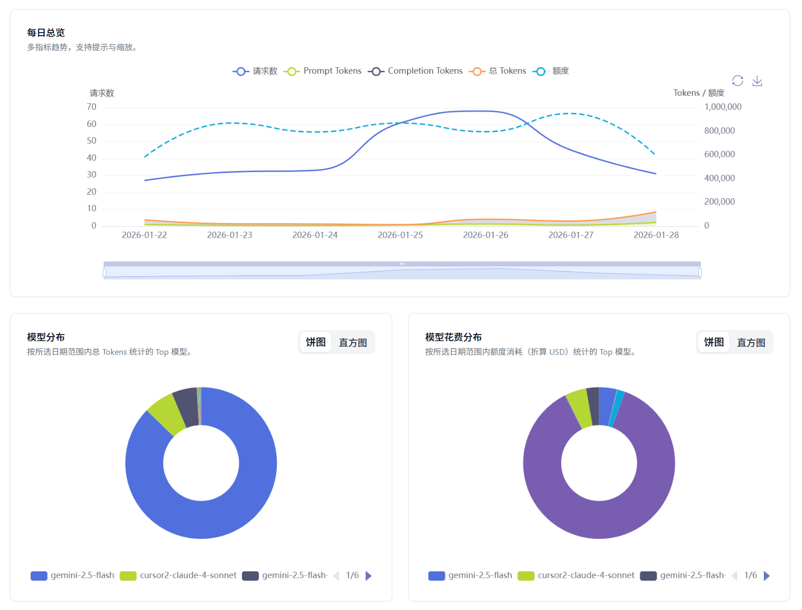
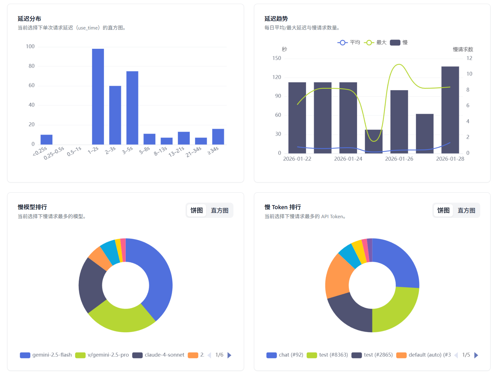

<h4 align="center">
简体中文 | <a href="./README_EN.md">English</a>
</h4>

  

# All API Hub – AI 中转站 & New API 管理器

**开源浏览器扩展，统一管理第三方 AI 聚合中转站与自建 New API：自动识别账号、查看余额、同步模型、管理密钥，并支持跨平台与云端备份。**

**[文档教程](https://all-api-hub.qixing1217.top/) | [常见问题](https://all-api-hub.qixing1217.top/faq.html)**

## 📖 介绍

现在 AI 生态里有越来越多基于 New API 系列的聚合中转站和自建面板，要同时管理各站点的余额、模型列表和 API 密钥，往往既分散又费时。

All API Hub 作为浏览器扩展，可以自动识别这些站点的账号，并一键查看余额、管理模型、密钥与自动签到，并为自建 New API 提供模型同步和渠道管理等工具。当前已支持基于以下项目的中转站账号：

- [one-api](https://github.com/songquanpeng/one-api)
- [new-api](https://github.com/QuantumNous/new-api)
- [Veloera](https://github.com/Veloera/Veloera)
- [one-hub](https://github.com/MartialBE/one-hub)
- [done-hub](https://github.com/deanxv/done-hub)
- [Sub2API](https://github.com/Wei-Shaw/sub2api)（基本功能支持）
- Neo-API（闭源）
- Super-API（闭源）
- RIX_API（闭源，基本功能支持）
- VoAPI（闭源，老版本支持）

## ✨ 功能特性

- 🔍 **智能站点识别**  
  登录后粘贴站点地址即可添加账号，自动识别站点名称、充值比例等信息；识别失败可手动补录，并会提示重复添加。

- 👥 **多账号总览面板**  
  把多个站点与账号集中在一个面板里，余额、用量与健康状态一眼看清，并支持自动刷新数据。

- 📆 **自动签到**  
  识别支持签到的站点并集中处理，支持自动签到与执行记录，避免忘记签到浪费额度。

- 🔑 **令牌与密钥管理**  
  集中查看、复制和批量管理 API Key，减少来回切站点后台。

- 🤖 **模型信息与价格**  
  查看站点模型列表与价格信息，方便查看和对比可用模型与成本差异。

- 🧪 **模型与接口验证**  
  对指定密钥与模型做可用性验证，并提供 CLI 兼容性检查，适合排查“看起来能用但在工具中使用失败”的情况。

- 📊 **用量分析与可视化**  
  面向多站点/多账号的用量报表：按站点、账号、Token、日期筛选与对比，查看用量、花费、模型分布与趋势，并提供延迟与慢请求视图辅助排查。

- 🚀 **快速导出集成**  
  一键导出到 CherryStudio、CC Switch、CLIProxyAPI、Claude Code Router、New API 和 Veloera 等常用工具，减少复制粘贴与重复配置。

- 🔄 **自建 New API 和 Veloera 管理**  
  面向自建 New API 和 Veloera 的站点管理员，提供一键创建渠道、渠道管理、模型同步与模型重定向等工具，减少频繁进后台操作。

- 🛡️ **Cloudflare 过盾助手**  
  遇到 Cloudflare 挑战时自动弹出临时窗口协助通过，验证成功后继续原有流程。

- ☁️ **数据备份与同步**  
  支持数据的导入导出，以及 WebDAV 备份与自动同步，便于换设备或多浏览器使用。

- 🌐 **全平台支持**  
  兼容 Chrome、Edge、Firefox 与移动端 Kiwi 等浏览器，适配深色模式。

- 🔒 **隐私优先的本地存储**  
  默认离线本地存储，无遥测数据收集；需要同步时才配置 WebDAV 等外部服务。

> [!NOTE]
> 最初基于 [One API Hub](https://github.com/fxaxg/one-api-hub) 开发，现已大幅重构扩展。数据格式保持兼容，支持直接导入

## 🖥️ 截图展示

<table>
  <tr>
    <td align="center">
      
      
账户管理总览

    </td>
    <td align="center">
      
      
模型列表与价格

    </td>
  </tr>
  <tr>
    <td align="center">
      
      
密钥列表与导出

    </td>
    <td align="center">
      
      
账号自动签到

    </td>
  </tr>
  <tr>
    <td align="center">
      
      
账号模型使用情况

    </td>
    <td align="center">
      
      
模型慢查询分析

    </td>
  </tr>
  <tr>
    <td align="center">
      
      
New API 模型同步

    </td>
    <td align="center">
      
      
New API 渠道管理

    </td>
  </tr>
</table>

## 🚀 安装使用

| 渠道 | 下载链接 | 当前版本 |
|------|----------|----------|
| Chrome 商店 | [Chrome 商店](https://chromewebstore.google.com/detail/lapnciffpekdengooeolaienkeoilfeo) |  |
| Edge 商店 | [Edge 商店](https://microsoftedge.microsoft.com/addons/detail/pcokpjaffghgipcgjhapgdpeddlhblaa) |  |
| Firefox 商店 | [Firefox 商店](https://addons.mozilla.org/firefox/addon/{bc73541a-133d-4b50-b261-36ea20df0d24}) |  |
| GitHub Release | [Release 下载](https://github.com/qixing-jk/all-api-hub/releases) |  |

### 手动安装

1. 下载最新版本的扩展包
2. 打开 Chrome 浏览器，进入 `chrome://extensions/`
3. 开启 "开发者模式"
4. 点击 "加载已解压的扩展程序"
5. 选择解压后的扩展文件夹

## 🧑‍🚀 新手快速上手

1. **安装并固定扩展图标**：从 Chrome / Edge / Firefox 商店或 GitHub Release 安装最新版本，在浏览器工具栏中固定 All API Hub，方便随时打开。
2. **先登录各个中转站账号**：像平时一样在浏览器标签页里打开 New API / one-api 等站点并完成登录，扩展会复用这些登录状态。
3. **添加第一个账号**：点击浏览器工具栏中的扩展图标 → 在首页点击“新增账号” → 粘贴站点地址并选择“自动识别”。如遇 Cloudflare 五秒盾，只需在弹出的辅助窗口中等待或完成验证。
4. **在面板中查看账号信息**：回到扩展弹窗或“账号管理”页面，可以按站点查看余额、模型和密钥，配合搜索、分组和排序快速找到需要的账号。
5. **快速导出到常用软件（可选）**：在“密钥管理”页面，为目标站点找到对应密钥，使用“导出”功能，一键推送到 CherryStudio、CC Switch、CLIProxyAPI 或 New API，而不必逐项复制粘贴。
6. **连接自建 New API（可选）**：如果你有自建 New API，前往“基础设置 → New API 集成设置”填写管理员 URL、Token、用户 ID，然后在“模型同步”和“渠道管理（Beta）”页面维护渠道和模型白名单。
7. **备份配置并在多设备间同步（可选）**：在“基础设置 → 数据与备份”的“导入与导出”区域导出 JSON 备份，或在页面下方配置 WebDAV 自动同步，在多台设备之间共享同一份配置。

更多详细步骤和进阶配置，请参阅文档站的[快速上手指南](https://all-api-hub.qixing1217.top/get-started.html)。

## 🛠️ 开发指南

请参阅 [CONTRIBUTING](CONTRIBUTING.md) 以获取更多信息。

## 🏗️ 技术栈

- **框架**: [WXT](https://wxt.dev) 负责多浏览器扩展工具链与构建流程
- **UI 层**: [React](https://react.dev) 构建扩展选项页与弹窗界面
- **语言**: [TypeScript](https://www.typescriptlang.org) 提供端到端的类型安全
- **样式**: [Tailwind CSS](https://tailwindcss.com) 以原子化工具类驱动主题样式
- **组件**: [Headless UI](https://headlessui.com) 提供无样式可访问组件与设计系统基石

## 🙏 致谢

- 感谢 [@AngleNaris](https://github.com/AngleNaris) 设计了项目 Logo 🎨
- [WXT](https://wxt.dev) - 现代化的浏览器扩展开发框架

---

  <strong>⭐ 如果这个项目对你有帮助，请考虑给它一个星标！</strong>

