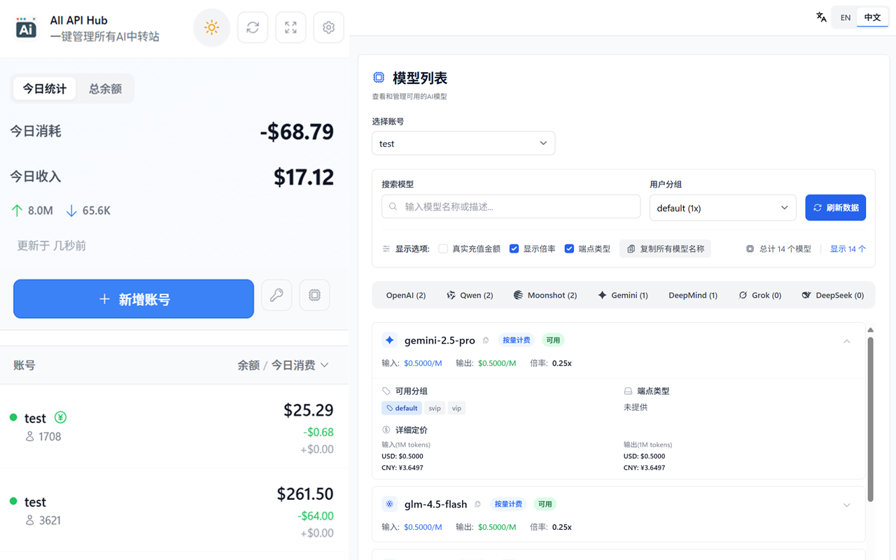

<div align="center">
  
  
  # 中转站管理器 - One API Hub
  
  **一个开源的浏览器插件，聚合管理所有中转站账号的余额、模型和密钥，告别繁琐登录。**
  
  [](https://github.com/fxaxg/one-api-hub)
  [](LICENSE)
  [](https://plasmo.com)
  [](https://reactjs.org)
  [](https://typescriptlang.org)
  [](https://tailwindcss.com)

   **[文档教程](https://fxaxg.github.io/one-api-hub/) | [常见问题](https://fxaxg.github.io/one-api-hub/faq.html)**
  
</div>

---

## 📖 介绍

目前市面上有太多 AI-API 中转站点，每次查看余额和支持模型列表等信息都非常麻烦，需要逐个登录查看。

本插件可以便捷的对基于以下项目的AI 中转站账号进行整合管理：
- [one-api](https://github.com/songquanpeng/one-api)
- [new-api](https://github.com/QuantumNous/new-api) 
- [Veloera](https://github.com/Veloera/Veloera)
- [one-hub](https://github.com/MartialBE/one-hub)
- [done-hub](https://github.com/deanxv/done-hub)
- [VoAPI](https://github.com/VoAPI/VoAPI)
- [Super-API](https://github.com/SuperAI-Api/Super-API)


## ✨ 功能特性

- 🔍 **自动识别中转站点** - 自动创建系统访问 token 并添加到插件的站点列表中
- 💰 **自动识别中转站充值比例** - 智能解析站点配置信息
- 👥 **多账号管理** - 每个站点可添加多个账号
- 📊 **余额与日志查看** - 账号的余额、使用日志一目了然
- 🔑 **令牌(key)管理** - 便捷的密钥查看与管理
- 🤖 **模型信息查看** - 站点支持模型信息和渠道查看
- 🔒 **完全离线** - 插件无需联网，保护隐私安全

## 🖥️ 截图展示



## 🚀 安装使用

### Chrome 应用商店（推荐）
[⬇️ 前往下载](https://chromewebstore.google.com/detail/%E4%B8%AD%E8%BD%AC%E7%AB%99%E7%AE%A1%E7%90%86%E5%99%A8-one-api-hub/eobdoeafpplhhhjfkinnlkljbkijpobd)

<!-- ### 手动安装
1. 下载最新版本的扩展包
2. 打开 Chrome 浏览器，进入 `chrome://extensions/`
3. 开启 "开发者模式"
4. 点击 "加载已解压的扩展程序"
5. 选择解压后的扩展文件夹 -->

## 🛠️ 开发指南

### 环境要求
- Node.js 18+
- npm 或 pnpm

### 本地开发

```bash
# 克隆项目
git clone https://github.com/username/one-api-hub.git
cd one-api-hub

# 安装依赖
pnpm install
# 或者
npm install

# 启动开发服务器
pnpm dev
# 或者
npm run dev
```

然后在浏览器中加载 `build/chrome-mv3-dev` 目录作为扩展程序。

### 构建生产版本

```bash
pnpm build
# 或者 
npm run build
```

这将在 `build` 目录中创建生产版本的扩展包。

## 🔮 未来支持

- 🧪 **模型降智测试** - 自动化模型性能测试
- ☁️ **WebDAV 数据备份** - 云端数据同步与备份


## 👥 贡献者（不分先后）

感谢以下贡献者对项目的支持：

- [@qixing-jk](https://github.com/qixing-jk)
- [@JianKang-Li](https://github.com/JianKang-Li)


## 🏗️ 技术栈

- **框架**: [Plasmo](https://plasmo.com) v0.90.5
- **UI 库**: [React](https://reactjs.org) 18.2.0
- **样式**: [Tailwind CSS](https://tailwindcss.com) v3.4.17
- **组件**: [Headless UI](https://headlessui.com)
- **图标**: [Heroicons](https://heroicons.com)
- **状态管理**: [Zustand](https://zustand-demo.pmnd.rs)
- **类型检查**: [TypeScript](https://typescriptlang.org) 5.3.3


## 📄 许可证

本项目采用 MIT 许可证 - 查看 [LICENSE](LICENSE) 文件了解详情。


## 🙏 致谢
- [Plasmo](https://plasmo.com) - 现代化的浏览器扩展开发框架

---

<div align="center">
  <strong>⭐ 如果这个项目对你有帮助，请考虑给它一个星标！</strong>
</div>