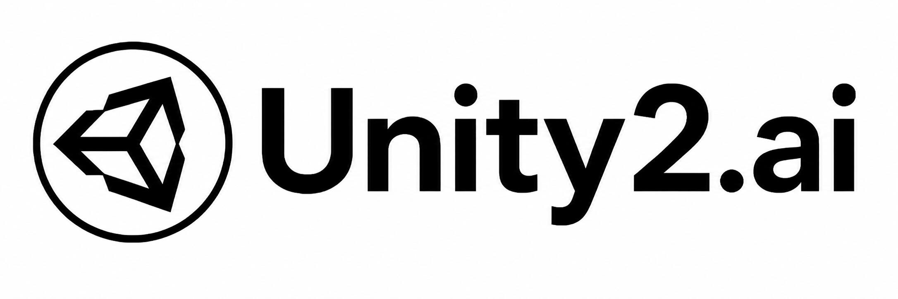
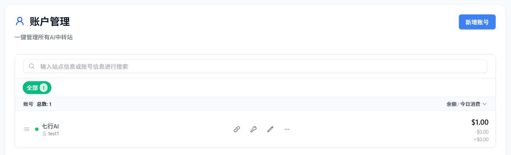
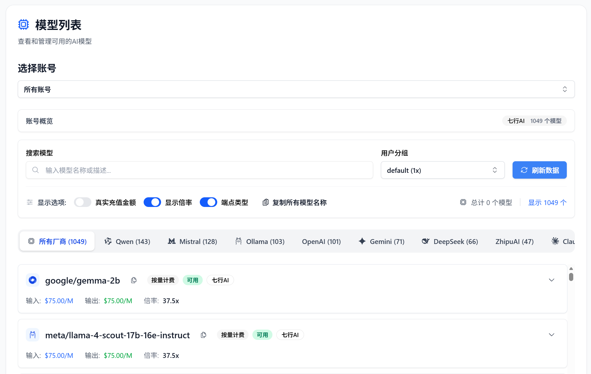
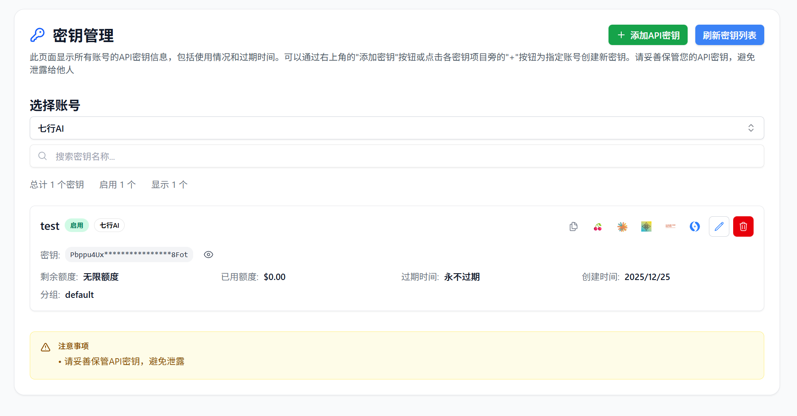
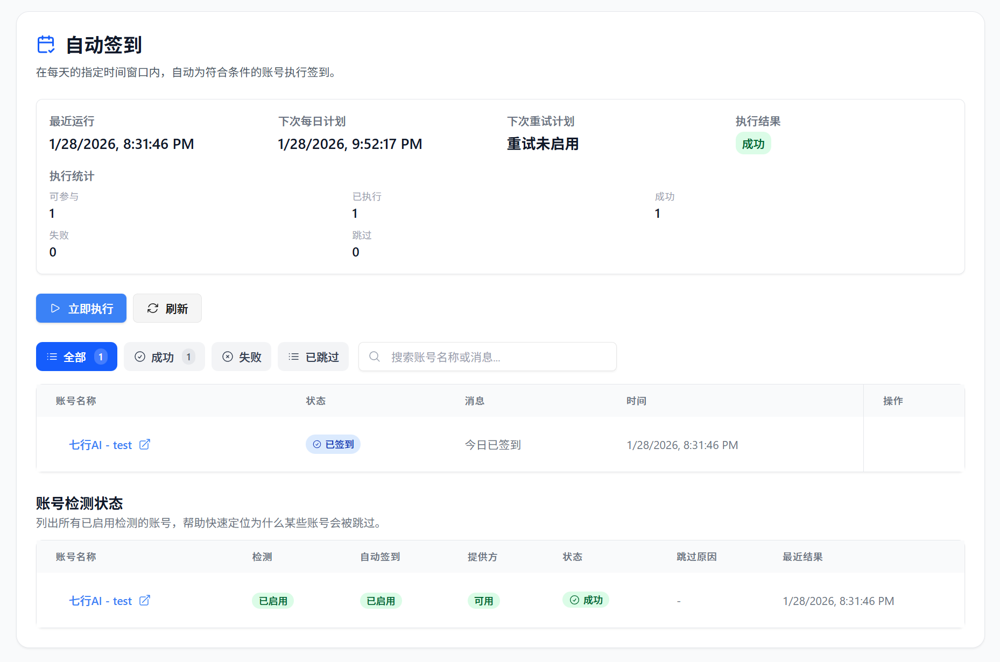
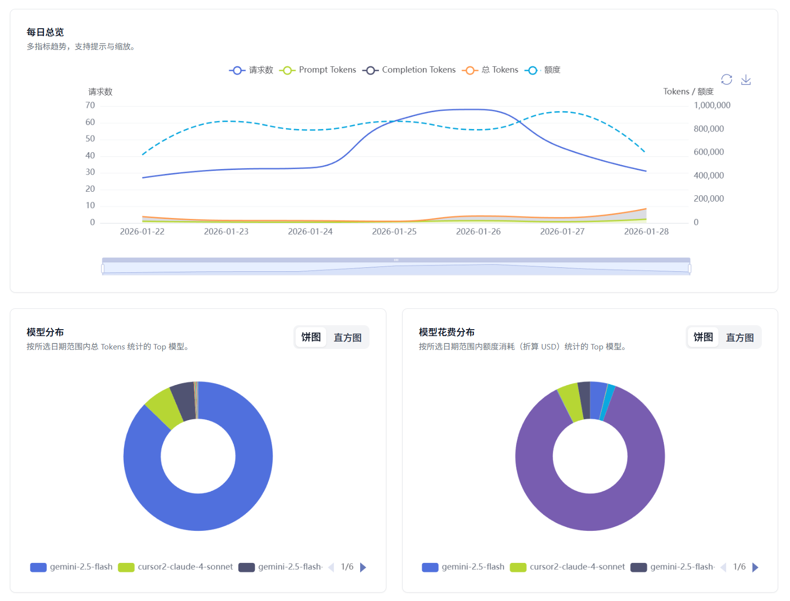
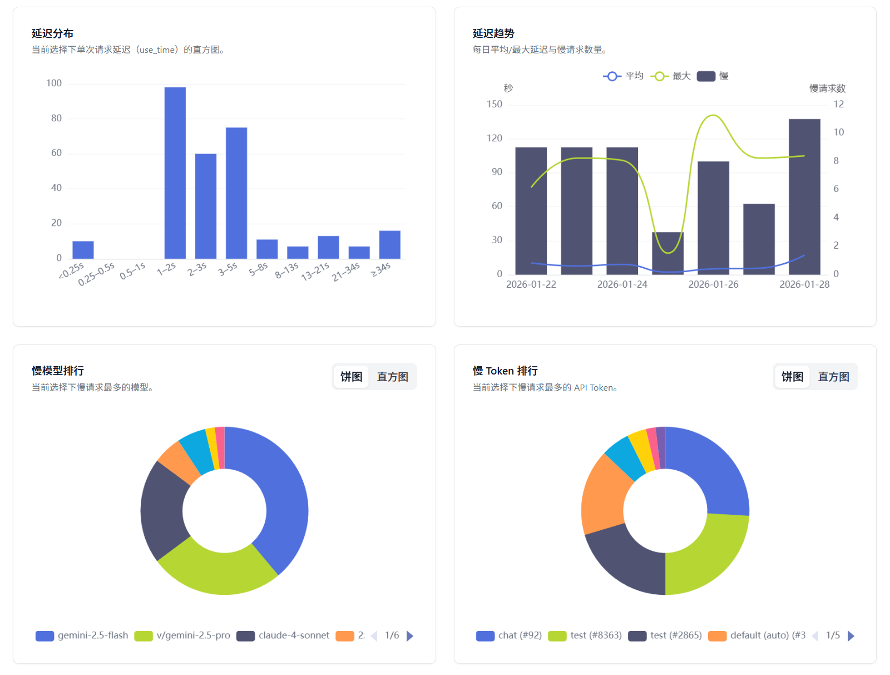
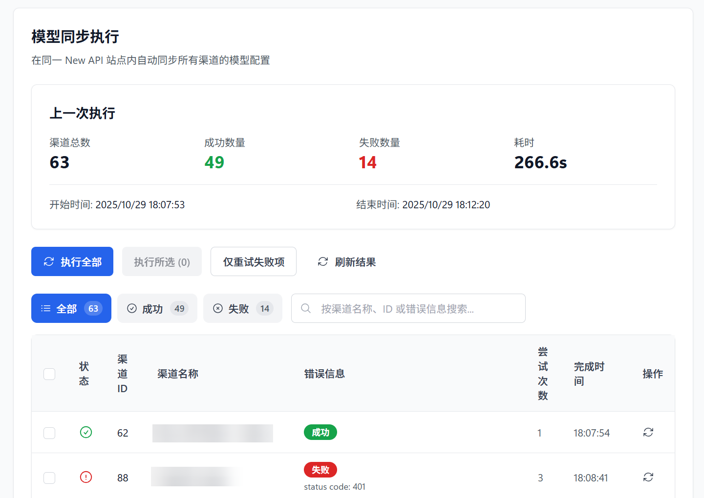
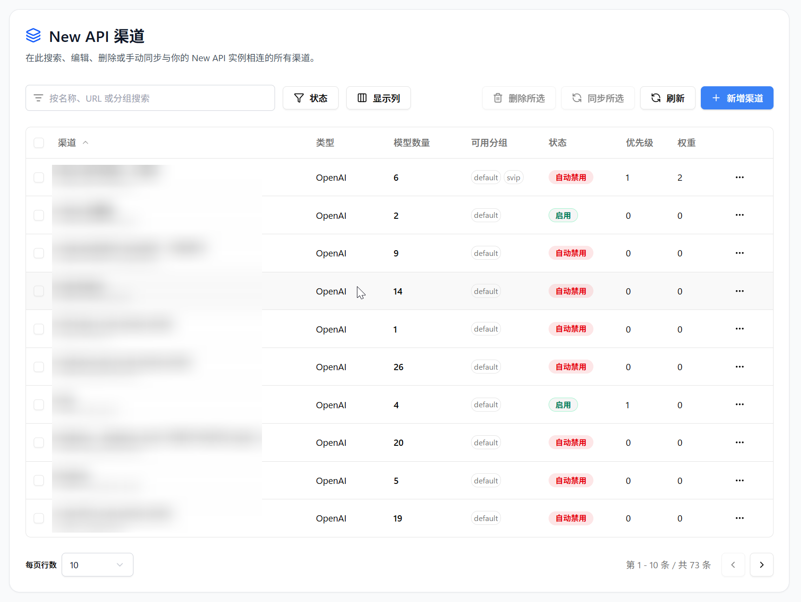

<h4 align="center">
简体中文 | <a href="./README.md">English</a> | <a href="./README_JA.md">日本語</a>
</h4>

# All API Hub – 你的全能 AI 资产管家

**一站式管理 New API 兼容中转站账号：余额/用量、模型价格、自动签到、API 凭据、网页内测试，以及渠道与模型同步/重定向**

**[⚡ 快速上手](https://all-api-hub.qixing1217.top/get-started.html) | [🌐 支持站点](https://all-api-hub.qixing1217.top/supported-sites.html) | [🔌 集成工具](https://all-api-hub.qixing1217.top/supported-export-tools.html) | [📜 更新日志](https://all-api-hub.qixing1217.top/changelog.html)**

  
  
  
  
  

## ❓ 为什么需要 All API Hub？

**简单来说**：AI 中转站就像“AI 充值卡超市”，能低价甚至免费使用 ChatGPT、Claude、GPT Image 等模型。

但如果你有多个账号，管理起来会很头疼：
- 📂 **资产分散**：余额和用量要逐站登录查看。
- 💲 **价格复杂**：不同站点倍率不同，难判断哪家更划算。
- ✅ **福利易漏**：每日签到送额度，但手动处理容易忘。
- 🔌 **配置繁琐**：API 信息要反复复制到 cc-switch、Cherry Studio 等工具里。

**All API Hub 就是你的 AI 资产管家**：填入站点地址，剩下的交给插件处理。

## ✨ 它能为你做什么？

### 📊 AI 资产全局掌控
- **中转站账号统一看板**：集中管理多个 AI 中转站账号，查看余额、用量与账号状态，免去逐站登录和来回切换。
- **API 凭据库**：无需绑定站点账号，把别人分享或平时零散收集的 Base URL 与 API Key 集中收好；查余额、看模型、测连接或导出，打开就能用。
- **用量与趋势统计**：记录余额变化，按站点、账号和模型查看统计图表，消耗情况一目了然。

### 💰 省钱比价与自动签到
- **跨站模型价格比对**：自动换算各站点同一模型的实际价格，快速找出更划算的调用渠道。
- **多站点自动签到**：支持一键或定时完成每日签到，自动领取签到奖励，免去每天逐站签到操作。

### 🚀 便捷录入与客户端集成
- **网页快速录入**：从网页中识别 Base URL 与 API Key，直接测试并存入 API 凭据库，减少反复复制和切换页面。
- **客户端一键导出**：将凭据快速导出至 CherryStudio、CC Switch、CLIProxyAPI、Claude Code Router、Kilo Code 等客户端，详见 [支持的工具](https://all-api-hub.qixing1217.top/supported-export-tools.html)。

### 🧪 接口验证与故障排查
- **API 与模型验证**：一键检测 API 连通性与模型可用性，快速判断 Key 是否有效、模型能否正常调用。
- **CLI 接入测试**：验证命令行工具能否正常使用目标 API，减少配置完成后的反复排查。

### 🔔 重要消息与任务提醒
- **公告集中查看**：自动汇总并集中展示已添加站点的各类公告消息，维护安排、模型调整、价格变动等任何动态也能及时收到提醒，无需逐站翻找。
- **任务结果通知**：自动签到、WebDAV 自动同步和模型同步等任务完成后，可通过浏览器或已配置的通知方式接收结果，遇到失败或异常也能及时处理。

### 🛠️ 自建 AI 网关集成与管理
- **主流 AI 网关统一管理**：New API、AxonHub、Claude Code Hub、Octopus、Veloera、DoneHub 网关都能直接在插件里管理渠道，不必逐个打开后台。
- **快速创建网关渠道**：把已保存的站点账号或 API 凭据库中的凭据快速创建为自建 AI 网关渠道，之后便能通过网关统一调用各类模型，并在不同渠道间灵活切换。
- **模型同步与重定向**：可手动或定时自动自定义同步渠道模型列表，及时跟进上游模型变化；支持自定义模型重定向规则，让客户端使用任何模型名称也能正常调用。

### 🔐 数据安全与云端同步
- **默认本地管理**：API Key、账号与设置默认保存在浏览器本地，仅在启用备份或同步时写入配置的 WebDAV 存储。
- **加密 WebDAV 自动同步**：开启加密与定时自动同步后，可在多台设备间安全传输与同步数据，更换设备也能顺畅接续使用。

## 🚀 快速安装

> [!IMPORTANT]
> **绝大多数用户建议优先选择商店安装**。商店版安装简单、支持自动更新。

| 渠道 | 安装链接                                                                                          | 当前版本 | 用户数                                                                                                                                                                                                                     |
|------|-----------------------------------------------------------------------------------------------|----------|-------------------------------------------------------------------------------------------------------------------------------------------------------------------------------------------------------------------------|
| Chrome 商店 | [Chrome 商店](https://chromewebstore.google.com/detail/lapnciffpekdengooeolaienkeoilfeo)        |  |  |
| Edge 商店 | [Edge 商店](https://microsoftedge.microsoft.com/addons/detail/pcokpjaffghgipcgjhapgdpeddlhblaa) |  |  |
| Firefox 商店 | [Firefox 商店](https://addons.mozilla.org/firefox/addon/{bc73541a-133d-4b50-b261-36ea20df0d24}) |  |  |

📦 需要手动安装或测试版？（点击展开）

| 渠道 | 下载链接 | 适用场景 |
|------|----------|----------|
| GitHub Stable | [下载 Stable](https://github.com/qixing-jk/all-api-hub/releases/latest) | 无法安装商店版，或需要临时手动安装已发布修复 |
| Nightly 预发布 | [下载 Nightly](https://github.com/qixing-jk/all-api-hub/releases/tag/nightly) | 想抢先体验新功能并协助测试，可能不如商店稳定版稳定 |

GitHub Stable 和 Nightly 属于手动安装通道，不会自动更新；可 Star / Watch 仓库接收新版本通知。更多说明见 [安装与更新说明](https://all-api-hub.qixing1217.top/extension-update-install.html)。

**其他环境支持：**
- **手机端**：支持 Edge 手机版、Firefox Android、Kiwi 等浏览器，详见 [移动端使用指南](https://all-api-hub.qixing1217.top/faq.html#mobile-browser-support)。
- **QQ / 360 等**：详见 [手动加载指南](https://all-api-hub.qixing1217.top/other-browser-install.html)。
- **Safari (Mac)**：需要 Xcode 编译，详详见 [Safari 安装指南](https://all-api-hub.qixing1217.top/safari-install.html)。

## ❤️ 赞助商

> [想出现在这里？](mailto:street-anime-olive@duck.com)

  

    
  

  

    <b>火山引擎方舟 Coding-Plan</b> 是字节跳动推出的开发者生产力计划。Lite 套餐仅需 <b>9.9 元/月</b>，即可畅享豆包、DeepSeek、GLM 等顶级大模型。
    完美适配 Cursor、Claude Code、Windsurf 等 IDE 工具，提供极速响应、高并发稳定性及独家 Auto 模型自动切换体验。
    现在通过<a href="https://dis.chatdesks.cn/chatdesk/hsyqallapihub.html">活动链接</a>加入，还可享受好友邀请返利及首单优惠。
  

  
  

    感谢七牛云AI赞助了本项目！七牛云AI 是七牛云（02567.HK）旗下企业级大模型 MaaS 平台，一站式调用全球 150+ 主流模型，兼容全球主流模型厂商协议，覆盖文本、图像、音频、视频、文件处理等全模态处理能力，服务超过 169 万企业及开发者用户。
    企业用户可通过<a href="https://s.qiniu.com/qE3eai">此链接</a>免费领取 1200 万 Token，邀请好友最高可得百亿 Token。
  

  
  

    感谢 Fenno.ai 赞助了本项目！Fenno.ai 是一家稳定、高效的 API 中转服务商，目前主要提供 Codex 中转服务，兼容 OpenAI 及 Anthropic 协议，可灵活接入 Codex、Claude Code、OpenCode 等主流编程工具，并支持企业级高吞吐调用、国内及海外主体公对公结算和开票。
    Fenno.ai 为 All API Hub 用户提供专属福利：通过<a href="https://api.fenno.ai/register?redirect=/purchase?tab=subscription%26group=16&aff=VS3FMCGW4XK4">此链接</a>即可订阅 9.9 元 / 150 刀额度的 Coding Plan，邀请好友最高可享 20% 奖励。
  

  
  

    感谢 PackyCode 赞助了本项目！PackyCode 是一家稳定、高效的API中转服务商，提供 Claude Code、Codex、Gemini 等多种中转服务。PackyCode
    为本软件的用户提供了特别优惠，使用<a href="https://www.packyapi.com/register?aff=all-api-hub">此链接</a>注册并在充值时填写"all-api-hub"优惠码，首次充值可以享受9折优惠（<a href="https://all-api-hub.qixing1217.top/sponsor-guides/packycode.html">使用教程</a>）！
  

  
  

    感谢星辰AI赞助了本项目！星辰AI是一家稳定、高效的 API 中转服务商，提供 Claude Code、Codex、Gemini 等多种中转服务。充值比例 1:1，可开发票；Claude 低至 4 折。欢迎通过<a href="https://ai.centos.hk">此链接</a>了解和使用（<a href="https://all-api-hub.qixing1217.top/sponsor-guides/xingchen.html">使用教程</a>）。
  

  
  

    感谢 Atlas Cloud 赞助了本项目！Atlas Cloud 是全模态 AI 推理平台，开发者只需接入一个 AI API，即可统一访问视频生成、图像生成和 LLM
    API，覆盖 300+ 精选模型。Atlas Cloud 新推出 Coding Plan 优惠，适合需要更高性价比 API 访问的开发者，欢迎通过<a href="https://www.atlascloud.ai/console/coding-plan?utm_source=github&utm_medium=link&utm_campaign=all-api-hub">此链接</a>了解。
  

  
  

    感谢 AICodeMirror 赞助了本项目！AICodeMirror 提供 Claude Code / Codex / Gemini CLI 官方高稳定中转服务，支持企业级高并发、极速开票、7×24 专属技术支持。Claude Code / Codex / Gemini 官方渠道低至 3.8 / 0.2 / 0.9 折，充值更有折上折！AICodeMirror
    为 All API Hub 的用户提供了特别福利：通过<a href="https://www.aicodemirror.com/register?invitecode=7IQNR8">此链接</a>注册，可享受首充 8 折，企业客户最高可享 7.5 折！
  

  
  

    感谢 RunAPI 赞助了本项目！RunAPI 是高效稳定的 API OpenRouter 平替平台，一个 API Key 即可访问 OpenAI、Claude、Gemini、DeepSeek、Grok 等 150+ 主流模型，低至 1 折，极其稳定，可以无缝兼容 Claude Code、OpenClaw 等工具。RunAPI
    为 All API Hub 的用户提供专属福利：使用<a href="https://runapi.co/register?aff=cvDm">此链接</a>注册并联系 RunAPI 管理员，即可领取 ￥7 的免费额度（<a href="https://all-api-hub.qixing1217.top/sponsor-guides/runapi.html">使用教程</a>）。
  

  
  

    感谢 Unity2.ai 赞助了本项目！Unity2.ai 是面向个人开发者、团队和企业的高性能 AI 模型 API 中转平台，长期服务国内头部企业，日均承载超 300 亿 token 调用，支持 5000 RPM 级高并发。支持余额计费、首充赠额、组合订阅、企业开票和专属对接。通过<a href="https://unity2.ai/register?ref=9NjKJ86j&source=allapihub">此链接</a>注册可领取 $2 余额，加入官方群再送 $10 余额，最高可领 $12 免费额度。
  

  
  

    感谢随想AI中转站对本项目的赞助！随想AI中转站 是一家可靠高效的 API 中继服务提供商，提供 Claude、Codex、Gemini 等的中继服务。注重隐私的中转站无数据倒卖无模型掺水，隐私，透明，极速售后。新账户注册每日签到就送 0.5 元测试额度，充值额度 1:1，无需订阅，按量付费。多线路冗余、跨区域容灾、自动故障切换，长链路 SSE 不中断。99.9% 可用性，关键调用从不掉队。欢迎通过<a href="https://sui-xiang.com/">此链接</a>了解和使用。
  

  
  

    担心模型掺水、降智或价格不透明？Infistar.ai 在售模型均经过真实调用验真，供给来自官方 API 与官方号池，超10000条供应链路进行负载均衡，保证时延和峰时稳定性。覆盖 ChatGPT、Claude、Gemini、Grok、GLM、DeepSeek、Kimi、Qwen、MiniMax等国内外主流模型，覆盖文本，视频，图片，嵌入，重排等全模态能力，价格与用量透明清晰可查，模型低至官方价的 10%。All API Hub 用户可通过<a href="https://infistar.ai/register?aff=ALLAPIHUB&ref_source=link">专属入口</a>注册体验。
  

> [!NOTE]
> 如果你之前使用过 [One API Hub](https://github.com/fxaxg/one-api-hub)，All API Hub 已完成大幅重构，并保留数据兼容能力，支持一键导入原有数据。

## 🧑‍🚀 30 秒上手指南

1. **安装插件**：从上方商店链接点击安装。
2. **登录站点**：在浏览器里登录你常用的 AI 中转站。
3. **点击识别**：点击插件图标 -> `新增账号` -> 输入网址 -> 点击 `自动识别`。
4. **开始享受**：查看余额、配置自动签到，或者将账号导出到你的 AI 客户端。

👉 **[点击查看：更详细的图文新手教程](https://all-api-hub.qixing1217.top/get-started.html)**

### 🧩 强大的兼容性
不论你用的是哪种架构，我们基本都支持：
- **账号站点兼容架构**：[new-api](https://github.com/QuantumNous/new-api)、[one-api](https://github.com/songquanpeng/one-api)、[Sub2API](https://github.com/Wei-Shaw/sub2api)、[one-hub](https://github.com/MartialBE/one-hub)、[Veloera](https://github.com/Veloera/Veloera)、[done-hub](https://github.com/deanxv/done-hub) 等
- **特色账号平台与兼容实现**：[AnyRouter](https://anyrouter.top)、[AIHubMix](https://aihubmix.com/?aff=W3DN)、Super-API、v-api、Neo-API 等
- **自建管理后台**：[new-api](https://github.com/QuantumNous/new-api)、[AxonHub](https://github.com/looplj/axonhub)、[Claude Code Hub](https://github.com/ding113/claude-code-hub)、[Octopus](https://github.com/bestruirui/octopus)、[Veloera](https://github.com/Veloera/Veloera)、[done-hub](https://github.com/deanxv/done-hub) 等，用于渠道管理、迁移和部分模型同步
- **查看完整列表**：👉 [支持的站点](https://all-api-hub.qixing1217.top/supported-sites.html)

## 🖼️ 界面预览

<table>
  <tr>
    <td align="center">
      
      
账户管理总览

    </td>
    <td align="center">
      
      
模型列表与价格

    </td>
  </tr>
  <tr>
    <td align="center">
      
      
密钥列表与导出

    </td>
    <td align="center">
      
      
账号自动签到

    </td>
  </tr>
  <tr>
    <td align="center">
      
      
账号模型使用情况

    </td>
    <td align="center">
      
      
模型慢查询分析

    </td>
  </tr>
  <tr>
    <td align="center">
      
      
New API 模型同步

    </td>
    <td align="center">
      
      
New API 渠道管理

    </td>
  </tr>
</table>

## 🛠️ 开发指南

请参阅 [CONTRIBUTING](CONTRIBUTING.md) 以获取更多信息。

## 📜 许可证与商业授权

All API Hub 基于 GNU Affero General Public License v3.0（AGPL-3.0）开源。

如果你需要 AGPL-3.0 之外的授权条款，例如闭源分发、私有修改、白标再分发，或其他闭源商业集成场景，可以联系项目维护者获取商业授权。

商业授权联系：<street-anime-olive@duck.com>

商业授权仅覆盖 All API Hub 维护者有权授权的代码和资源。第三方依赖以及历史上源自 [One API Hub](https://github.com/fxaxg/one-api-hub) 的 MIT 许可部分，仍需保留对应版权与许可声明，详见 [THIRD_PARTY_NOTICES.md](THIRD_PARTY_NOTICES.md)。

## 🏗️ 技术栈

- **框架**: [WXT](https://wxt.dev) 负责多浏览器扩展工具链与构建流程
- **UI 层**: [React](https://react.dev) 构建扩展选项页与弹窗界面
- **语言**: [TypeScript](https://www.typescriptlang.org) 提供端到端的类型安全
- **样式**: [Tailwind CSS](https://tailwindcss.com) 以原子化工具类驱动主题样式
- **组件**: [Radix UI](https://www.radix-ui.com/) 提供可访问组件与设计系统基石

## 🙏 致谢

- 感谢 [@AngleNaris](https://github.com/AngleNaris) 设计了项目 Logo 🎨
- 感谢 [Linux.do 社区](https://linux.do) 提供的反馈、测试和传播支持，尤其是 [All-API-Hub 主题帖](https://linux.do/t/topic/2395800) 中持续的讨论与建议
- [WXT](https://wxt.dev) - 现代化的浏览器扩展开发框架

  <strong>⭐ 如果这个项目对你有帮助，请考虑给它一个星标！</strong>

