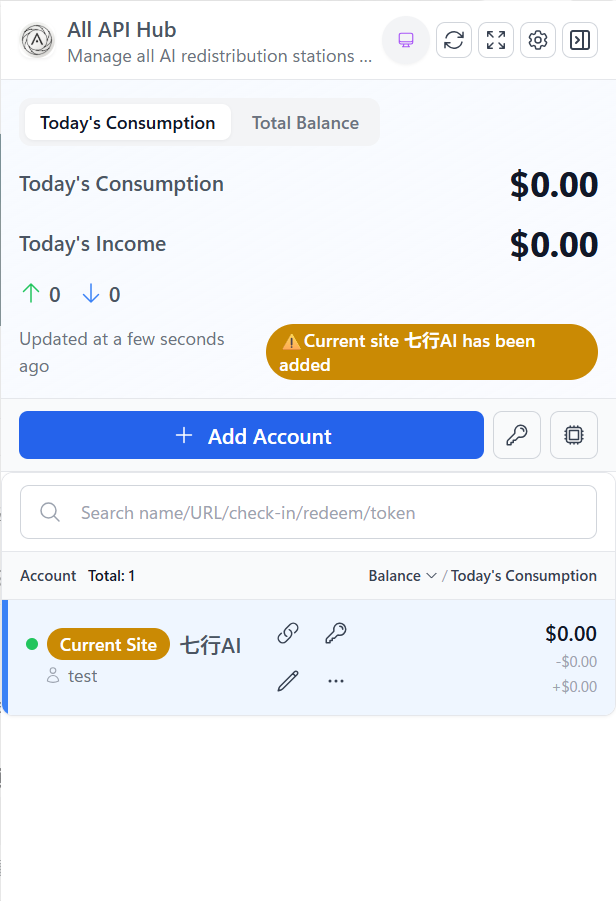
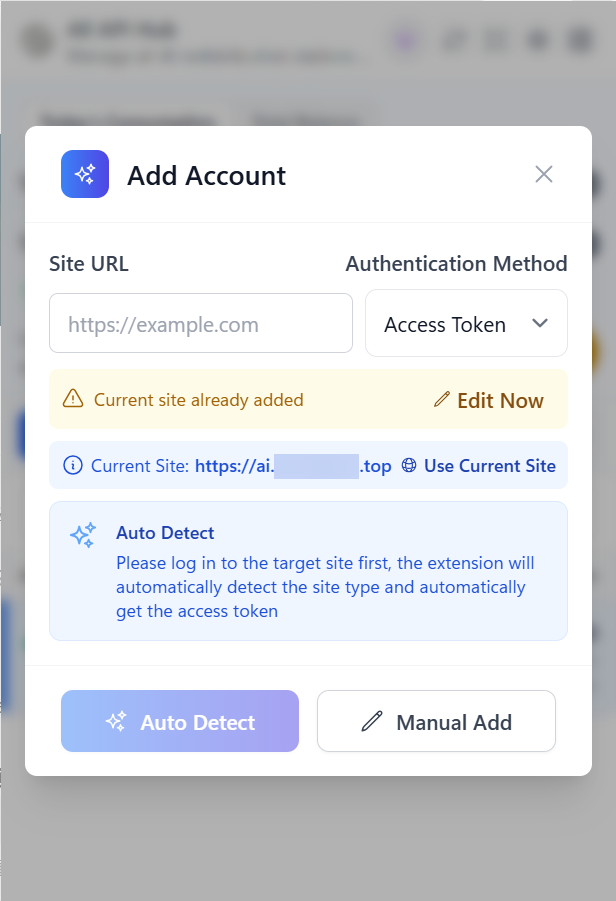
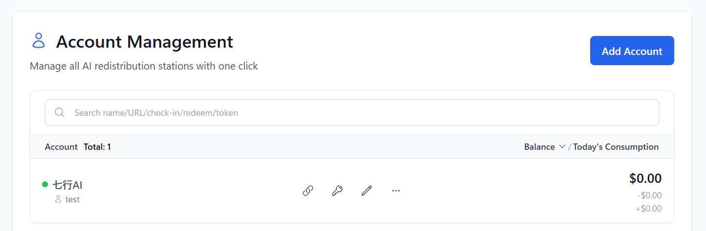
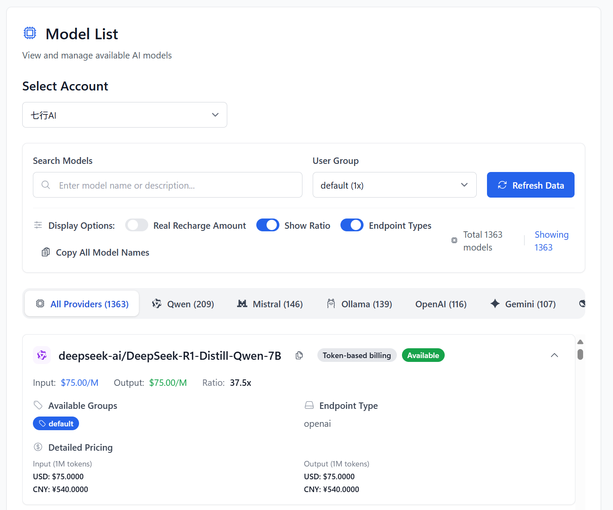
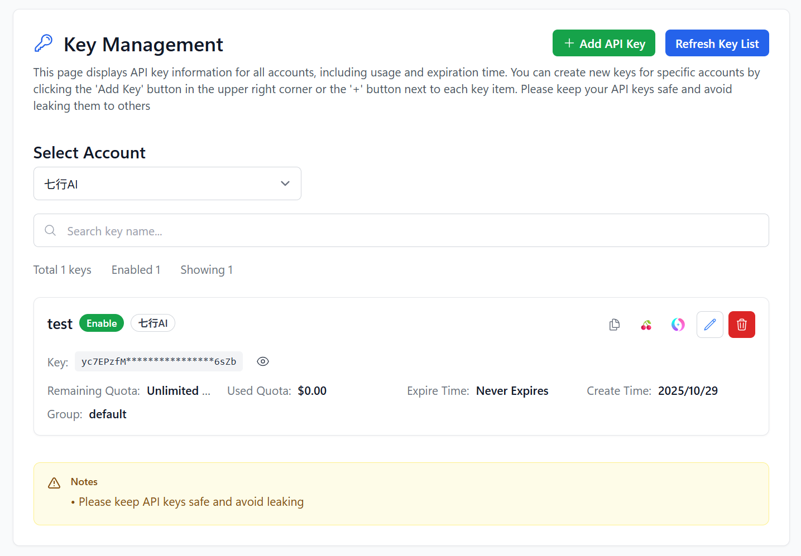
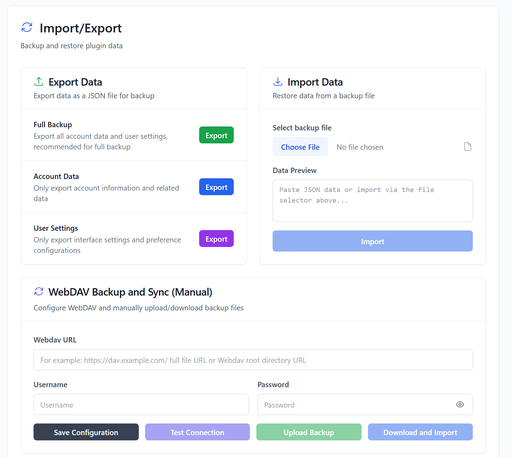

<h4 align="center">
<a href="./README.md">简体中文</a> | English
</h4>

  

# All API Hub

**Open-source browser extension that auto-detects and manages all AI aggregation and relay site accounts. View balances, sync models, manage keys, with cross-platform and cloud backup support**

**[Documentation](https://qixing-jk.github.io/all-api-hub/en) | [FAQ](https://qixing-jk.github.io/all-api-hub/en/faq.html)**

## 📖 Introduction

With numerous AI aggregation and relay sites available, checking balances, model lists, and keys requires logging into each site individually—a tedious process.
This extension automatically detects and manages accounts from sites based on the following projects:

- [one-api](https://github.com/songquanpeng/one-api)
- [new-api](https://github.com/QuantumNous/new-api)
- [Veloera](https://github.com/Veloera/Veloera)
- [one-hub](https://github.com/MartialBE/one-hub)
- [done-hub](https://github.com/deanxv/done-hub)
- Neo-API (closed source)
- Super-API (closed source)
- RIX_API (closed source, basic functionality supported)
- VoAPI (closed source, old versions supported)

## ✨ Features

- 🔍 **Smart Site Detection** - Automatically identify AI aggregation and relay sites, create access tokens, intelligently parse pricing ratios and configurations, with duplicate detection
- 🏷️ **Site Information Management** - Multiple methods to retrieve real site names, check-in status detection and automatic check-in, manually add any AI aggregation and relay site
- 👥 **Multi-Account Management** - Support multiple accounts per site, account grouping and quick switching, balance and usage logs at a glance
- 🔑 **Token & Key Management** - Convenient API Key viewing and management, support quick copy and batch operations
- 🤖 **View Model Information** - View the list of models supported by the site and pricing information.
- 🔄 **New API System Management**
    - Automatically synchronize the channel model list of New API and its fork projects, continuously staying in sync with the upstream model list.
    - Automatically generate model redirects, eliminating manual searching and individual configuration, maximizing channel resource utilization, and enhancing model availability.
- 🚀 **Quick Export Integration** - One-click export configurations to [CherryStudio](https://github.com/CherryHQ/cherry-studio) and [New API](https://github.com/QuantumNous/new-api), simplifying API usage workflow
- ☁️ **Data Backup & Recovery** - Support JSON format import/export, WebDav cloud backup, cross-device data synchronization
- 🌐 **Cross-Platform Compatible** - Support Chrome, Firefox browsers, works on mobile devices via Kiwi Browser, with automatic dark mode switching
- 🔒 **Privacy & Security** - Fully offline operation, all data stored locally, protecting your privacy

> [!NOTE]
> Originally based on [One API Hub](https://github.com/fxaxg/one-api-hub), now significantly refactored and expanded. Data format remains compatible, supporting direct import

## 🖥️ Screenshots

  <figure>
    
    
    <figcaption style="text-align:center;">Duplicate Site Detection</figcaption>
  </figure>

<figure>

<figcaption style="text-align:center;">Account Management</figcaption>
</figure>
<figure>

<figcaption style="text-align:center;">Model list</figcaption>
</figure>
<figure>

<figcaption style="text-align:center;">Key list</figcaption>
</figure>
<figure>

<figcaption style="text-align:center;">New API Model Synchronization</figcaption>
<figure>

<figcaption style="text-align:center;">Import/Export</figcaption>
</figure>

## 🚀 Installation

### Chrome App Store (Recommended)

[🔗 Go to download](https://chromewebstore.google.com/detail/lapnciffpekdengooeolaienkeoilfeo)

### Edge App Store (Recommended)

[🔗 Go to download](https://microsoftedge.microsoft.com/addons/detail/pcokpjaffghgipcgjhapgdpeddlhblaa)

### FireFox App Store (Recommended)
[🔗 Go to download](https://addons.mozilla.org/firefox/addon/%E4%B8%AD%E8%BD%AC%E7%AB%99%E7%AE%A1%E7%90%86%E5%99%A8-all-api-hub/)

### Manual Installation

1. Download the latest release package.
2. Open Chrome and navigate to `chrome://extensions/`.
3. Enable "Developer mode".
4. Click "Load unpacked".
5. Select the unzipped extension folder.

## 🛠️ Development Guide

Please refer to the [CONTRIBUTING](CONTRIBUTING.md) for more information.

## 🏗️ Tech Stack

- **Framework**: [WXT](https://wxt.dev)
- **UI Library**: [React](https://reactjs.org)
- **Styling**: [Tailwind CSS](https://tailwindcss.com)
- **Components**: [Headless UI](https://headlessui.com)
- **Icons**: [Heroicons](https://heroicons.com)
- **State Management**: React Context API
- **Type Checking**: [TypeScript](https://typescriptlang.org)

## 🙏 Acknowledgements

- Thanks to [@AngleNaris](https://github.com/AngleNaris) for designing the project logo 🎨
- [WXT](https://wxt.dev) - The modern browser extension development framework.

---

  <strong>⭐ If you find this project helpful, please consider giving it a star!</strong>

