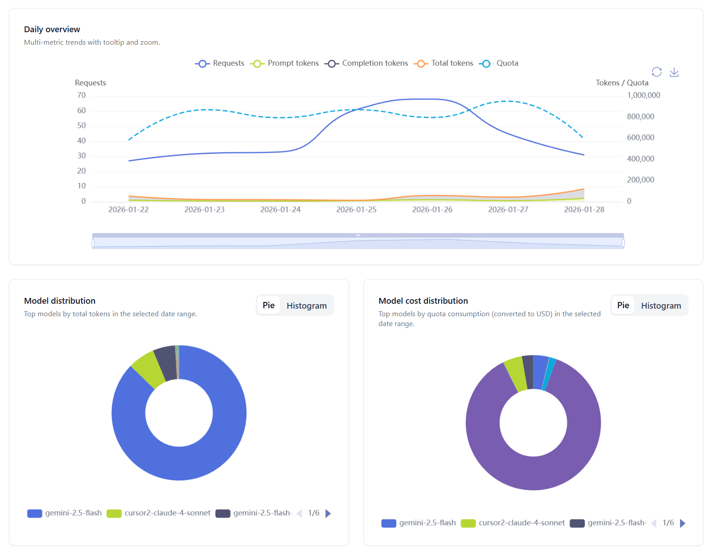
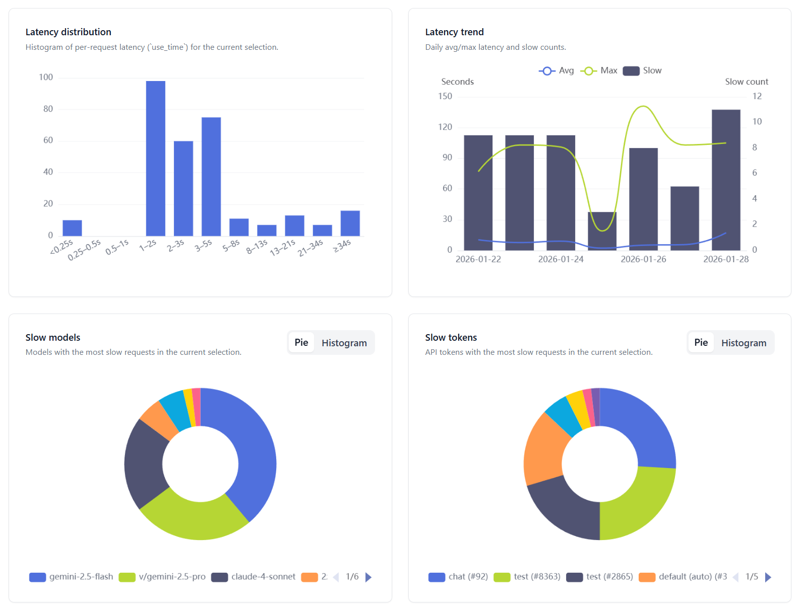

<h4 align="center">
<a href="./README.md">简体中文</a> | English
</h4>

  

# All API Hub – AI Relay & New API Manager

**One-stop management for New API-compatible relay accounts: balance/usage dashboard, automatic check-in, one-click key export to popular apps, in-page API availability testing, and channel/model sync & redirect**

**[Documentation](https://all-api-hub.qixing1217.top/en) | [Getting Started](https://all-api-hub.qixing1217.top/en/get-started.html) | [FAQ](https://all-api-hub.qixing1217.top/en/faq.html) | [Changelog](https://all-api-hub.qixing1217.top/en/changelog.html) | [Contributing](CONTRIBUTING.md)**

💬 **Join the discussion**: Have usage, feature, or technical questions? Join the [Telegram group](https://t.me/qixing_chat) and chat with the community!

---

## 📖 Introduction

Nowadays, within the AI ecosystem, there's a growing number of aggregated relay stations and custom dashboards built upon the New API series. Checking balances and model lists across these platforms, while also managing and quickly using API keys, is often fragmented and time-consuming.

All API Hub is a browser extension for one-stop management of New API-style relay accounts: balance/usage dashboard, automatic check-in, one-click key export to popular apps, in-page API availability testing, and channel/model sync & redirect. It currently supports relay station accounts from projects such as:

- [one-api](https://github.com/songquanpeng/one-api)
- [new-api](https://github.com/QuantumNous/new-api)
- [Veloera](https://github.com/Veloera/Veloera)
- [one-hub](https://github.com/MartialBE/one-hub)
- [done-hub](https://github.com/deanxv/done-hub)
- [Sub2API](https://github.com/Wei-Shaw/sub2api) (basic functionality supported)
- Neo-API (closed source)
- Super-API (closed source)
- RIX_API (closed source, basic functionality supported)
- VoAPI (closed source, old versions supported)

## ✨ Features

- 🔍 **Smart Site Detection**  
  Paste the site URL after signing in to add an account; basic account info is filled automatically, with duplicate protection and a manual fallback.

- 🛡️ **Cloudflare Bypass Assistant**  
  Opens a helper window when Cloudflare challenges block detection or refresh, then continues after you complete the challenge.

- 👥 **Multi‑Account Dashboard**  
  Manage multiple sites and accounts in one place, with balances, usage, health, and auto refresh.

- 🔑 **Token & Key Management**  
  Inspect, copy, and manage API keys per site, with bulk actions.

- 🤖 **Model Information & Pricing**  
  View per‑site model lists and pricing details for comparison.

- 🧪 **Model & API Verification**  
  Verify whether a key/model works and check common capabilities, including CLI compatibility, for troubleshooting.

- 📊 **Usage Analytics & Visualization**  
  Aggregate usage across multiple sites/accounts: filter by site, account, token, and date range, compare usage/cost/model breakdowns and trends, and inspect latency/slow requests when needed.

- 🚀 **Quick Export Integration**  
  Export configuration to CherryStudio, CC Switch, CLIProxyAPI, Claude Code Router, Kilo Code, New API, Veloera, and Octopus.

- 🔄 **New API, Veloera & Octopus Management (Self‑Hosted)**  
  For your self‑hosted New API, Veloera, and Octopus instances: model sync, channel management, and model redirect.

- 📆 **Automatic check‑in**  
  Detects which sites support daily check‑in, can run automatically, and keeps run records.

- ☁️ **Data Backup and Synchronization**  
  Import/export and WebDAV sync for backup and migration across devices.

- 🌐 **Cross‑Platform Compatible**  
  Works on Chrome, Edge, Firefox and mobile Chromium browsers like Kiwi, with dark mode.

- 🔒 **Privacy‑First Local Storage**  
  Local‑first by default with no telemetry; WebDAV and external APIs are only used when configured.

> [!NOTE]
> Originally based on [One API Hub](https://github.com/fxaxg/one-api-hub), now significantly refactored and expanded. Data format remains compatible, supporting direct import

## 🖼️ UI Preview

<table>
  <tr>
    <td align="center">
      
      
Account Management Overview

    </td>
    <td align="center">
      
      
Model List & Pricing

    </td>
  </tr>
  <tr>
    <td align="center">
      
      
Key List & Export

    </td>
    <td align="center">
      
      
Auto Check-in

    </td>
  </tr>
  <tr>
    <td align="center">
      
      
Account Model Usage Overview

    </td>
    <td align="center">
      
      
Account Model Latency Overview

    </td>
  </tr>
  <tr>
    <td align="center">
      
      
New API Model Sync

    </td>
    <td align="center">
      
      
New API Channel Management

    </td>
  </tr>
</table>

## 🚀 Installation

| Channel | Download Link | Current Version |
|------|----------|----------|
| Chrome Web Store | [Chrome Web Store](https://chromewebstore.google.com/detail/lapnciffpekdengooeolaienkeoilfeo) |  |
| Edge Add-ons | [Edge Add-ons](https://microsoftedge.microsoft.com/addons/detail/pcokpjaffghgipcgjhapgdpeddlhblaa) |  |
| Firefox Add-ons | [Firefox Add-ons](https://addons.mozilla.org/firefox/addon/{bc73541a-133d-4b50-b261-36ea20df0d24}) |  |
| GitHub Release | [Release Download](https://github.com/qixing-jk/all-api-hub/releases) |  |

Manual installation (Load unpacked)

1. Download the latest release package.
2. Open Chrome and navigate to `chrome://extensions/`.
3. Enable "Developer mode".
4. Click "Load unpacked".
5. Select the unzipped extension folder.

## 🧑‍🚀 Quick Start Guide for New Users

[Getting Started guide](https://all-api-hub.qixing1217.top/en/get-started.html).

## 🛠️ Development Guide

Please refer to the [CONTRIBUTING](CONTRIBUTING.md) for more information.

## 🏗️ Tech Stack

- **Framework**: [WXT](https://wxt.dev) powers the multi-browser extension tooling and build pipeline
- **UI Layer**: [React](https://react.dev) drives the options UI and popup experiences
- **Language**: [TypeScript](https://www.typescriptlang.org) keeps the entire codebase type-safe
- **Styling**: [Tailwind CSS](https://tailwindcss.com) supplies utility-first theming primitives
- **Components**: [Headless UI](https://headlessui.com) provides unstyled accessible primitives for our design system

## 🙏 Acknowledgements

- Thanks to [@AngleNaris](https://github.com/AngleNaris) for designing the project logo 🎨
- [WXT](https://wxt.dev) - The modern browser extension development framework.

---

  <strong>⭐ If you find this project helpful, please consider giving it a star!</strong>

