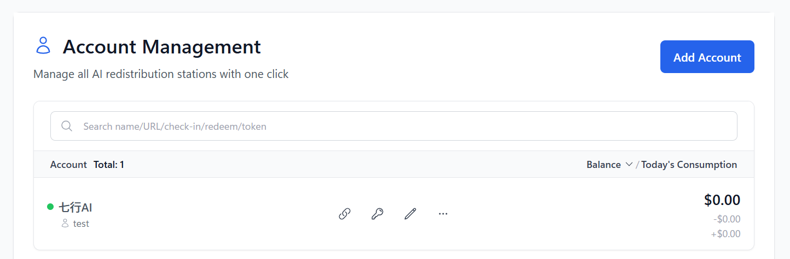
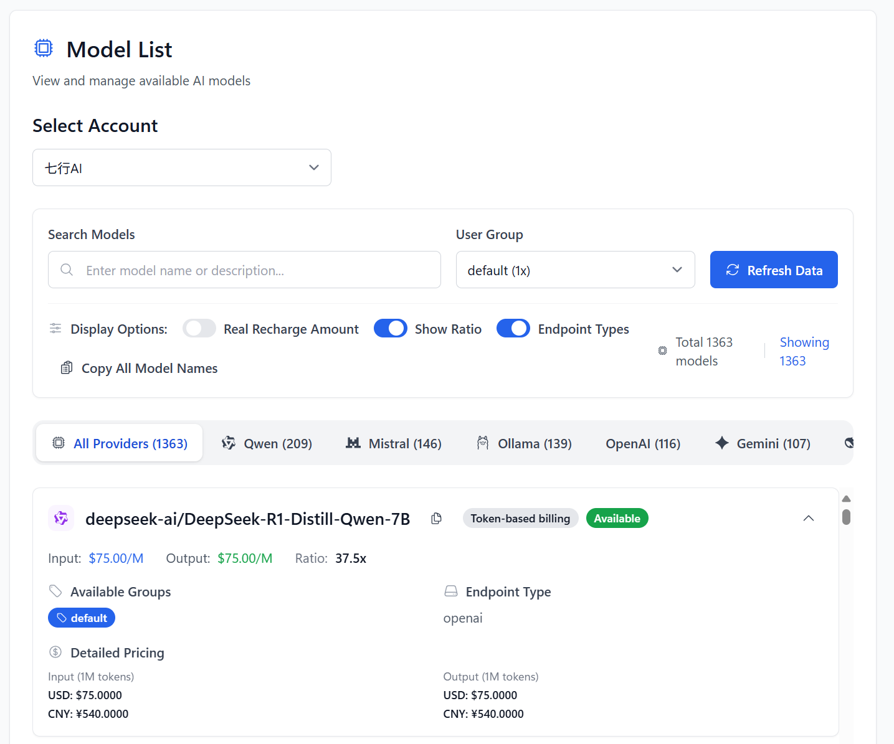
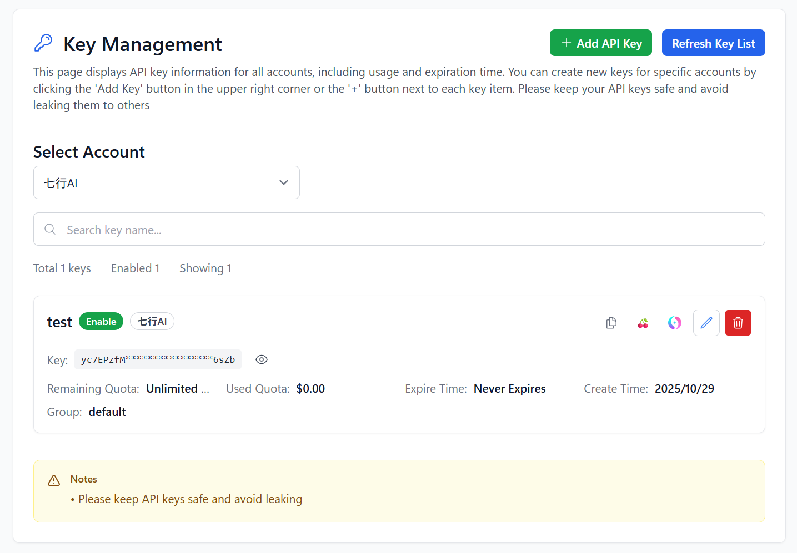
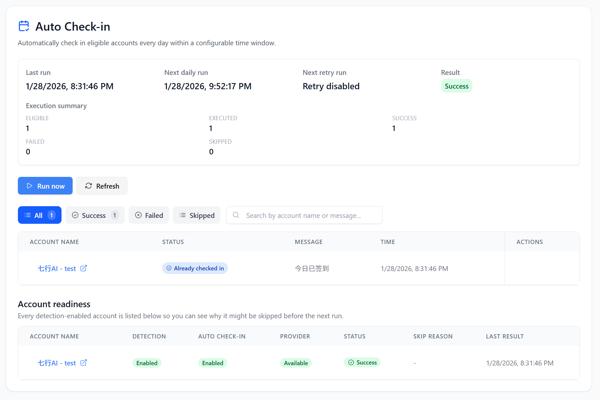
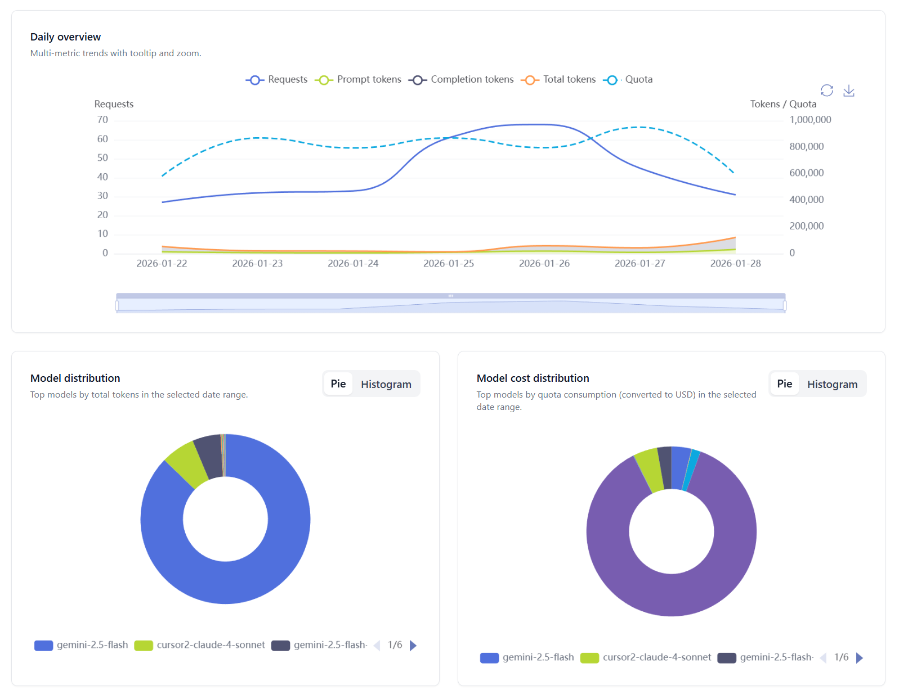
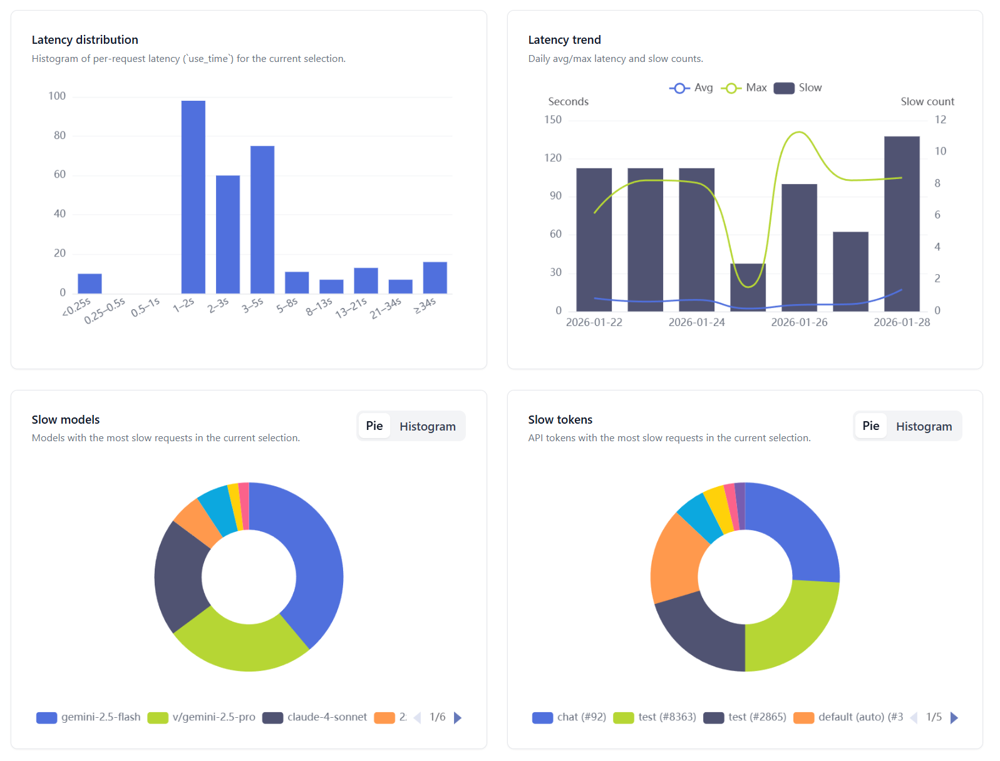
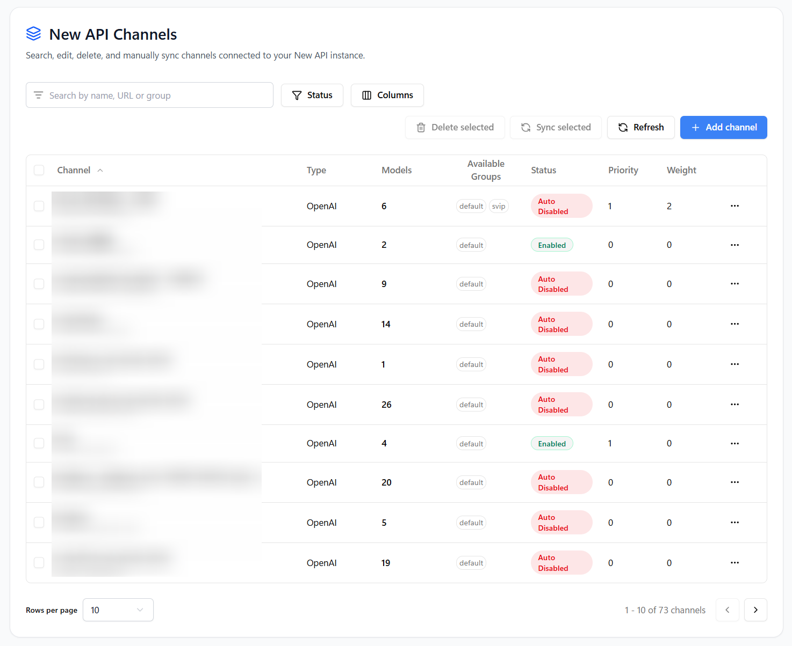

<h4 align="center">
<a href="./README.md">简体中文</a> | English
</h4>

  

# All API Hub – Your All-in-One AI Asset Manager

**One-stop management for New API-compatible relay accounts: balance/usage dashboards, model price comparison, automatic check-in, site keys and standalone API credential management, in-page API availability testing, and channel/model sync & redirect**

**[⚡ Quick Start](https://all-api-hub.qixing1217.top/en/get-started.html) | [📚 Docs](https://all-api-hub.qixing1217.top/en/) | [💬 Community](https://all-api-hub.qixing1217.top/#community) | [🔌 Integrations](https://all-api-hub.qixing1217.top/en/supported-export-tools.html) | [🌐 Supported Sites](https://all-api-hub.qixing1217.top/en/supported-sites.html) | [❓ FAQ](https://all-api-hub.qixing1217.top/en/faq.html) | [📜 Changelog](https://all-api-hub.qixing1217.top/en/changelog.html)**

  <strong>📢 Discussion:</strong>
  <a href="https://linux.do/t/topic/1001042">All API Hub Thread on Linux.do</a>

  <strong>💬 Community:</strong> 
  
  
  

## ❓ Why All API Hub?

**In simple terms**: AI relay sites are like a marketplace for AI credits, letting you access top-tier models such as ChatGPT, Claude, and Midjourney in one place at very low prices, sometimes even for free.

But once you have multiple accounts, management quickly becomes painful:

- 📂 **Scattered assets**: To check balances and spending, you have to sign in to each site one by one.
- 💲 **Messy pricing**: Every site uses different billing ratios, so it is hard to tell which one is actually the best deal.
- ✅ **Missed daily perks**: Many sites offer free daily check-in credits, but manual check-ins are tedious and easy to forget.
- 🔌 **Annoying setup work**: Pasting API credentials into different AI tools such as Immersive Translate or Cherry Studio gets old fast.

**All API Hub is your all-purpose AI asset manager.** Just add your site URLs and let the extension handle the rest.

## ✨ What Can It Do for You?

### 📊 Unified Dashboard for Multiple Sites
- **Multi-account asset overview**: See balances, total usage, and health status for all your sites in one panel.
- **Smart site detection**: Paste a URL and the extension automatically detects the architecture type, billing ratio, and setup details.
- **Standalone credential profiles**: Manage `URL + Key` pairs directly, with tags for organization, as easily as managing bookmarks.

### 💰 Smarter Savings and Automated Gains
- **Model price comparison**: Automatically calculate the effective per-model price across sites so you can find the best-value group and endpoint.
- **Fully automated check-in flow**: Run check-ins for all supported sites with one click or on a schedule, so your stored quota keeps growing.
- **Deep usage analytics**: Generate reports by site, account, model, and date, including heatmaps and slow-request analysis.

### 🚀 Fast Ecosystem Integration
- **One-click quick export**: Deep integration with **CherryStudio, CC Switch, CLIProxyAPI, Claude Code Router, Kilo Code**, and more.
- **Admin workflow tools**: Built-in productivity tools for self-hosted site admins, including channel management, model redirection, and channel sync.
- **Web sniffing and quick capture**: Select a Base URL or API Key on a webpage to instantly open the test popup and save it. See [Web AI API Sniffing & Verification](https://all-api-hub.qixing1217.top/en/web-ai-api-check.html).
- **Supported integrations**: 👉 [Supported Tools](https://all-api-hub.qixing1217.top/en/supported-export-tools.html)

### 🧪 Reliability Safeguards
- **Multi-dimensional API verification**: Batch test model availability, token compatibility, and CLI proxy availability.
- **Cloudflare challenge assistant**: Automatically helps you get through Cloudflare challenges so data refreshes and API calls stay uninterrupted.

### 🔒 Privacy and Security
- **Local-first data storage**: Your keys and account data stay on your own device and are never uploaded to a server.
- **Encrypted sync**: Supports encrypted WebDAV backup so you can restore everything instantly on another machine.

> [!NOTE]
> Loved the original [One API Hub](https://github.com/fxaxg/one-api-hub)? You will probably like All API Hub even more. It has been heavily refactored while keeping data compatibility, so you can import with one click.

## 🚀 Quick Installation

> [!IMPORTANT]
> **For 90% of users, the store build is the right choice.** It is the easiest to install, supports automatic updates, and is the most hassle-free option.

| Channel | Install Link | Current Version | Users |
|------|----------|----------|-------|
| Chrome Web Store | [Chrome Web Store](https://chromewebstore.google.com/detail/lapnciffpekdengooeolaienkeoilfeo) |  |  |
| Edge Add-ons | [Edge Add-ons](https://microsoftedge.microsoft.com/addons/detail/pcokpjaffghgipcgjhapgdpeddlhblaa) |  |  |
| Firefox Add-ons | [Firefox Add-ons](https://addons.mozilla.org/firefox/addon/{bc73541a-133d-4b50-b261-36ea20df0d24}) |  |  |
| GitHub Releases | [Browse All Releases](https://github.com/qixing-jk/all-api-hub/releases) |  |  |

📦 Need manual installation or Nightly builds? (Click to expand)

| Channel | Download Link | Best For |
|------|----------|----------|
| Stable release | [Download Stable](https://github.com/qixing-jk/all-api-hub/releases/latest) | When you cannot access the store or want to manage versions manually |
| Nightly pre-release | [Download Nightly](https://github.com/qixing-jk/all-api-hub/releases/tag/nightly) | When you want early access to new features and are willing to help test |

**Other environments:**
- **Mobile browsers**: Supports mobile Edge, Firefox for Android, Kiwi, and more. See the [mobile browser guide](https://all-api-hub.qixing1217.top/en/faq.html#mobile-browser-support).
- **QQ Browser / 360 Browser / similar**: See the [manual loading guide](https://all-api-hub.qixing1217.top/en/other-browser-install.html).
- **Safari (Mac)**: Requires Xcode for compilation. See the [Safari installation guide](https://all-api-hub.qixing1217.top/en/safari-install.html).

## 🧑‍🚀 30-Second Quick Start

1. **Install the extension**: Use one of the store links above.
2. **Sign in to your site**: Open your usual AI relay site in the browser and log in.
3. **Run auto detection**: Click the extension icon -> `Add Account` -> enter the site URL -> click `Auto Detect`.
4. **Start using it**: Check balances, configure auto check-in, or export the account to your AI client.

👉 **[Click here for the full illustrated beginner guide](https://all-api-hub.qixing1217.top/en/get-started.html)**

### 🧩 Strong Compatibility
No matter which architecture you use, there is a good chance we support it:
- **Mainstream open source**: [one-api](https://github.com/songquanpeng/one-api), [new-api](https://github.com/QuantumNous/new-api), [Sub2API](https://github.com/Wei-Shaw/sub2api), [one-hub](https://github.com/MartialBE/one-hub), [done-hub](https://github.com/deanxv/done-hub), [Veloera](https://github.com/Veloera/Veloera)
- **Specialized architectures**: [AIHubMix](https://aihubmix.com/), [AnyRouter](https://anyrouter.top), Neo-API, Super-API, and more
- **Full list**: 👉 [Supported Sites](https://all-api-hub.qixing1217.top/en/supported-sites.html)

## 🖼️ UI Preview

<table>
  <tr>
    <td align="center">
      
      
Account Management Overview

    </td>
    <td align="center">
      
      
Model List & Pricing

    </td>
  </tr>
  <tr>
    <td align="center">
      
      
Key List & Export

    </td>
    <td align="center">
      
      
Auto Check-in

    </td>
  </tr>
  <tr>
    <td align="center">
      
      
Account Model Usage Overview

    </td>
    <td align="center">
      
      
Account Model Latency Overview

    </td>
  </tr>
  <tr>
    <td align="center">
      
      
New API Model Sync

    </td>
    <td align="center">
      
      
New API Channel Management

    </td>
  </tr>
</table>

## 🛠️ Development Guide

Please refer to the [CONTRIBUTING](CONTRIBUTING.md) for more information.

## 🏗️ Tech Stack

- **Framework**: [WXT](https://wxt.dev) powers the multi-browser extension tooling and build pipeline
- **UI Layer**: [React](https://react.dev) drives the options UI and popup experiences
- **Language**: [TypeScript](https://www.typescriptlang.org) keeps the entire codebase type-safe
- **Styling**: [Tailwind CSS](https://tailwindcss.com) supplies utility-first theming primitives
- **Components**: [Headless UI](https://headlessui.com) provides unstyled accessible primitives for our design system

## 🙏 Acknowledgements

- Thanks to [@AngleNaris](https://github.com/AngleNaris) for designing the project logo 🎨
- Thanks to the [Linux.do community](https://linux.do) for feedback, testing, and visibility support, especially the continued discussion and suggestions in the [All API Hub thread on Linux.do](https://linux.do/t/topic/1001042)
- [WXT](https://wxt.dev) - The modern browser extension development framework

  <strong>⭐ If you find this project helpful, please consider giving it a star!</strong>

