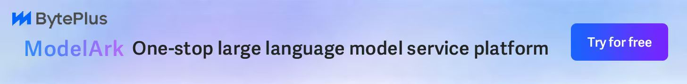

<h4 align="center">
<a href="./README_CN.md">简体中文</a> | <a href="./README.md">English</a> | 日本語
</h4>

# All API Hub - あなたの万能 AI 資産マネージャー

**New API 互換の中継サイトアカウントを一元管理：残高、使用量、モデル価格、自動チェックイン、API 認証情報、ページ内テスト、チャネル/モデル同期とリダイレクトに対応**

**[⚡ クイックスタート](https://all-api-hub.qixing1217.top/ja/get-started.html) | [🌐 対応サイト](https://all-api-hub.qixing1217.top/ja/supported-sites.html) | [🔌 連携ツール](https://all-api-hub.qixing1217.top/ja/supported-export-tools.html) | [📜 更新履歴](https://all-api-hub.qixing1217.top/ja/changelog.html)**

  
  
  
  
  

## ❓ All API Hub が必要な理由

**簡単に言うと**、AI 中継サイトは AI クレジットのマーケットのようなもので、ChatGPT、Claude、GPT Image などのモデルを低コスト、場合によっては無料で使えるようにします。

ただし、複数のアカウントを持つと管理はすぐに面倒になります。

- 📂 **資産が分散する**：残高と使用量をサイトごとに確認する必要があります。
- 💲 **価格が分かりにくい**：課金倍率がサイトごとに異なり、どこが得か判断しづらくなります。
- ✅ **毎日の特典を逃しやすい**：手動チェックインは忘れがちです。
- 🔌 **設定が手間**：API 情報を cc-switch や Cherry Studio などのツールへ何度もコピーする必要があります。

**All API Hub は、あなたの AI 資産マネージャーです**。サイト URL を追加すれば、残りの管理は拡張機能が引き受けます。

## ✨ できること

### 📊 複数サイトをまとめる統合ダッシュボード
- **複数アカウントの資産概要**：残高、使用量、健全性を 1 つの画面で確認できます。
- **スマートなサイト検出**：URL を貼り付けるだけで、アーキテクチャ、課金倍率、設定情報を検出します。
- **API 認証情報ライブラリ**：よく使う `Base URL + API Key` を保存し、コピー、API 検証、モデル確認、残高/使用量確認に使えます。

### 💰 より賢い節約と自動化
- **モデル価格比較**：サイトをまたいだ実効モデル価格を計算し、よりお得なグループやエンドポイントを見つけます。
- **完全自動チェックイン**：対応サイトのチェックインをワンクリックまたはスケジュールで実行できます。
- **詳細な使用量分析**：サイト、アカウント、モデル、日付ごとのレポートを作成し、ヒートマップや低速リクエスト分析も確認できます。

### 🚀 すばやいエコシステム連携
- **ワンクリックのクイックエクスポート**：**CherryStudio, CC Switch, CLIProxyAPI, Claude Code Router, Kilo Code** などへ同期できます。対応一覧は [連携ツール](https://all-api-hub.qixing1217.top/ja/supported-export-tools.html) を参照してください。
- **管理者向けワークフローツール**：アカウントやキーを自社構築サイトのチャネルとしてインポートし、チャネル管理、モデルリダイレクト、チャネル同期を行えます。
- **Web スニッフィングとクイック保存**：Web ページ上の Base URL や API Key を選択すると、すぐにテストポップアップを開いて保存できます。詳しくは [Web AI API スニッフィングと検証](https://all-api-hub.qixing1217.top/ja/web-ai-api-check.html) を参照してください。

### 🧪 安定性を支える検証機能
- **多角的な API 検証**：モデルの可用性、Token 互換性、CLI プロキシの可用性を一括でテストできます。
- **Cloudflare チャレンジ補助**：Cloudflare チャレンジの通過を自動で支援し、データ更新や API 呼び出しを止めにくくします。

### 🔒 プライバシーとセキュリティ
- **ローカル管理が既定**：WebDAV バックアップ/同期を有効にしない限り、キーとアカウント情報は端末内に保存されます。
- **暗号化同期**：暗号化 WebDAV バックアップに対応し、別の端末でもデータを復元できます。

## 🚀 クイックインストール

> [!IMPORTANT]
> **ほとんどのユーザーにはストア版を推奨します。** インストールが簡単で、自動更新にも対応しています。

| チャネル | インストールリンク | 現在のバージョン | ユーザー数 |
|------|----------|----------|-------|
| Chrome ウェブストア | [Chrome ウェブストア](https://chromewebstore.google.com/detail/lapnciffpekdengooeolaienkeoilfeo) |  |  |
| Edge アドオン | [Edge アドオン](https://microsoftedge.microsoft.com/addons/detail/pcokpjaffghgipcgjhapgdpeddlhblaa) |  |  |
| Firefox Add-ons | [Firefox Add-ons](https://addons.mozilla.org/firefox/addon/{bc73541a-133d-4b50-b261-36ea20df0d24}) |  |  |

📦 手動インストールや Nightly ビルドが必要ですか？（クリックして展開）

| チャネル | ダウンロードリンク | 向いている用途 |
|------|----------|----------|
| GitHub Stable | [Stable をダウンロード](https://github.com/qixing-jk/all-api-hub/releases/latest) | ストア版をインストールできない場合、または公開済み修正を一時的に手動導入したい場合 |
| Nightly pre-release | [Nightly をダウンロード](https://github.com/qixing-jk/all-api-hub/releases/tag/nightly) | 新機能を早めに試し、テストに協力したい場合。ストア安定版より不安定な可能性があります |

GitHub Stable と Nightly は手動インストール用チャネルで、自動更新されません。新しいバージョン通知を受け取りたい場合は、リポジトリを Star / Watch してください。詳しくは [インストールと更新ガイド](https://all-api-hub.qixing1217.top/ja/extension-update-install.html) を参照してください。

**その他の環境：**
- **モバイルブラウザ**：Edge モバイル版、Firefox for Android、Kiwi などに対応しています。詳しくは [モバイルブラウザガイド](https://all-api-hub.qixing1217.top/ja/faq.html#mobile-browser-support) を参照してください。
- **QQ Browser / 360 Browser など**：[手動読み込みガイド](https://all-api-hub.qixing1217.top/ja/other-browser-install.html) を参照してください。
- **Safari (Mac)**：Xcode でのビルドが必要です。[Safari インストールガイド](https://all-api-hub.qixing1217.top/ja/safari-install.html) を参照してください。

## ❤️ スポンサー

> [ここに掲載したい場合はこちら](mailto:street-anime-olive@duck.com)

  

    
  

  

    Dola Seed 様、本プロジェクトへのご協賛ありがとうございます。Dola Seed 2.0 は ByteDance がグローバル市場向けに独自開発したフルモーダル汎用大規模モデルです。統一されたマルチモーダルアーキテクチャを基盤に、テキスト、画像、音声、動画の理解と生成を横断的にサポートします。エージェント協調をネイティブに実現し、推論、長時間タスク実行、ツール連携、コーディング能力に優れています。スマートコックピット、パーソナルアシスタント、教育、カスタマーサポート、マーケティング、小売など幅広いシナリオに適用できます。マルチモーダル認識、エンドツーエンドの複雑タスク実行、安定した対話、データセキュリティに強みがあり、ModelArk プラットフォームからすぐにアクセス、デプロイできます。<a href="https://www.byteplus.com/en/product/modelark?utm_campaign=hw&utm_content=all-api-hub&utm_medium=devrel_tool_web&utm_source=OWO&utm_term=all-api-hub">こちらのリンク</a>から登録すると、各モデルにつき 500,000 トークン分の無料推論枠を受け取れます。<a href="https://dis.chatdesks.cn/chatdesk/hsyqallapihub.html"> >>中国大陆地区的开发者请点击这里</a>
  

  
  

    PackyCode 様、本プロジェクトへのご協賛ありがとうございます。PackyCode は、Claude Code、Codex、Gemini などの中継サービスを提供する、信頼性と効率性に優れた API 中継サービスプロバイダーです。
    All API Hub ユーザー向けの特別割引として、<a href="https://www.packyapi.com/register?aff=all-api-hub">こちらのリンク</a> から登録し、初回チャージ時にプロモコード "all-api-hub" を入力すると 10% オフになります（<a href="https://all-api-hub.qixing1217.top/ja/sponsor-guides/packycode.html">設定ガイド</a>）。
  

  
  

    Xingchen AI 様、本プロジェクトへのご協賛ありがとうございます。Xingchen AI は、Claude Code、Codex、Gemini などの中継サービスを提供する、安定性と効率性に優れた API 中継サービスプロバイダーです。1:1 のチャージ比率と請求書発行に対応し、Claude は通常価格の 40% 程度から利用できます。詳しくは <a href="https://ai.centos.hk">こちらのリンク</a> をご覧ください（<a href="https://all-api-hub.qixing1217.top/ja/sponsor-guides/xingchen.html">設定ガイド</a>）。
  

  
  

    Atlas Cloud 様、本プロジェクトへのご協賛ありがとうございます。Atlas Cloud はフルモーダル AI 推論プラットフォームで、1 つの AI API から動画生成、画像生成、LLM API にアクセスでき、300
    以上の厳選モデルを横断して利用できます。より手頃な API 利用に向けた新しい Coding Plan プロモーションは、<a href="https://www.atlascloud.ai/console/coding-plan?utm_source=github&utm_medium=link&utm_campaign=all-api-hub">こちらのリンク</a>をご覧ください。
  

  
  

    RunAPI 様、本プロジェクトへのご協賛ありがとうございます。RunAPI は安定した OpenRouter 代替 API プラットフォームで、1 つの API Key から OpenAI、Claude、Gemini、DeepSeek、Grok など 150 以上の主要モデルにアクセスできます。
    標準価格の 10% 程度から利用でき、Claude Code や OpenClaw などのツールにも対応しています。RunAPI は All API Hub ユーザー向けの限定特典として、<a href="https://runapi.co/register?aff=cvDm">こちらのリンク</a> から登録して管理者に連絡すると、¥7 の無料クレジットを受け取れます（<a href="https://all-api-hub.qixing1217.top/ja/sponsor-guides/runapi.html">設定ガイド</a>）。
  

  
  

    AICodeMirror 様、本プロジェクトへのご協賛ありがとうございます。AICodeMirror は Claude Code / Codex / Gemini CLI 向けの公式高安定中継サービスを提供し、エンタープライズ級の高同時実行、迅速な請求書発行、24 時間 365 日の専任技術サポートに対応しています。Claude Code / Codex / Gemini の公式チャネルを通常価格の 38% / 2% / 9% 程度から利用でき、チャージ時の追加割引もあります。All API Hub ユーザー向け特典として、<a href="https://www.right.codes/register?aff=690a8be5">こちらのリンク</a>から登録すると初回チャージが 20% オフになり、エンタープライズ顧客は最大 25% オフを受けられます。
  

> [!NOTE]
> 以前 [One API Hub](https://github.com/fxaxg/one-api-hub) を使っていた場合でも、All API Hub は大幅なリファクタリング後もデータ互換性を維持しているため、既存データをワンクリックでインポートできます。

## 🧑‍🚀 30 秒クイックスタート

1. **拡張機能をインストール**：上記のストアリンクからインストールします。
2. **サイトにログイン**：普段使っている AI 中継サイトをブラウザで開いてログインします。
3. **自動検出を実行**：拡張機能アイコン -> `Add Account` -> サイト URL を入力 -> `Auto Detect` をクリックします。
4. **使い始める**：残高を確認し、自動チェックインを設定するか、アカウントを AI クライアントへエクスポートします。

👉 **[図解付きの詳しい初心者ガイドを見る](https://all-api-hub.qixing1217.top/ja/get-started.html)**

### 🧩 高い互換性
どのアーキテクチャを使っていても、高い確率で対応しています。
- **アカウントサイト互換アーキテクチャ**：[one-api](https://github.com/songquanpeng/one-api)、[new-api](https://github.com/QuantumNous/new-api)、[Veloera](https://github.com/Veloera/Veloera)、[one-hub](https://github.com/MartialBE/one-hub)、[done-hub](https://github.com/deanxv/done-hub)、[Sub2API](https://github.com/Wei-Shaw/sub2api) など
- **特色あるアカウントプラットフォームと互換実装**：[AIHubMix](https://aihubmix.com/?aff=W3DN)、[AnyRouter](https://anyrouter.top)、Neo-API、Super-API、v-api など
- **セルフホスト型管理バックエンド**：[new-api](https://github.com/QuantumNous/new-api)、[Veloera](https://github.com/Veloera/Veloera)、[done-hub](https://github.com/deanxv/done-hub)、[Octopus](https://github.com/bestruirui/octopus)、[AxonHub](https://github.com/looplj/axonhub)、[Claude Code Hub](https://github.com/ding113/claude-code-hub) など。チャネル管理、移行、一部のモデル同期に利用できます
- **完全な一覧**：👉 [対応サイト](https://all-api-hub.qixing1217.top/ja/supported-sites.html)

## 🖼️ UI プレビュー

<table>
  <tr>
    <td align="center">
      
      
アカウント管理の概要

    </td>
    <td align="center">
      
      
モデル一覧と価格

    </td>
  </tr>
  <tr>
    <td align="center">
      
      
キー一覧とエクスポート

    </td>
    <td align="center">
      
      
自動チェックイン

    </td>
  </tr>
  <tr>
    <td align="center">
      
      
アカウント別モデル使用量の概要

    </td>
    <td align="center">
      
      
アカウント別モデル遅延の概要

    </td>
  </tr>
  <tr>
    <td align="center">
      
      
New API モデル同期

    </td>
    <td align="center">
      
      
New API チャネル管理

    </td>
  </tr>
</table>

## 🛠️ 開発ガイド

詳しくは [CONTRIBUTING](CONTRIBUTING.md) を参照してください。

## 📜 ライセンスと商用ライセンス

All API Hub は GNU Affero General Public License v3.0 (AGPL-3.0) のもとで公開されています。

AGPL-3.0 では対応できない条件が必要な組織または個人向けに、商用ライセンスを提供しています。対象には、プロプライエタリ配布、クローズドソースでの変更、ホワイトラベル再配布、その他の非公開商用統合などが含まれます。

商用ライセンスの問い合わせ先：<street-anime-olive@duck.com>

商用ライセンスは、All API Hub のメンテナーが商用条件を付与する権利を持つコードとアセットにのみ適用されます。第三者依存関係、および過去に [One API Hub](https://github.com/fxaxg/one-api-hub) から派生した MIT ライセンス部分は、それぞれの著作権表示とライセンス条件に従います。詳しくは [THIRD_PARTY_NOTICES.md](THIRD_PARTY_NOTICES.md) を参照してください。

## 🏗️ 技術スタック

- **Framework**：[WXT](https://wxt.dev) がマルチブラウザ拡張機能のツールチェーンとビルドパイプラインを支えます
- **UI Layer**：[React](https://react.dev) がオプション画面とポップアップ体験を構築します
- **Language**：[TypeScript](https://www.typescriptlang.org) により、コードベース全体の型安全性を保ちます
- **Styling**：[Tailwind CSS](https://tailwindcss.com) がユーティリティファーストのテーマプリミティブを提供します
- **Components**：[Headless UI](https://headlessui.com) がデザインシステム向けのアクセシブルな無スタイルプリミティブを提供します

## 🙏 謝辞

- プロジェクトロゴをデザインしてくれた [@AngleNaris](https://github.com/AngleNaris) に感謝します 🎨
- フィードバック、テスト、周知に協力してくれた [Linux.do コミュニティ](https://linux.do)、特に [Linux.do の All API Hub スレッド](https://linux.do/t/topic/1001042) で継続的に議論と提案を寄せてくれた皆さんに感謝します
- [WXT](https://wxt.dev) - モダンなブラウザ拡張機能開発フレームワーク

  <strong>⭐ このプロジェクトが役に立ったら、ぜひスターを付けてください！</strong>

