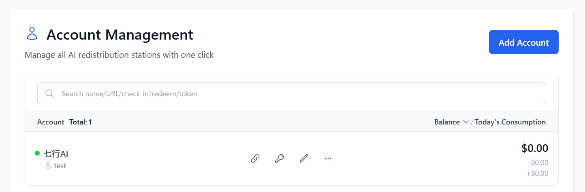
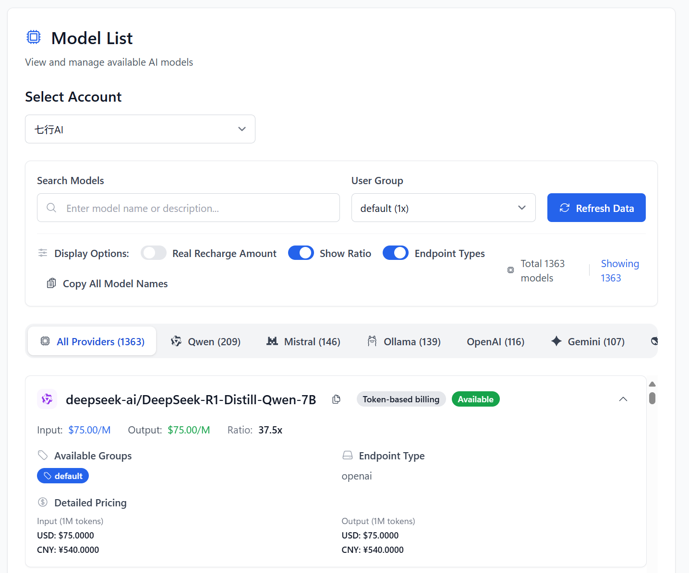
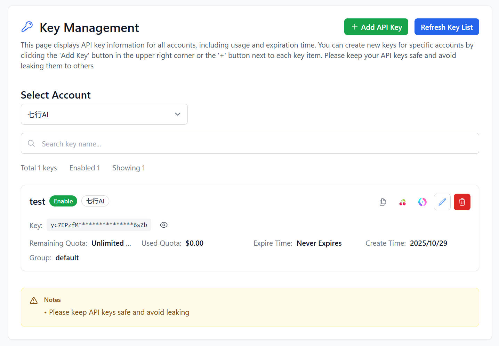
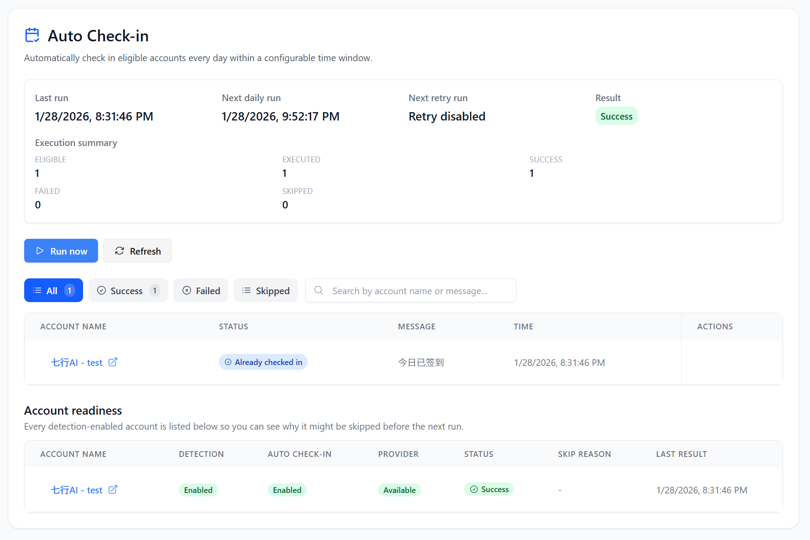
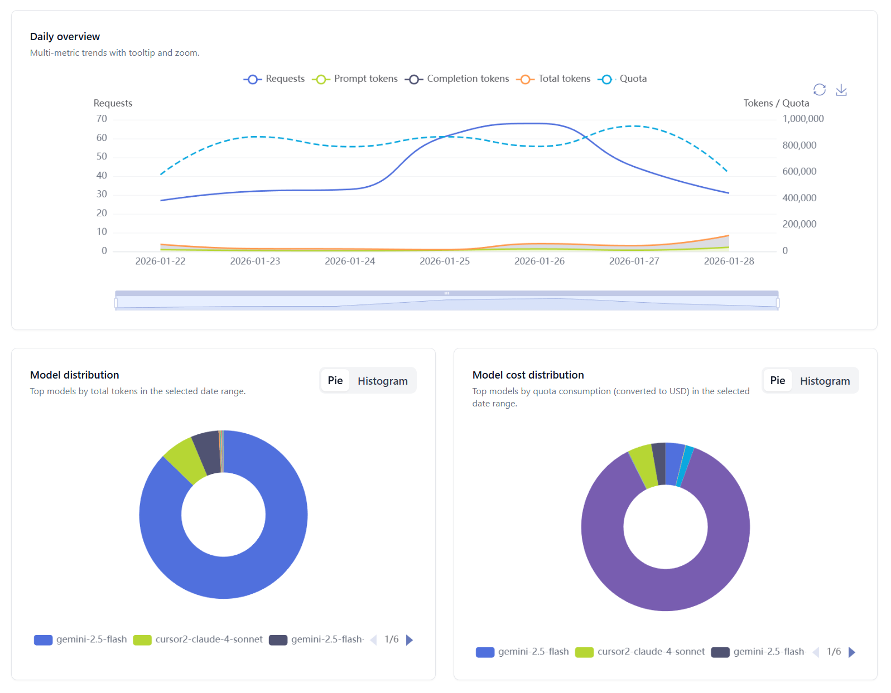
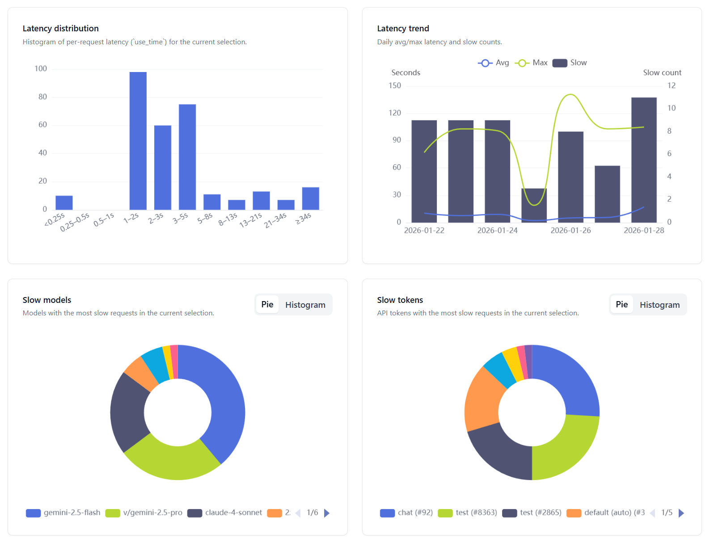
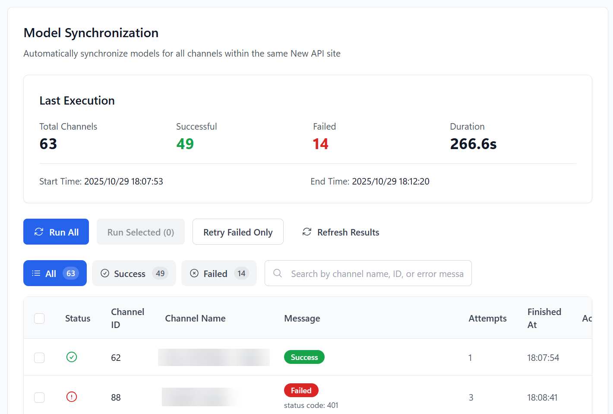
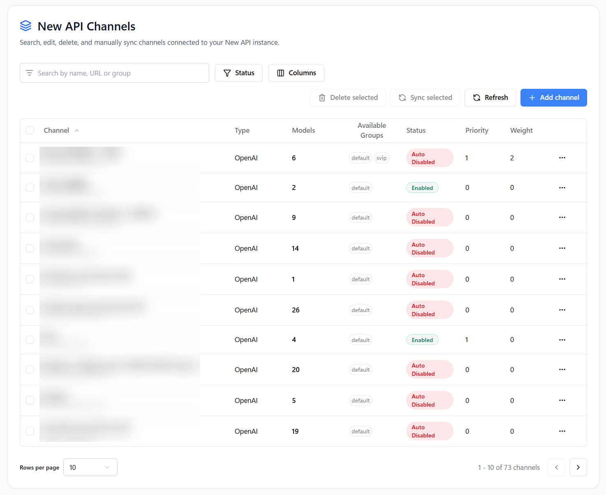

<h4 align="center">
<a href="./README_CN.md">简体中文</a> | <a href="./README.md">English</a> | 日本語
</h4>

# All API Hub - あなたの万能 AI 資産マネージャー

**New API 互換の中継サイトアカウントを一元管理：残高、使用量、モデル価格、自動チェックイン、API 認証情報、ページ内テスト、チャネル/モデル同期とリダイレクトに対応**

**[⚡ クイックスタート](https://all-api-hub.qixing1217.top/ja/get-started.html) | [🌐 対応サイト](https://all-api-hub.qixing1217.top/ja/supported-sites.html) | [🔌 連携ツール](https://all-api-hub.qixing1217.top/ja/supported-export-tools.html) | [📜 更新履歴](https://all-api-hub.qixing1217.top/ja/changelog.html)**

  
  
  
  
  

## ❓ All API Hub が必要な理由

**簡単に言うと**、AI 中継サイトは AI クレジットのマーケットのようなもので、ChatGPT、Claude、GPT Image などのモデルを低コスト、場合によっては無料で使えるようにします。

ただし、複数のアカウントを持つと管理はすぐに面倒になります。

- 📂 **資産が分散する**：残高と使用量をサイトごとに確認する必要があります。
- 💲 **価格が分かりにくい**：課金倍率がサイトごとに異なり、どこが得か判断しづらくなります。
- ✅ **毎日の特典を逃しやすい**：手動チェックインは忘れがちです。
- 🔌 **設定が手間**：API 情報を cc-switch や Cherry Studio などのツールへ何度もコピーする必要があります。

**All API Hub は、あなたの AI 資産マネージャーです**。サイト URL を追加すれば、残りの管理は拡張機能が引き受けます。

## ✨ All API Hub でできること

### 📊 AI 資産をまとめて把握
- **中継サイトアカウントの統合管理**：複数のアカウントを一か所で管理し、サイトごとにログインし直すことなく残高、利用量、状態を確認できます。
- **API 認証情報ライブラリ**：サイトアカウントを登録せず、共有されたものや日頃個別に収集した Base URL と API Key をまとめて保存できます。残高確認、モデル閲覧、接続テスト、クライアントへのエクスポートもすぐに使えます。
- **利用量と傾向の統計**：残高の変化を記録し、サイト、アカウント、モデルごとのグラフからクレジットの使い道を把握できます。

### 💰 料金比較と自動チェックイン
- **サイト間モデル価格比較**：同じモデルの実質価格をサイト間で比較し、よりお得な接続先をすぐに見つけられます。
- **複数サイトの自動チェックイン**：対応サイトへワンクリックまたはスケジュールでチェックインし、毎日のログインなしで特典を受け取れます。

### 🚀 Web からのクイック取り込みとクライアント連携
- **Web ページからのクイック取り込み**：Web ページから Base URL と API Key を検出し、その場でテストして認証情報ライブラリへ保存できます。
- **クライアントへのワンクリックエクスポート**：CherryStudio、CC Switch、CLIProxyAPI、Claude Code Router、Kilo Code などの [連携ツール](https://all-api-hub.qixing1217.top/ja/supported-export-tools.html)へ認証情報をすばやくエクスポートできます。

### 🧪 API 検証とトラブルシューティング
- **API・モデル検証**：ワンクリックで API の接続状態とモデルの利用可否を確認し、Key やモデルを実際に使えるかすぐに判断できます。
- **CLI 接続テスト**：一般的なコマンドラインツールから対象 API を利用できるか事前に確認し、設定後のトラブル調査を減らします。

### 🔔 お知らせとタスク結果通知
- **お知らせを一か所で確認**：登録済みサイトの各種お知らせを自動で集約・表示し、メンテナンス、モデル変更、価格改定などの更新もすぐに通知します。サイトを一つずつ確認する必要はありません。
- **タスク結果通知**：自動チェックイン、WebDAV 自動同期、モデル同期などの完了後、ブラウザまたは設定済みの通知先で結果を受け取り、失敗や異常にもすぐ対応できます。

### 🛠️ セルフホスト AI ゲートウェイ管理
- **主要 AI ゲートウェイを一元管理**：New API、AxonHub、Claude Code Hub、Octopus、Veloera、DoneHub のチャネルを、個別の管理画面を開かずに拡張機能から直接管理できます。
- **ゲートウェイチャネルをすばやく作成**：保存済みのサイトアカウントや API 認証情報ライブラリの認証情報から、セルフホスト AI ゲートウェイのチャネルをすばやく作成できます。その後はゲートウェイ経由で各種モデルをまとめて呼び出し、チャネルを柔軟に切り替えられます。
- **モデル同期とリダイレクト**：チャネルのモデル一覧を手動またはスケジュールで自動同期し、上流のモデル変更に追従できます。モデルリダイレクトも自由に設定でき、クライアントでは任意のモデル名で呼び出せます。

### 🔐 データ保護とクラウド同期
- **ローカル優先**：API Key、アカウント、設定はデフォルトでブラウザ内に保存され、バックアップや同期を有効にした場合のみ WebDAV へ書き込まれます。
- **暗号化 WebDAV 自動同期**：暗号化と定期的な自動同期を有効にすると、複数デバイス間でデータを安全に同期し、パソコンを替えてもそのまま使い続けられます。

## 🚀 クイックインストール

> [!IMPORTANT]
> **ほとんどのユーザーにはストア版を推奨します。** インストールが簡単で、自動更新にも対応しています。

| チャネル | インストールリンク | 現在のバージョン | ユーザー数 |
|------|----------|----------|-------|
| Chrome ウェブストア | [Chrome ウェブストア](https://chromewebstore.google.com/detail/lapnciffpekdengooeolaienkeoilfeo) |  |  |
| Edge アドオン | [Edge アドオン](https://microsoftedge.microsoft.com/addons/detail/pcokpjaffghgipcgjhapgdpeddlhblaa) |  |  |
| Firefox Add-ons | [Firefox Add-ons](https://addons.mozilla.org/firefox/addon/{bc73541a-133d-4b50-b261-36ea20df0d24}) |  |  |

📦 手動インストールや Nightly ビルドが必要ですか？（クリックして展開）

| チャネル | ダウンロードリンク | 向いている用途 |
|------|----------|----------|
| GitHub Stable | [Stable をダウンロード](https://github.com/qixing-jk/all-api-hub/releases/latest) | ストア版をインストールできない場合、または公開済み修正を一時的に手動導入したい場合 |
| Nightly pre-release | [Nightly をダウンロード](https://github.com/qixing-jk/all-api-hub/releases/tag/nightly) | 新機能を早めに試し、テストに協力したい場合。ストア安定版より不安定な可能性があります |

GitHub Stable と Nightly は手動インストール用チャネルで、自動更新されません。新しいバージョン通知を受け取りたい場合は、リポジトリを Star / Watch してください。詳しくは [インストールと更新ガイド](https://all-api-hub.qixing1217.top/ja/extension-update-install.html) を参照してください。

**その他の環境：**
- **モバイルブラウザ**：Edge モバイル版、Firefox for Android、Kiwi などに対応しています。詳しくは [モバイルブラウザガイド](https://all-api-hub.qixing1217.top/ja/faq.html#mobile-browser-support) を参照してください。
- **QQ Browser / 360 Browser など**：[手動読み込みガイド](https://all-api-hub.qixing1217.top/ja/other-browser-install.html) を参照してください。
- **Safari (Mac)**：Xcode でのビルドが必要です。[Safari インストールガイド](https://all-api-hub.qixing1217.top/ja/safari-install.html) を参照してください。

## ❤️ スポンサー

スポンサーの皆様による本プロジェクトへのご支援は、長期的な機能開発とメンテナンスを支えています。また、All API Hub を利用し、フィードバック、テスト、共有、改善に協力してくださるすべてのユーザー、コントリビューター、コミュニティの皆様にも感謝します。

> [ここに掲載したい場合はこちら](mailto:street-anime-olive@duck.com)

  
  

    Qiniu Cloud AI は Qiniu Cloud のエンタープライズ向け MaaS プラットフォームで、世界の主要 150 以上のモデルへワンストップでアクセスでき、主要モデルプロバイダーのプロトコルと互換性があります。テキスト、画像、音声、動画、ファイル処理までフルモーダル処理に対応します。
    エンタープライズユーザーは <a href="https://s.qiniu.com/qE3eai">こちらのリンク</a> から 1,200 万 Token を無料で受け取れ、紹介特典では最大で百億 Token 規模の報酬を獲得できます。
  

  
  

    FennoAI は、Codex 中継サービスを中心に提供する安定性と効率性に優れた API 中継サービスプロバイダーです。OpenAI と Anthropic のプロトコルに対応し、Codex、Claude Code、OpenCode などの主要なコーディングツールへ柔軟に接続できます。1 日あたり 1,000 億 Token 規模の企業利用を安定して支え、中国国内および海外法人との企業間決済と請求書発行にも対応しています。
    All API Hub ユーザー向け特典として、<a href="https://api.fenno.ai/s/DCGC">専用リンク</a>からわずか 1.99 ドルで、50 ドル相当の Coding Plan クレジットを購入できます。友人の購入に対して最大 20% の紹介報酬を受け取ることができ、紹介人数に応じて報酬も増えます（<a href="https://all-api-hub.qixing1217.top/ja/service-guides/fenno.html">設定ガイド</a>）。
  

  
  

    PackyCode は、Claude Code、Codex、Gemini などの中継サービスを提供する、信頼性と効率性に優れた API 中継サービスプロバイダーです。
    All API Hub ユーザー向けの特別割引として、<a href="https://www.packyapi.com/register?aff=all-api-hub">こちらのリンク</a> から登録し、初回チャージ時にプロモコード "all-api-hub" を入力すると 10% オフになります（<a href="https://all-api-hub.qixing1217.top/ja/sponsor-guides/packycode.html">設定ガイド</a>）。
  

  
  

    Xingchen AI は、Claude Code、Codex、Gemini などの中継サービスを提供する、安定性と効率性に優れた API 中継サービスプロバイダーです。1:1 のチャージ比率と請求書発行に対応し、Claude は通常価格の 40% 程度から利用できます。詳しくは <a href="https://ai.centos.hk">こちらのリンク</a> をご覧ください（<a href="https://all-api-hub.qixing1217.top/ja/sponsor-guides/xingchen.html">設定ガイド</a>）。
  

  
  

    XuanShu API は、企業、技術チーム、個人開発者向けの次世代 AI モデルルーティングゲートウェイです。Claude、GPT、Grok など世界トップクラスのモデルへ、エンタープライズ級の安定性を備えた API で一括アクセスできます。チャージは 20% オフ、モデル料金は通常価格の 20% から。登録で 5 米ドル分、さらに<a href="https://www.xuanshuapi.com/register?aff=ALL-API-HUB&promo=ALL-API-HUB">こちらのリンク</a>からの登録で 5 米ドル分の追加クレジットを受け取れ、法人向け請求書にも対応します（<a href="https://all-api-hub.qixing1217.top/ja/service-guides/xuanshuapi.html">設定ガイド</a>）。
  

  
  

    Atlas Cloud はフルモーダル AI 推論プラットフォームで、1 つの AI API から動画生成、画像生成、LLM API にアクセスでき、300
    以上の厳選モデルを横断して利用できます。より手頃な API 利用に向けた新しい Coding Plan プロモーションは、<a href="https://www.atlascloud.ai/console/coding-plan?utm_source=github&utm_medium=link&utm_campaign=all-api-hub">こちらのリンク</a>をご覧ください（<a href="https://all-api-hub.qixing1217.top/ja/service-guides/atlascloud.html">設定ガイド</a>）。
  

  
  

    AICodeMirror は Claude Code / Codex / Gemini CLI 向けの公式高安定中継サービスを提供し、エンタープライズ級の高同時実行、迅速な請求書発行、24 時間 365 日の専任技術サポートに対応しています。Claude Code / Codex / Gemini の公式チャネルを通常価格の 38% / 2% / 9% 程度から利用でき、チャージ時の追加割引もあります。All API Hub ユーザー向け特典として、<a href="https://www.aicodemirror.ai/register?invitecode=7IQNR8">こちらのリンク</a>から登録すると初回チャージが 20% オフになり、エンタープライズ顧客は最大 25% オフを受けられます。
  

  
  

    Suixiang AI Relay は、Claude、Codex、Gemini などの中継サービスを提供する、信頼性と効率性に優れた API 中継サービスプロバイダーです。プライバシー、透明性、迅速なサポートを重視し、データ転売やモデル品質の水増しを行いません。新規アカウントは毎日のチェックインで ¥0.5 のテストクレジットを受け取れ、1:1 チャージ、従量課金、複数回線冗長、リージョン間 DR、自動フェイルオーバー、長時間 SSE 接続の維持、99.9% の可用性に対応します。詳しくは <a href="https://sui-xiang.com/">こちらのリンク</a> をご覧ください（<a href="https://all-api-hub.qixing1217.top/ja/service-guides/suixiang.html">設定ガイド</a>）。
  

  
  

    モデルの品質低下や性能制限、不透明な料金が心配ですか？Infistar.ai で提供されるすべてのモデルは、実際の呼び出しによって動作と品質を検証しています。供給元は公式 API と公式アカウントプールで、10,000 を超える供給経路を負荷分散し、低遅延とピーク時の安定性を確保します。ChatGPT、Claude、Gemini、Grok、GLM、DeepSeek、Kimi、Qwen、MiniMax など、国内外の主要モデルに対応し、テキスト、動画、画像、埋め込み、リランキングなどのフルモーダル機能を提供します。料金と使用量は透明で明確に確認でき、モデルによっては公式価格の 10% から利用できます。All API Hub ユーザーは<a href="https://infistar.ai/register?aff=ALLAPIHUB&ref_source=link">専用リンク</a>から登録してお試しいただけます（<a href="https://all-api-hub.qixing1217.top/ja/service-guides/infistar.html">設定ガイド</a>）。
  

  

    
  

  

    Dola Seed 2.0 は ByteDance がグローバル市場向けに独自開発したフルモーダル汎用大規模モデルです。統一されたマルチモーダルアーキテクチャを基盤に、テキスト、画像、音声、動画の理解と生成を横断的にサポートします。エージェント協調をネイティブに実現し、推論、長時間タスク実行、ツール連携、コーディング能力に優れています。スマートコックピット、パーソナルアシスタント、教育、カスタマーサポート、マーケティング、小売など幅広いシナリオに適用できます。マルチモーダル認識、エンドツーエンドの複雑タスク実行、安定した対話、データセキュリティに強みがあり、ModelArk プラットフォームからすぐにアクセス、デプロイできます。<a href="https://www.byteplus.com/en/product/modelark?utm_campaign=hw&utm_content=all-api-hub&utm_medium=devrel_tool_web&utm_source=OWO&utm_term=all-api-hub">こちらのリンク</a>から登録すると、各モデルにつき 500,000 トークン分の無料推論枠を受け取れます。<a href="https://dis.chatdesks.cn/chatdesk/hsyqallapihub.html"> >>中国大陆地区的开发者请点击这里</a>
  

> [!NOTE]
> 以前 [One API Hub](https://github.com/fxaxg/one-api-hub) を使っていた場合でも、All API Hub は大幅なリファクタリング後もデータ互換性を維持しているため、既存データをワンクリックでインポートできます。

## 🧑‍🚀 30 秒クイックスタート

1. **拡張機能をインストール**：上記のストアリンクからインストールします。
2. **サイトにログイン**：普段使っている AI 中継サイトをブラウザで開いてログインします。
3. **自動検出を実行**：拡張機能アイコン -> `Add Account` -> サイト URL を入力 -> `Auto Detect` をクリックします。
4. **使い始める**：残高を確認し、自動チェックインを設定するか、アカウントを AI クライアントへエクスポートします。

👉 **[図解付きの詳しい初心者ガイドを見る](https://all-api-hub.qixing1217.top/ja/get-started.html)**

### 🧩 高い互換性
どのアーキテクチャを使っていても、高い確率で対応しています。
- **アカウントサイト互換アーキテクチャ**：[new-api](https://github.com/QuantumNous/new-api)、[one-api](https://github.com/songquanpeng/one-api)、[Sub2API](https://github.com/Wei-Shaw/sub2api)、[one-hub](https://github.com/MartialBE/one-hub)、[Veloera](https://github.com/Veloera/Veloera)、[done-hub](https://github.com/deanxv/done-hub) など
- **特色あるアカウントプラットフォームと互換実装**：[AnyRouter](https://anyrouter.top)、[AIHubMix](https://aihubmix.com/?aff=W3DN)、Super-API、v-api、Neo-API など
- **セルフホスト型管理バックエンド**：[new-api](https://github.com/QuantumNous/new-api)、[AxonHub](https://github.com/looplj/axonhub)、[Claude Code Hub](https://github.com/ding113/claude-code-hub)、[Octopus](https://github.com/bestruirui/octopus)、[Veloera](https://github.com/Veloera/Veloera)、[done-hub](https://github.com/deanxv/done-hub) など。チャネル管理、移行、一部のモデル同期に利用できます
- **完全な一覧**：👉 [対応サイト](https://all-api-hub.qixing1217.top/ja/supported-sites.html)

## 🖼️ UI プレビュー

<table>
  <tr>
    <td align="center">
      
      
アカウント管理の概要

    </td>
    <td align="center">
      
      
モデル一覧と価格

    </td>
  </tr>
  <tr>
    <td align="center">
      
      
キー一覧とエクスポート

    </td>
    <td align="center">
      
      
自動チェックイン

    </td>
  </tr>
  <tr>
    <td align="center">
      
      
アカウント別モデル使用量の概要

    </td>
    <td align="center">
      
      
アカウント別モデル遅延の概要

    </td>
  </tr>
  <tr>
    <td align="center">
      
      
New API モデル同期

    </td>
    <td align="center">
      
      
New API チャネル管理

    </td>
  </tr>
</table>

## 🛠️ 開発ガイド

詳しくは [CONTRIBUTING](CONTRIBUTING.md) を参照してください。

## 📜 ライセンスと商用ライセンス

All API Hub は GNU Affero General Public License v3.0 (AGPL-3.0) のもとで公開されています。

AGPL-3.0 では対応できない条件が必要な組織または個人向けに、商用ライセンスを提供しています。対象には、プロプライエタリ配布、クローズドソースでの変更、ホワイトラベル再配布、その他の非公開商用統合などが含まれます。

商用ライセンスの問い合わせ先：<street-anime-olive@duck.com>

商用ライセンスは、All API Hub のメンテナーが商用条件を付与する権利を持つコードとアセットにのみ適用されます。第三者依存関係、および過去に [One API Hub](https://github.com/fxaxg/one-api-hub) から派生した MIT ライセンス部分は、それぞれの著作権表示とライセンス条件に従います。詳しくは [THIRD_PARTY_NOTICES.md](THIRD_PARTY_NOTICES.md) を参照してください。

## 🏗️ 技術スタック

- **Framework**：[WXT](https://wxt.dev) がマルチブラウザ拡張機能のツールチェーンとビルドパイプラインを支えます
- **UI Layer**：[React](https://react.dev) がオプション画面とポップアップ体験を構築します
- **Language**：[TypeScript](https://www.typescriptlang.org) により、コードベース全体の型安全性を保ちます
- **Styling**：[Tailwind CSS](https://tailwindcss.com) がユーティリティファーストのテーマプリミティブを提供します
- **Components**：[Radix UI](https://www.radix-ui.com/) がデザインシステム向けのアクセシブルなプリミティブを提供します

## 🔗 エコシステムプロジェクト

All API Hub を取り巻くコミュニティ拡張・連携プロジェクト：

| プロジェクト | 概要 | 機能 |
|-------------|------|------|
| [CLIProxyAPI](https://github.com/router-for-me/CLIProxyAPI) | AI API プロキシサービス | Management API を通じて、All API Hub からプロバイダー設定をインポート・更新できます。 |
| [Metapi](https://github.com/cita-777/metapi) | セルフホスト型メタ集約ゲートウェイ | 複数の中継サイトアカウントを 1 つの API エントリにまとめます。All API Hub が最初の着想元です。 |
| [Fl API Hub](https://github.com/RebornQ/fl_api_hub) | クロスプラットフォームのネイティブ管理クライアント | アカウント、残高、キーを管理し、クイックチェックインに対応します。All API Hub から着想を得たプロジェクトです。 |
| [APIManager](https://github.com/zhalice2011/api-manager) | ローカル AI API 集約プロキシ | All API Hub からアカウントを同期し、統合プロキシ、ルーティング、使用状況ダッシュボードを提供します。 |

> All API Hub をベースにしたプロジェクト、All API Hub と連携するプロジェクト、または All API Hub から着想を得たプロジェクトを開発した場合は、PR を作成してこの一覧に追加してください。

## 🙏 謝辞

- プロジェクトロゴをデザインしてくれた [@AngleNaris](https://github.com/AngleNaris) に感謝します 🎨
- フィードバック、テスト、周知に協力してくれた [Linux.do コミュニティ](https://linux.do)、特に [Linux.do の All API Hub スレッド](https://linux.do/t/topic/2395800) で継続的に議論と提案を寄せてくれた皆さんに感謝します
- [WXT](https://wxt.dev) - モダンなブラウザ拡張機能開発フレームワーク

  <strong>⭐ このプロジェクトが役に立ったら、ぜひスターを付けてください！</strong>

