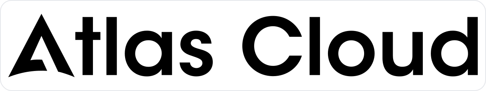

## 介绍

在 AI 时代，为了省钱或体验不同模型，我们往往拥有多个中转站账号。但管理起来却很头疼：余额分散、价格混乱、每天手动签到太累...

**All API Hub 为解决这些问题而生。** 它是你的 AI 资产中心，让管理变得简单、直观且自动化。

## 🎯 你的使用场景

### 👤 我是普通 AI 用户 (新手推荐)
- **我该怎么用？**：[下载并安装扩展](./get-started.md) -> [添加第一个账号](./get-started.md#add-site)
- **我想省钱**：[自动签到获取额度](./auto-checkin.md) -> [跨站模型价格比对](./model-list.md)
- **我想更省事**：[资产变动一眼看清](./balance-history.md) -> [同步账号到其它 AI 工具](./get-started.md#quick-export-sites)

### 🛠️ 我是进阶玩家 (Key 收藏家)
- **密钥管理**：[将独立 URL+Key 保存到 API 凭据库](./api-credential-profiles.md)
- **可用性测试**：[批量验证接口与 CLI 兼容性](./web-ai-api-check.md)
- **跨端同步**：[配置 WebDAV 加密备份](./webdav-sync.md)

### 👑 我是站点管理员 (站长专区)
- **效率工具**：[在插件内直接管理渠道](./self-hosted-site-management.md) -> [批量同步模型](./managed-site-model-sync.md)
- **配置优化**：[设置模型重定向](./model-redirect.md)
- **安全保障**：[处理 2FA / OTP 验证](./new-api-security-verification.md)

## 🧩 支持的系统架构

不论你用的是哪种架构，我们基本都支持：
- **账号站点兼容架构**：One API, New API, Veloera, One-Hub, Done-Hub, Sub2API 等。
- **特色账号平台与兼容实现**：AIHubMix, AnyRouter, Neo-API, Super-API, v-api 等。
- **自建管理后台**：New API, Veloera, Done-Hub, Octopus, AxonHub, Claude Code Hub 等，用于渠道管理、迁移和部分模型同步。

> 如果你在 macOS 上使用 Safari，请先查看 [Safari 安装指南](./safari-install.md)。
> 如果你使用 QQ/360/Brave 等浏览器，请查看 [手动安装指南](./other-browser-install.md)。
> 如果你想了解商店版为什么会晚于 GitHub Release、如何手动检查更新，请查看 [安装渠道与更新说明](./extension-update-install.md)。

## 💬 社区交流

遇到问题？想分享好用的站点？加入我们的社区：

- [GitHub Discussions](https://github.com/qixing-jk/all-api-hub/discussions)
- [Discord 社区](https://discord.gg/RmFXZ577ZQ)
- [Telegram 群](https://t.me/qixing_chat)
- [QQ 群](https://qm.qq.com/q/ebSCy31Phe)
- **微信群**：扫描下方二维码加入中文群。

## ❤️ 赞助商

  

    
  

  

    <strong>火山引擎方舟 Coding-Plan</strong> 是字节跳动推出的开发者生产力计划。Lite 套餐仅需 <strong>9.9 元/月</strong>，即可使用豆包、DeepSeek、GLM 等主流模型，适配 Cursor、Claude Code、Windsurf 等 IDE 工具，并提供模型自动切换体验。现在通过<a href="https://dis.chatdesks.cn/chatdesk/hsyqallapihub.html">活动链接</a>加入，还可享受好友邀请返利及首单优惠。
  

  

    
  

  

    感谢星辰AI赞助了本项目！星辰AI是一家稳定、高效的 API 中转服务商，提供 Claude Code、Codex、Gemini 等多种中转服务。充值比例 1:1，可开发票；Claude 低至 4 折。欢迎通过<a href="https://ai.centos.hk">此链接</a>了解和使用（<a href="./sponsor-guides/xingchen.md">使用教程</a>）。
  

  

    
  

  

    感谢 PackyCode 赞助了本项目！PackyCode 是一家稳定、高效的API中转服务商，提供 Claude Code、Codex、Gemini 等多种中转服务。PackyCode
    为本软件的用户提供了特别优惠，使用<a href="https://www.packyapi.com/register?aff=all-api-hub">此链接</a>注册并在充值时填写"all-api-hub"优惠码，首次充值可以享受9折优惠！
  

  

    
  

  

    感谢 Atlas Cloud 赞助了本项目！Atlas Cloud 是全模态 AI 推理平台，开发者只需接入一个 AI API，即可统一访问视频生成、图像生成和 LLM
    API，覆盖 300+ 精选模型。Atlas Cloud 新推出 Coding Plan 优惠，适合需要更高性价比 API 访问的开发者，欢迎通过<a href="https://www.atlascloud.ai/console/coding-plan?utm_source=github&utm_medium=link&utm_campaign=all-api-hub">此链接</a>了解。
  

  

    
  

  

    感谢 RunAPI 赞助了本项目！RunAPI 是高效稳定的 API OpenRouter 平替平台，一个 API Key 即可访问 OpenAI、Claude、Gemini、DeepSeek、Grok 等 150+ 主流模型，低至 1 折，极其稳定，可以无缝兼容 Claude Code、OpenClaw 等工具。RunAPI
    为 All API Hub 的用户提供专属福利：使用<a href="https://runapi.co/register?aff=cvDm">此链接</a>注册并联系 RunAPI 管理员，即可领取 ￥7 的免费额度（<a href="./sponsor-guides/runapi.md">使用教程</a>）。
  

