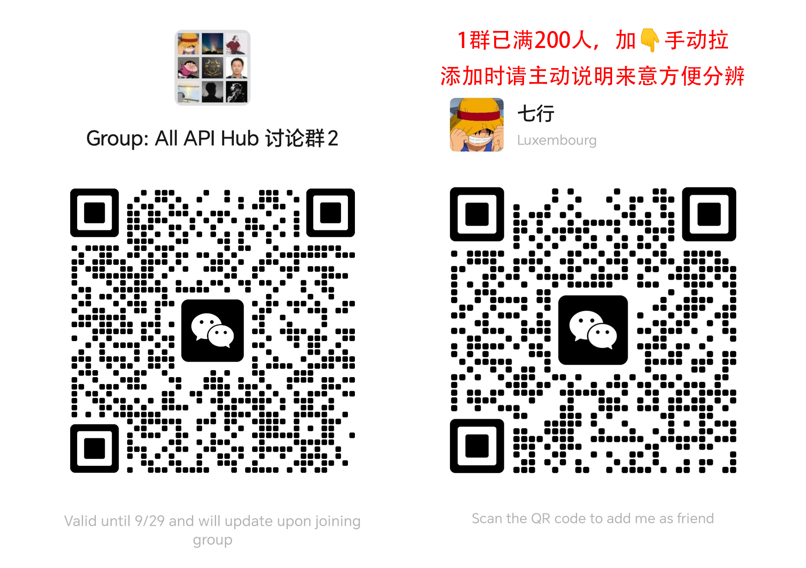
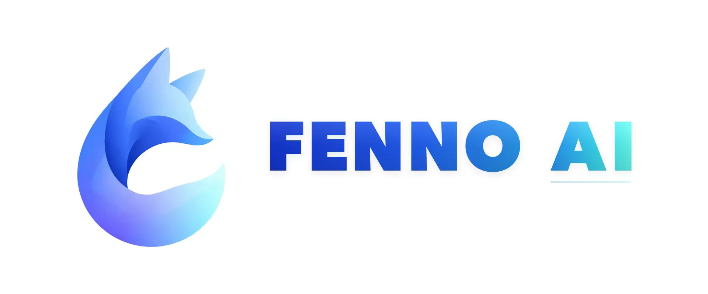
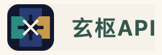
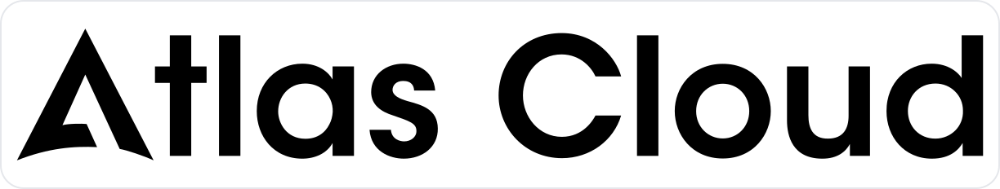
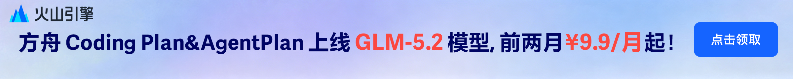

## 介绍

在 AI 时代，为了省钱或体验不同模型，我们往往拥有多个中转站账号。但管理起来却很头疼：余额分散、价格混乱、每天手动签到太累...

**All API Hub 为解决这些问题而生。** 它是你的 AI 资产中心，让管理变得简单、直观且自动化。

## 🎯 你的使用场景

### 👤 我是普通 AI 用户 (新手推荐)
- **我该怎么用？**：[下载并安装扩展](./get-started.md) -> [添加第一个账号](./get-started.md#add-site)
- **我想省钱**：[自动签到获取额度](./auto-checkin.md) -> [跨站模型价格比对](./model-list.md)
- **我想更省事**：[资产变动一眼看清](./balance-history.md) -> [同步账号到其它 AI 工具](./get-started.md#quick-export-sites)

### 🛠️ 我是进阶玩家 (Key 收藏家)
- **密钥管理**：[将独立 URL+Key 保存到 API 凭据库](./api-credential-profiles.md)
- **可用性测试**：[批量验证接口与 CLI 兼容性](./web-ai-api-check.md)
- **跨端同步**：[配置 WebDAV 加密备份](./webdav-sync.md)

### 👑 我是站点管理员 (站长专区)
- **效率工具**：[在插件内直接管理渠道](./self-hosted-site-management.md) -> [批量同步模型](./managed-site-model-sync.md)
- **配置优化**：[设置模型重定向](./model-redirect.md)
- **安全保障**：[处理 2FA / OTP 验证](./new-api-security-verification.md)

## 🧩 支持的系统架构

不论你用的是哪种架构，我们基本都支持：
- **账号站点兼容架构**：New API, One API, Sub2API, One-Hub, Veloera, Done-Hub 等。
- **特色账号平台与兼容实现**：[OpenRouter](https://openrouter.ai/)、[AnyRouter](https://anyrouter.top/register?aff=tDKX)、[AgentRouter](https://agentrouter.org/register?aff=TUX6)、[AIHubMix](https://aihubmix.com/?aff=W3DN)、Super-API、v-api、Neo-API 等。
- **自建管理后台**：New API, Sub2API, AxonHub, Claude Code Hub, Octopus, Veloera, Done-Hub 等，用于后台管理、迁移和部分模型同步。

> 如果你在 macOS 上使用 Safari，请先查看 [Safari 安装指南](./safari-install.md)。
> 如果你使用 QQ/360/Brave/Vivaldi/Opera 等浏览器，请查看 [其他浏览器安装指南](./other-browser-install.md)。
> 如果你想了解商店版为什么会晚于 GitHub Release、如何手动检查更新，请查看 [安装渠道与更新说明](./extension-update-install.md)。

## 💬 社区交流

遇到问题？想分享好用的站点？加入我们的社区：

- [GitHub Discussions](https://github.com/qixing-jk/all-api-hub/discussions)
- [Discord 社区](https://discord.gg/RmFXZ577ZQ)
- [Telegram 群](https://t.me/qixing_chat)
- [QQ 群](https://qm.qq.com/q/ebSCy31Phe)
- **微信群**：扫描下方二维码加入中文群。

## ❤️ 赞助商

感谢所有赞助者对本项目的支持，这些支持助力项目长期的功能更新与维护。也感谢每一位用户、贡献者和社区伙伴的使用、反馈、测试、分享与贡献。

  

    
  

  

    七牛云AI 是七牛云（02567.HK）旗下企业级大模型 MaaS 平台，一站式调用全球 150+ 主流模型，兼容全球主流模型厂商协议，覆盖文本、图像、音频、视频、文件处理等全模态处理能力，服务超过 169 万企业及开发者用户。企业用户可通过<a href="https://s.qiniu.com/qE3eai">此链接</a>免费领取 1200 万 Token，邀请好友最高可得百亿 Token。
  

  

    
  

  

    FennoAI 是一家稳定、高效的 API 中转服务商，目前主要提供 Codex 中转服务，兼容 OpenAI 及 Anthropic 协议，可灵活接入 Codex、Claude Code、OpenCode 等主流编程工具，可稳定支撑千亿 Token/日的企业级调用需求，支持国内及海外主体公对公结算、开票。FennoAI 为 All API Hub 用户提供专属福利：通过<a href="https://api.fenno.ai/s/DCGC">专属链接</a>购买订阅，仅需 1.99 美元即可获得价值 50 美元的 Coding Plan 额度。同时支持邀请奖励，邀请好友购买最高可获得 20% 返佣，邀请越多，奖励越高（<a href="./service-guides/fenno.md">使用教程</a>）。
  

  

    
  

  

    PackyCode 是一家稳定、高效的API中转服务商，提供 Claude Code、Codex、Gemini 等多种中转服务。PackyCode
    为本软件的用户提供了特别优惠，使用<a href="https://www.packyapi.com/register?aff=all-api-hub">此链接</a>注册并在充值时填写"all-api-hub"优惠码，首次充值可以享受9折优惠（<a href="./sponsor-guides/packycode.md">使用教程</a>）！
  

  

    
  

  

    星辰AI是一家稳定、高效的 API 中转服务商，提供 Claude Code、Codex、Gemini 等多种中转服务。充值比例 1:1，可开发票；Claude 低至 4 折。欢迎通过<a href="https://ai.centos.hk">此链接</a>了解和使用（<a href="./sponsor-guides/xingchen.md">使用教程</a>）。
  

  

    
  

  

    玄枢API是面向企业、技术团队和个人开发者的新一代 AI 模型路由网关，提供企业级稳定性的全球顶级模型（Claude, GPT, Grok等）一站式API 接入。模型一折到六折，通过<a href="https://www.xuanshuapi.com/register?aff=ALL-API-HUB&promo=ALL-API-HUB">此链接</a>注册，充值额外加赠，首充送更多！企业支持对公转账和开票（<a href="./service-guides/xuanshuapi.md">使用教程</a>）。
  

  

    
  

  

    Atlas Cloud 是全模态 AI 推理平台，开发者只需接入一个 AI API，即可统一访问视频生成、图像生成和 LLM
    API，覆盖 300+ 精选模型。Atlas Cloud 新推出 Coding Plan 优惠，适合需要更高性价比 API 访问的开发者，欢迎通过<a href="https://www.atlascloud.ai/console/coding-plan?utm_source=github&utm_medium=link&utm_campaign=all-api-hub">此链接</a>了解（<a href="./service-guides/atlascloud.md">使用教程</a>）。
  

  

    
  

  

    AICodeMirror 提供 Claude Code / Codex / Gemini CLI 官方高稳定中转服务，支持企业级高并发、极速开票、7×24 专属技术支持。Claude Code / Codex / Gemini 官方渠道低至 3.8 / 0.2 / 0.9 折，充值更有折上折！AICodeMirror
    为 All API Hub 的用户提供了特别福利：通过<a href="https://www.aicodemirror.ai/register?invitecode=7IQNR8">此链接</a>注册，可享受首充 8 折，企业客户最高可享 7.5 折！
  

  

    
  

  

    随想AI中转站 是一家可靠高效的 API 中继服务提供商，提供 Claude、Codex、Gemini 等的中继服务。注重隐私的中转站无数据倒卖无模型掺水，隐私，透明，极速售后。新账户注册每日签到就送 0.5 元测试额度，充值额度 1:1，无需订阅，按量付费。多线路冗余、跨区域容灾、自动故障切换，长链路 SSE 不中断。99.9% 可用性，关键调用从不掉队。欢迎通过<a href="https://sui-xiang.com/">此链接</a>了解和使用（<a href="./service-guides/suixiang.md">使用教程</a>）。
  

  

    
  

  

    担心模型掺水、降智或价格不透明？Infistar.ai 在售模型均经过真实调用验真，供给来自官方 API 与官方号池，超 10000 条供应链路进行负载均衡，保证时延和峰时稳定性。覆盖 ChatGPT、Claude、Gemini、Grok、GLM、DeepSeek、Kimi、Qwen、MiniMax 等国内外主流模型，覆盖文本、视频、图片、嵌入、重排等全模态能力，价格与用量透明清晰可查，模型低至官方价的 10%。All API Hub 用户可通过<a href="https://infistar.ai/register?aff=ALLAPIHUB&ref_source=link">专属入口</a>注册体验（<a href="./service-guides/infistar.md">使用教程</a>）。
  

  

    
  

  

    <strong>火山引擎方舟 Coding-Plan</strong> 是字节跳动推出的开发者生产力计划。Lite 套餐仅需 <strong>9.9 元/月</strong>，即可使用豆包、DeepSeek、GLM 等主流模型，适配 Cursor、Claude Code、Windsurf 等 IDE 工具，并提供模型自动切换体验。现在通过<a href="https://dis.chatdesks.cn/chatdesk/hsyqallapihub.html">活动链接</a>加入，还可享受好友邀请返利及首单优惠。
  

