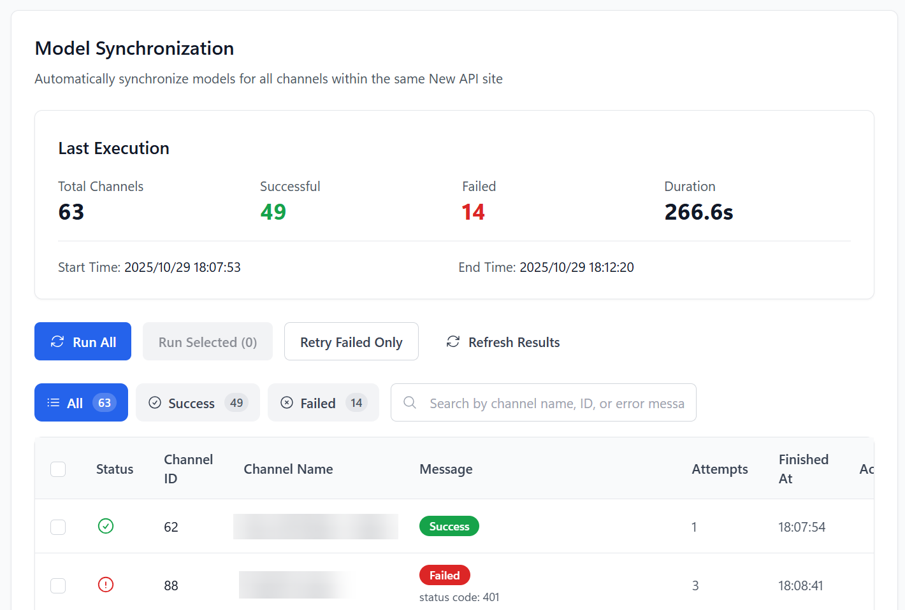

# Managed Site Model Sync

> An automation tool for administrators of self-hosted management panels (New API, AxonHub, Octopus, etc.). Automatically pulls the latest model list from upstream providers and updates your channel configurations, ensuring worry-free synchronization.

## Feature Overview

- 🔄 **Cross-Platform Auto-Sync**: Supports New API, AxonHub, Octopus, and other systems, executing sync automatically at set intervals.
- 🎯 **Flexible Sync Strategies**: Supports full sync, manually selected channel sync, or retrying only the last failed tasks.
- ⚡ **Smart Rate Limiting**: Built-in rate-limiting algorithm to avoid being flagged as an attack by upstream sites when syncing dozens or hundreds of channels in bulk.
- 📊 **Real-time Progress Monitoring**: View the sync status, HTTP status code, and duration of each channel in real-time during the sync process.
- 📜 **Detailed Execution History**: Retains the results of each sync, comparing model list changes before and after for easy tracking.

## Supported System Types

| System Type | Sync Logic |
|----------|----------|
| **New API / DoneHub / Veloera** | Calls `GET /api/channel/fetch_models` to fetch upstream models, then updates channel configuration. |
| **Octopus** | Calls `POST /api/v1/channel/fetch-model` to fetch upstream models. |
| **AxonHub** | Automatically reads and syncs the model list associated with the channel through the AxonHub management interface. |

## Prerequisites

Before starting the sync, you need to complete the connection configuration for the corresponding system (Base URL, Admin Token, or account password) in **Basic Settings -> Self-Hosted Site Management**.

::: tip Tip
After the configuration is complete, select **"Model List Sync"** on the settings page to enter the task management interface.
:::

## Core Operating Workflow

### 1. Manually Execute Tasks
On the "Model Sync" page, you can:
- **Execute All**: Scans all enabled channels and triggers synchronization.
- **Execute Selected**: Select specific channels in the table for partial updates.
- **Retry Failed Items Only**: Quickly repair channels that failed due to the last network fluctuation.

### 2. View Execution Results
The sync table displays the following key fields:
- **Status**: Success, failure, or in progress.
- **Old Model List**: Models the channel already had before synchronization.
- **New Model List**: Models obtained from the upstream interface in real-time.
- **Error Message**: If it fails, the specific error code (such as 401, 429, 500) and reason will be displayed.

### 3. Configure Automation Options
In the **Settings -> Model List Sync** panel, you can customize the sync behavior:

| Option | Recommended Value | Description |
|------|------|------|
| **Execution Interval** | 6 - 12 hours | The frequency of automatic synchronization; it is not recommended to set it too frequently. |
| **Concurrency** | 1 - 3 | The number of simultaneous sync tasks. It is recommended to keep it within 2 when there are many channels. |
| **Rate Limit (RPM)** | 20 | The maximum number of requests allowed per minute to protect upstream sites. |
| **Max Retries** | 3 | The number of automatic retries after a task fails. |

## FAQ

| Question | Solution |
|------|----------|
| No change in model list after sync | Please check if the upstream site has really updated the models, or if the API Key of the channel has permission to read the model list. |
| Frequent 429 errors | Please lower the "Requests Per Minute" or increase the "Execution Interval." |
| Unable to get AxonHub models | Please confirm that the AxonHub administrator account has sufficient permissions and that the Base URL is filled in correctly. |
| Sync causes some models to be lost | By default, sync will **overwrite** the existing model list. If you have custom models (not returned by upstream), please manually add them after sync or use the Whitelist strategy (Beta). |

## Related Docs

- [Self-Hosted Site Management](./self-hosted-site-management.md): How to configure connection information for self-hosted sites.
- [Model Redirect Management](./model-redirect.md): How to map model names after syncing models.
- [Supported Sites List](./supported-sites.md): View all compatible system types.