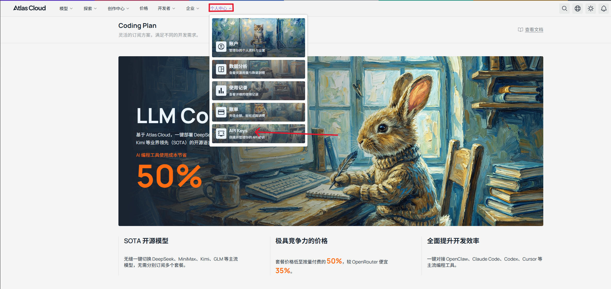
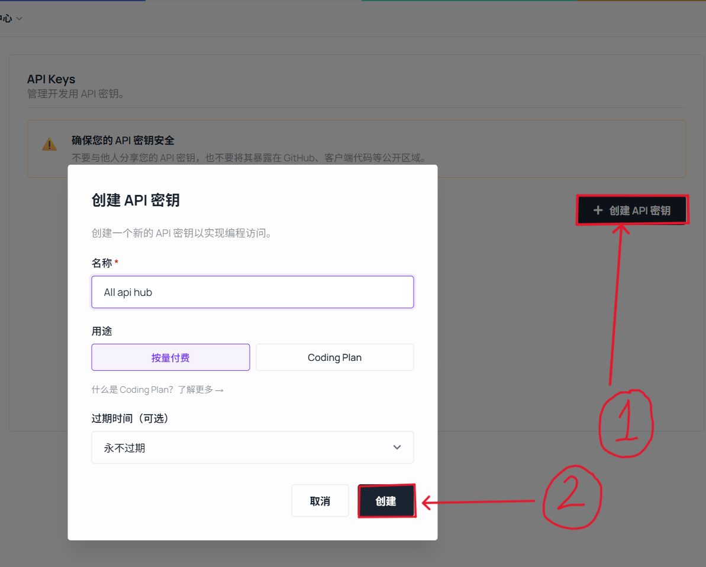
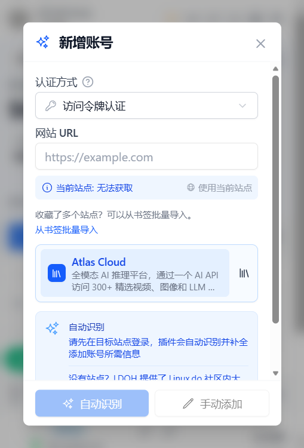
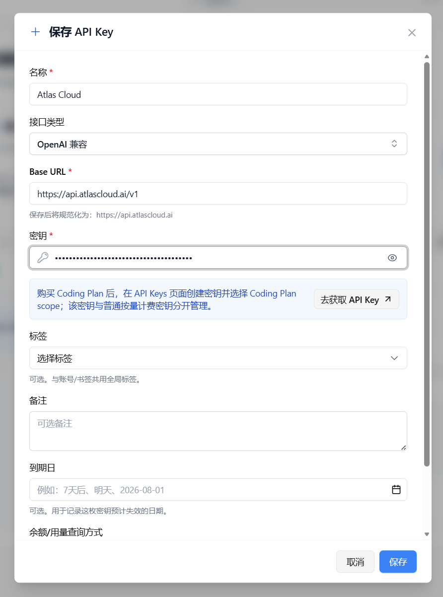
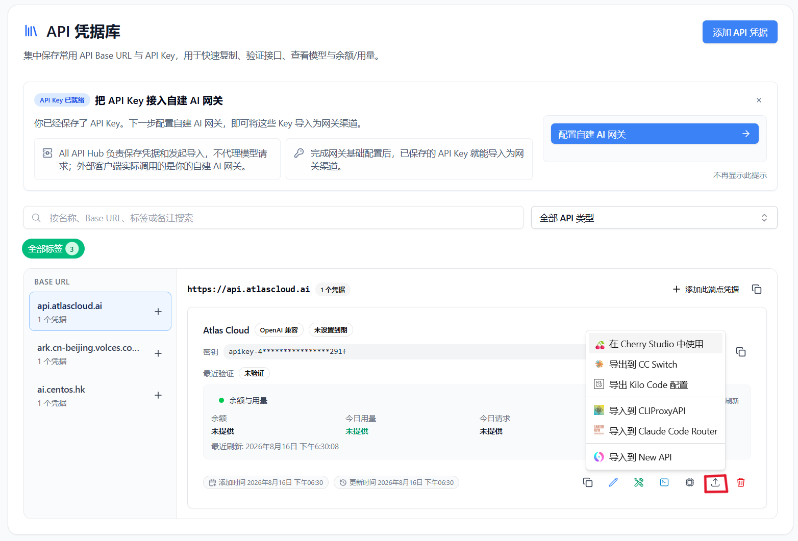

# Manage Atlas Cloud API Assets with All API Hub

> Use All API Hub with Atlas Cloud to compare model pricing and quickly export credentials to the AI tools you use.

Atlas Cloud is a multimodal AI inference platform that provides video generation, image generation, and LLM APIs through one API, with more than 300 selected models. If you use multiple Atlas Cloud accounts, several AI API platforms, or different clients, **All API Hub** gives you one local place to manage and reuse those credentials.

After adding an Atlas Cloud credential, you can check model pricing and export it to Cherry Studio, CC Switch, Kilo Code, CLIProxyAPI, Claude Code Router, or your own self-hosted backend.

---

## 1. What All API Hub Does

**All API Hub** ([open source on GitHub](https://github.com/qixing-jk/all-api-hub)) is a browser extension for managing multiple AI API accounts, sites, and client configurations. For Atlas Cloud users, it brings API keys, model pricing, and export settings into one workflow.

When used with Atlas Cloud, it helps with:

- **Centralized API credentials**: keep Atlas Cloud API keys together with other accounts in API Credential Profiles.
- **Cross-account price comparison**: compare Atlas Cloud model prices with other added accounts.
- **Credential reuse**: export managed `Base URL + API Key` values to clients, CLI tools, or self-hosted channels.
- **One-click client export**: export directly from API Credential Profiles to tools such as Cherry Studio, CC Switch, and Kilo Code.
- **Multi-device continuity**: move common configuration with data import/export or WebDAV sync.

Atlas Cloud provides the models and API, while All API Hub connects credential management, pricing comparison, and downstream tool configuration.

---

## 2. Install All API Hub

For automatic updates and the most stable experience, install from the official store for your browser when possible.

- **Chrome**: [Chrome Web Store](https://chromewebstore.google.com/detail/lapnciffpekdengooeolaienkeoilfeo)
- **Edge**: [Microsoft Edge Add-ons](https://microsoftedge.microsoft.com/addons/detail/pcokpjaffghgipcgjhapgdpeddlhblaa)
- **Firefox**: [Firefox Add-ons](https://addons.mozilla.org/firefox/addon/{bc73541a-133d-4b50-b261-36ea20df0d24})
- **Other browsers**: see the [Other Browser Installation Guide](../other-browser-install.md).
- **Safari on Mac**: see the [Safari installation guide](../safari-install.md).
- **Mobile browsers**: see the [mobile browser FAQ](../faq.md#mobile-browser-support).
- **Fallback**: download the Stable package from [GitHub Releases](https://github.com/qixing-jk/all-api-hub/releases/latest). Manual installations do not update automatically.

---

## 3. Add an Atlas Cloud API Credential

Atlas Cloud does not currently support automatic recognition, so add an API key manually. Create the key in the Atlas Cloud console first, then save it in All API Hub.

### 3.1 Add the credential manually

1. Log in to [Atlas Cloud](https://www.atlascloud.ai/console/coding-plan?utm_source=github&utm_medium=link&utm_campaign=all-api-hub).
2. Open **API Keys** in your profile and create or manage an API key.

   
   

3. Click the All API Hub extension icon in the top-right corner of the browser.
4. Click **Add Account**, find **Atlas Cloud** in the sponsor list, and select it.

   

5. Enter the key and save it.

   

:::: tip
After the credential is saved, the extension uses the imported API key to read the model list and pricing information.
::::

---

## 4. Common Atlas Cloud Workflows

### 4.1 Export to AI clients

1. Find the Atlas Cloud key in **API Credential Profiles**.
2. Click the export button.
3. Select **Cherry Studio**, **CC Switch**, **Kilo Code**, **CLIProxyAPI**, **Claude Code Router**, or a configured self-hosted channel.

You can also copy `Base URL + API Key`, verify API or CLI compatibility, view the models available to the credential, export it to multiple clients, import it as a self-hosted channel, and move it with data import/export or WebDAV sync.

::: warning Credential transfer scope
Browser local storage is only the default save location. Exporting to clients, importing into self-hosted sites, API or CLI tests, and WebDAV sync send credentials to the corresponding destination. Only send keys to destinations you trust, and revoke them when no longer needed.
:::

### 4.2 Import into a self-hosted channel

If you maintain an AI distribution backend, use Atlas Cloud as an upstream provider. Configure it under **Basic Settings -> Self-hosted Site Management**, then return to **API Credential Profiles** and import the Atlas Cloud credential into the current site. Multiple credentials can be imported in bulk.

### 4.3 Move between devices and back up

All API Hub stores data in the current browser by default. Use data import/export or WebDAV sync when moving between computers. WebDAV is used only after you explicitly configure it.

---

## 5. All API Hub vs. API Clients

| Area | All API Hub (Management) | Cherry Studio / NextChat and Similar Clients |
| --- | --- | --- |
| Core role | Manage Atlas Cloud and other AI API accounts, keys, pricing, and channels | Send chats, run inference, and manage prompts or agent workflows |
| Main actions | Credential management, price comparison, credential export, and channel import | Chat, file analysis, and agent workflows |
| Relationship | Organizes keys, Base URL, and pricing for reuse | Uses the managed credentials to call models |

Recommended workflow: manage Atlas Cloud keys, pricing, and exports in All API Hub, then use your preferred client to send requests.

---

## 6. FAQ

**Q: Does All API Hub upload my API key?**

A: By default, account and key data stays in your local browser. Exporting, self-hosted imports, API or CLI tests, and WebDAV sync send credentials to their corresponding destinations. Only send keys to destinations you trust, and revoke them when no longer needed.

**Q: Who is this best suited for?**

A: It is useful if you use multiple Atlas Cloud accounts, other AI API platforms, or several clients and devices. You can start with one account and use key management and pricing comparison.

**Q: Can I use it without a self-hosted backend?**

A: Yes. Add an Atlas Cloud credential to use key management, model price comparison, and client export. Self-hosted site management is optional.

**Q: Will exported clients continue to work independently?**

A: Yes. All API Hub only generates or fills configuration; the target client performs the actual model calls.

**Q: What is the relationship with the Atlas Cloud console?**

A: They work together. The Atlas Cloud console remains the source for account, recharge, and official service operations. All API Hub is for day-to-day keys, pricing, and client configuration.

---

## Links

- [Atlas Cloud](https://www.atlascloud.ai/console/coding-plan?utm_source=github&utm_medium=link&utm_campaign=all-api-hub)
- [All API Hub GitHub repository](https://github.com/qixing-jk/all-api-hub)
- [All API Hub documentation](https://all-api-hub.qixing1217.top/en/)
