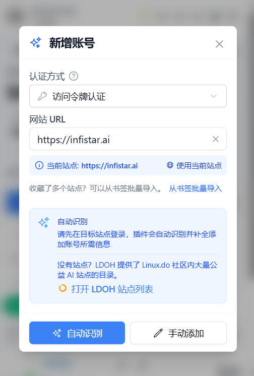
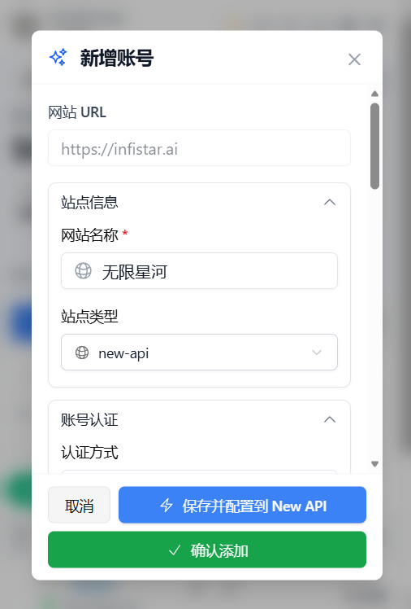
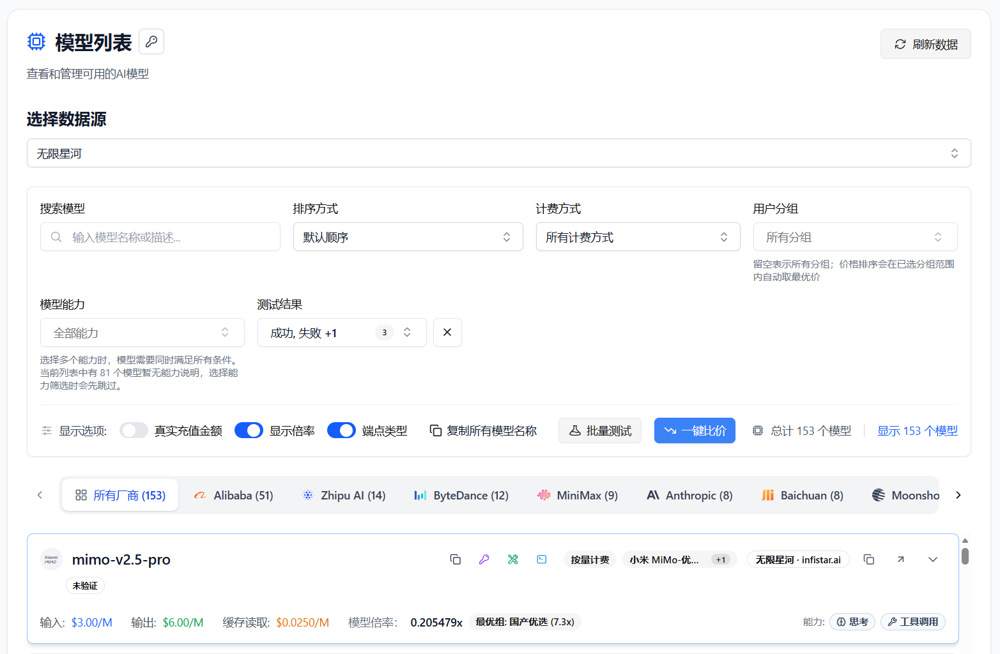
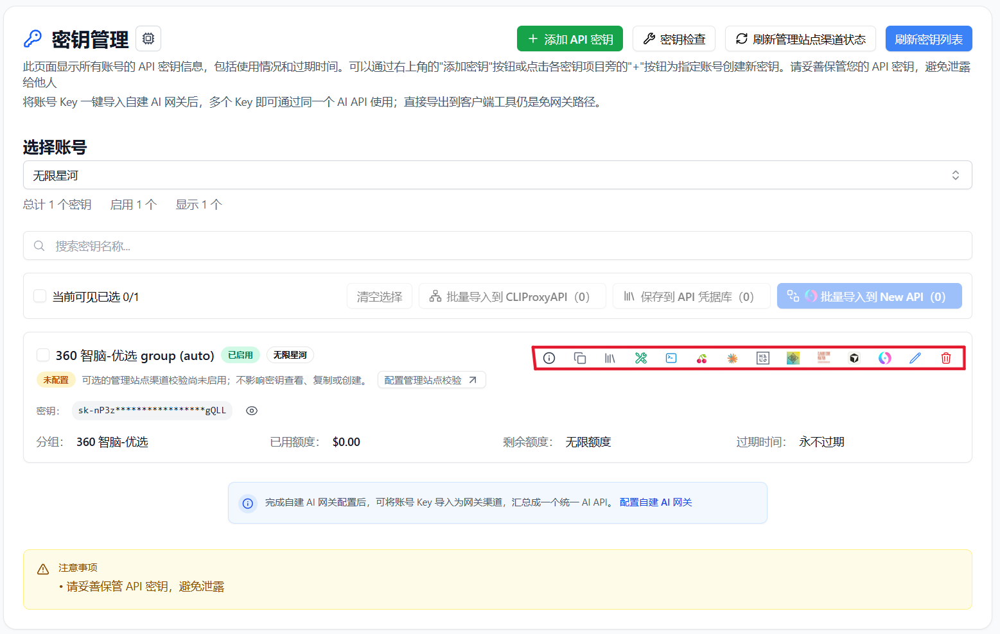

# Manage Infistar.ai with All API Hub

> Use All API Hub with Infistar.ai to check balances, compare model pricing, manage API keys, and export credentials to the AI tools you use.

Infistar.ai is an AI model routing platform. Its models are verified through real calls and include ChatGPT, Claude, Gemini, Grok, GLM, DeepSeek, Kimi, Qwen, and multimodal text, video, and image capabilities. If you use multiple Infistar.ai accounts, AI API platforms, or clients, **All API Hub** gives you one local place to manage and reuse them.

After adding an Infistar.ai account, you can view balances, manage API keys, check model pricing, and export credentials to Cherry Studio, CC Switch, Kilo Code, CLIProxyAPI, Claude Code Router, or your own self-hosted backend.

---

## 1. What All API Hub Does

**All API Hub** ([open source on GitHub](https://github.com/qixing-jk/all-api-hub)) is a browser extension for managing multiple AI API accounts, sites, and client configurations. For Infistar.ai users, it brings account status, API keys, model pricing, and export actions into one workflow.

When used with Infistar.ai, it helps with:

- **Unified multi-account dashboard**: view Infistar.ai alongside other AI API accounts.
- **Cross-account price comparison**: compare Infistar.ai model prices with other added accounts.
- **Centralized API key management**: view, create, edit, delete, and copy Infistar.ai keys.
- **Credential reuse**: export managed `Base URL + API Key` values to clients, CLI tools, or self-hosted channels.
- **Multi-device continuity**: move common configuration with import/export or WebDAV sync.

Infistar.ai provides the model API, while All API Hub organizes accounts, keys, pricing, and downstream tool configuration.

---

## 2. Install All API Hub

Install from the official store for your browser when possible: [Chrome Web Store](https://chromewebstore.google.com/detail/lapnciffpekdengooeolaienkeoilfeo), [Microsoft Edge Add-ons](https://microsoftedge.microsoft.com/addons/detail/pcokpjaffghgipcgjhapgdpeddlhblaa), or [Firefox Add-ons](https://addons.mozilla.org/firefox/addon/{bc73541a-133d-4b50-b261-36ea20df0d24}). For other browsers, Safari, mobile browsers, or a manual installation, use the [installation guides](../get-started.md) and [GitHub Releases](https://github.com/qixing-jk/all-api-hub/releases/latest).

---

## 3. Add an Infistar.ai Account

All API Hub can auto-recognize Infistar.ai accounts. Log in to Infistar.ai in your browser first, then let the extension read the current site and save the account.

### 3.1 Auto-recognize and add

1. Log in to [Infistar.ai](https://infistar.ai/register?aff=ALLAPIHUB&ref_source=link) in your browser.
2. Click the All API Hub extension icon.
3. Click **Add Account**, then use the current site address or enter the Infistar.ai address manually.

   

4. Click **Auto-Recognize**.
5. Confirm the account information and click **Save Account**.

   

:::: tip
After the account is saved, the extension uses the imported token to read balance, API keys, and model pricing information.
::::

### 3.2 Manage Infistar.ai API keys

Open **Key Management** after adding the account. You can view existing keys, create, edit, delete, and copy keys, save them to **API Credential Profiles**, and export them whenever another tool needs the credential.

---

## 4. Common Infistar.ai Workflows

### 4.1 View balance and account status

The All API Hub dashboard shows Infistar.ai alongside your other AI API accounts. Balance, status, and refresh results are shown in one place.

### 4.2 Compare model pricing

Open **Model Pricing** and select the Infistar.ai account. You can view its model list, search for a model, test availability, check input/output pricing, and compare prices with other accounts.

### 4.3 Export to AI clients

1. Find your Infistar.ai key in **Key Management**.
2. Choose an export action.
3. Select **Cherry Studio**, **CC Switch**, **Kilo Code**, **CLIProxyAPI**, **Claude Code Router**, or a configured self-hosted channel.

You can also copy `Base URL + API Key`, verify API or CLI compatibility, view available models, export to multiple clients, import into a self-hosted site, and move credentials with data import/export or WebDAV sync.

::: warning Credential transfer scope
Browser local storage is only the default save location. Exporting, self-hosted imports, API or CLI tests, and WebDAV sync send credentials to the corresponding destination. Only send keys to destinations you trust, and revoke them when no longer needed.
:::

### 4.4 Import into a self-hosted channel

Configure your backend under **Basic Settings -> Self-hosted Site Management**, then return to **Key Management** and import the Infistar.ai key into the current site. Multiple keys can be imported in bulk.

### 4.5 Move between devices and back up

Data stays in the current browser by default. Use data import/export or explicitly configured WebDAV sync to move configuration between computers.

---

## 5. All API Hub vs. API Clients

| Area | All API Hub (Management) | Cherry Studio / NextChat and Similar Clients |
| --- | --- | --- |
| Core role | Manage Infistar.ai and other AI API accounts, balances, keys, pricing, and channels | Send chats, run inference, and manage prompts or agent workflows |
| Main actions | Dashboard, key management, price comparison, credential export, and channel import | Chat, file analysis, and agent workflows |
| Relationship | Organizes source configuration | Uses managed credentials to call models |

Recommended workflow: manage Infistar.ai accounts, keys, pricing, and exports in All API Hub, then use your preferred client to send requests.

---

## 6. FAQ

**Q: Does All API Hub upload my API key?**

A: By default, account and key data stays in your local browser. Exporting, self-hosted imports, API or CLI tests, and WebDAV sync send credentials to their corresponding destinations. Only send keys to destinations you trust, and revoke them when no longer needed.

**Q: Who is this best suited for?**

A: It is useful if you have multiple Infistar.ai accounts, use other AI API platforms, or configure Infistar.ai in several clients and devices.

**Q: Can I use it without a self-hosted backend?**

A: Yes. Add an Infistar.ai account to use balance checks, key management, pricing comparison, and client export.

**Q: Will exported clients continue to work independently?**

A: Yes. All API Hub only generates or fills configuration; the target client performs the actual model calls.

**Q: What is the relationship with the Infistar.ai console?**

A: They work together. The Infistar.ai console remains the source for account, recharge, and official service operations. All API Hub is for day-to-day account status, API keys, pricing, and client configuration.

---

## Links

- [Infistar.ai](https://infistar.ai/register?aff=ALLAPIHUB&ref_source=link)
- [All API Hub GitHub repository](https://github.com/qixing-jk/all-api-hub)
- [All API Hub documentation](https://all-api-hub.qixing1217.top/en/)
