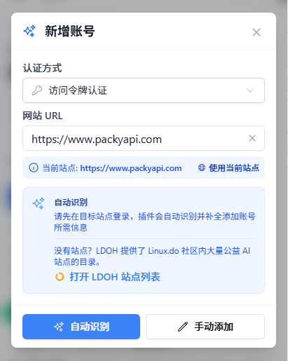
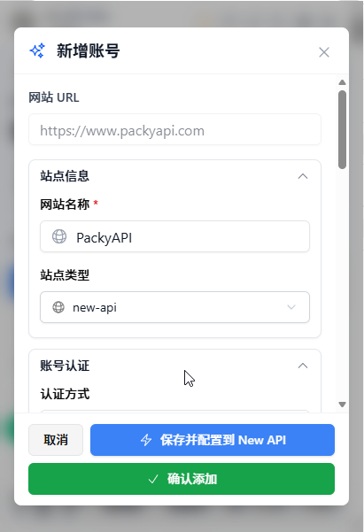
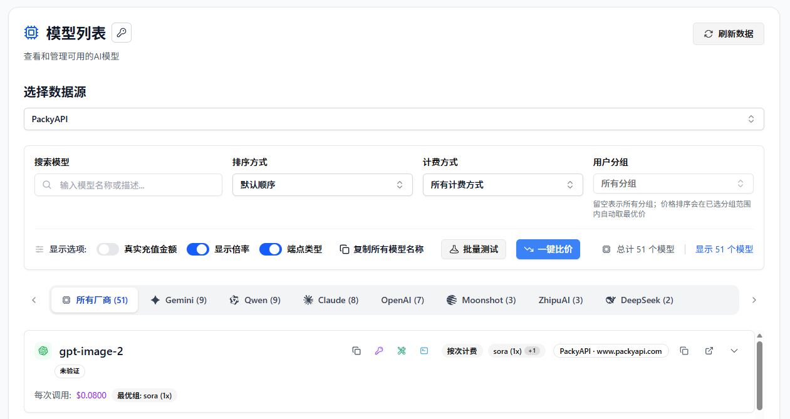
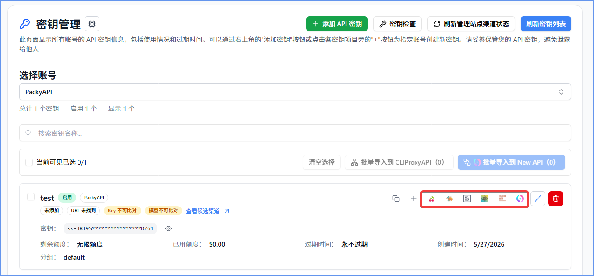

# Managing PackyCode API Assets with All API Hub

> Use All API Hub with PackyCode to check balances, compare model pricing, manage API keys, and export credentials to the AI tools you already use.

PackyCode offers relay services for Claude Code, Codex, Gemini, and more. If you use multiple PackyCode accounts, work across several AI API platforms, or often configure PackyCode in different clients, **All API Hub** can keep those accounts and credentials in one local management entry point.

After adding a PackyCode account, you can view balances, manage API keys, check model pricing, and export credentials to Cherry Studio, CC Switch, Kilo Code, CLIProxyAPI, Claude Code Router, or your own self-hosted backend.

---

## 1. What All API Hub Does

**All API Hub** ([open source on GitHub](https://github.com/qixing-jk/all-api-hub)) is a browser extension for AI API users who need to manage multiple accounts, sites, and client configurations. For PackyCode users, it brings PackyCode account status, API keys, model pricing, and export actions into one workflow.

When used with PackyCode, it helps with:

- **Unified multi-account dashboard**: view PackyCode together with other AI API accounts.
- **Cross-account price comparison**: compare PackyCode model prices with other added accounts.
- **Centralized API key management**: view, create, edit, delete, and copy PackyCode API keys.
- **Credential reuse**: export managed `Base URL + API Key` credentials to clients, CLI tools, or self-hosted channels.
- **Multi-device continuity**: move common configuration with import/export or WebDAV sync.

PackyCode provides the model API, and All API Hub helps organize the account, key, pricing, and downstream tool configuration around it.

---

## 2. Install All API Hub

For automatic updates and the most stable experience, install from the official store for your browser when possible.

### Desktop Browsers

- **Chrome**: [Chrome Web Store](https://chromewebstore.google.com/detail/lapnciffpekdengooeolaienkeoilfeo)
- **Edge**: [Microsoft Edge Add-ons](https://microsoftedge.microsoft.com/addons/detail/pcokpjaffghgipcgjhapgdpeddlhblaa)
- **Firefox**: [Firefox Add-ons](https://addons.mozilla.org/firefox/addon/{bc73541a-133d-4b50-b261-36ea20df0d24})

### Other Environments

- **QQ / 360 / Brave / Vivaldi / Opera, etc.**: Brave, Vivaldi, and Opera can usually try Chrome Web Store first; QQ Browser, 360 Browser, Cheetah Browser, and similar browsers can use manual Chromium loading when no usable store path is available. See the [Other Browser Installation Guide](../other-browser-install.md).
- **Safari on Mac**: see the [Safari installation guide](../safari-install.md).
- **Mobile browsers**: see the [mobile browser FAQ](../faq.md#mobile-browser-support).
- **Fallback option**: if your browser cannot use a store build or Chrome Web Store compatible build, and the guide above does not work, download the Stable package from [GitHub Releases](https://github.com/qixing-jk/all-api-hub/releases/latest). Manually installed builds do not update automatically.

---

## 3. Add a PackyCode Account

All API Hub can auto-recognize PackyCode accounts. Log in to PackyCode in your browser first, then let the extension read the current site and save the account.

### 3.1 Auto-Recognize and Add

1. Log in to [PackyCode](https://www.packyapi.com/register?aff=all-api-hub) in your browser.
2. Click the All API Hub extension icon in the top-right corner of the browser.
3. Click **Add Account**, then use the current site address or manually enter the PackyCode address.

   

4. Click **Auto-Recognize**.
5. Confirm the account information, then click **Save Account**.

   

:::: tip
After the account is saved, the extension uses the imported account token to read balance, API key, and model pricing information.
::::

### 3.2 Manage PackyCode API Keys

After adding the account, open **Key Management** to manage PackyCode API keys:

- View existing API keys under the account.
- Create a new key, or edit and delete existing keys.
- Copy frequently used keys, or save them to **API Credential Profiles** for reuse.
- Export credentials from the key list or credential profile when you need to configure another tool.

Use **Key Management** for day-to-day PackyCode key organization. Use export actions when you want to reuse the same key in a client, CLI tool, or self-hosted backend.

---

## 4. Common PackyCode Workflows

### 4.1 View Balance and Account Status

The All API Hub dashboard shows PackyCode alongside your other AI API accounts. Balance, status, and refresh results are shown in one place, which is useful when you manage multiple accounts.

### 4.2 Compare Model Pricing

Open **Model Pricing** and select the PackyCode account as the data source. You can:

- View the model list returned by PackyCode.
- Search for a model and test whether it is available.
- Check input and output pricing for each model.
- Compare PackyCode pricing with models from other added accounts.

### 4.3 Export to AI Clients

To use PackyCode in another tool:

1. Find your PackyCode key in **Key Management**.
2. Choose an export action.
3. Select the target tool, such as **Cherry Studio**, **CC Switch**, **Kilo Code**, **CLIProxyAPI**, **Claude Code Router**, or a configured self-hosted site.

You can also:

- Copy `Base URL + API Key` for manual configuration.
- Verify whether the API is available, including CLI compatibility checks.
- View the model list available through the credential.
- Export the same credential to multiple clients.
- Import the credential into a configured self-hosted site as a new channel.
- Move the credential with data import/export or WebDAV sync.

### 4.4 Import into a Self-Hosted Channel

If you maintain an AI distribution backend, you can use PackyCode as an upstream provider. Configure your backend under **Basic Settings -> Self-hosted Site Management**, then return to **Key Management** and import the PackyCode key into the current self-hosted site. You can also select multiple keys and import them in bulk.

### 4.5 Back Up and Move Between Devices

All API Hub stores data in the current browser by default. If you work across several computers, use data import/export or WebDAV sync to move configuration. Data is synced to WebDAV only after you explicitly configure it.

---

## 5. All API Hub vs. API Clients

| Area | All API Hub (Management) | Cherry Studio / NextChat and Similar Clients |
| --- | --- | --- |
| Core role | Manage PackyCode and other AI API accounts, balances, keys, pricing, and channels | Send chats, run inference, and manage prompts or agent workflows |
| Main actions | Dashboard, key management, price comparison, credential export, channel import | Chat, file analysis, and agent workflows |
| Relationship | Organizes source configuration such as keys, Base URL, pricing, and account status | Uses the managed credentials to call models |

Recommended workflow: manage PackyCode accounts, keys, pricing, and exports in All API Hub, then use your preferred client to send requests.

---

## 6. FAQ

**Q: Does All API Hub upload my API key?**

A: By default, account and key data stays in your local browser. It is synced only if you explicitly enable WebDAV sync and configure your own WebDAV storage.

**Q: Who is this best suited for?**

A: It is useful if you have multiple PackyCode accounts, also use other AI API platforms, or often configure PackyCode in several clients and devices. You can still start with one PackyCode account and use balance checks, key management, and pricing comparison.

**Q: Can I use All API Hub without a self-hosted backend?**

A: Yes. After adding a PackyCode account, you can view balances, manage keys, compare prices, and export to clients. Self-hosted site management is only needed if you maintain an AI distribution backend.

**Q: Will exported clients continue to work independently?**

A: Yes. All API Hub only helps generate or fill configuration. Actual model calls are still handled by the target client.

**Q: What is the relationship between All API Hub and the PackyCode console?**

A: They work together. The PackyCode console remains the source for account, recharge, and official service operations. All API Hub is better suited for day-to-day account status, API key, pricing, and client configuration management.

---

## Links

- [PackyCode](https://www.packyapi.com/register?aff=all-api-hub)
- [All API Hub GitHub repository](https://github.com/qixing-jk/all-api-hub)
- [All API Hub documentation](https://all-api-hub.qixing1217.top/en/)
