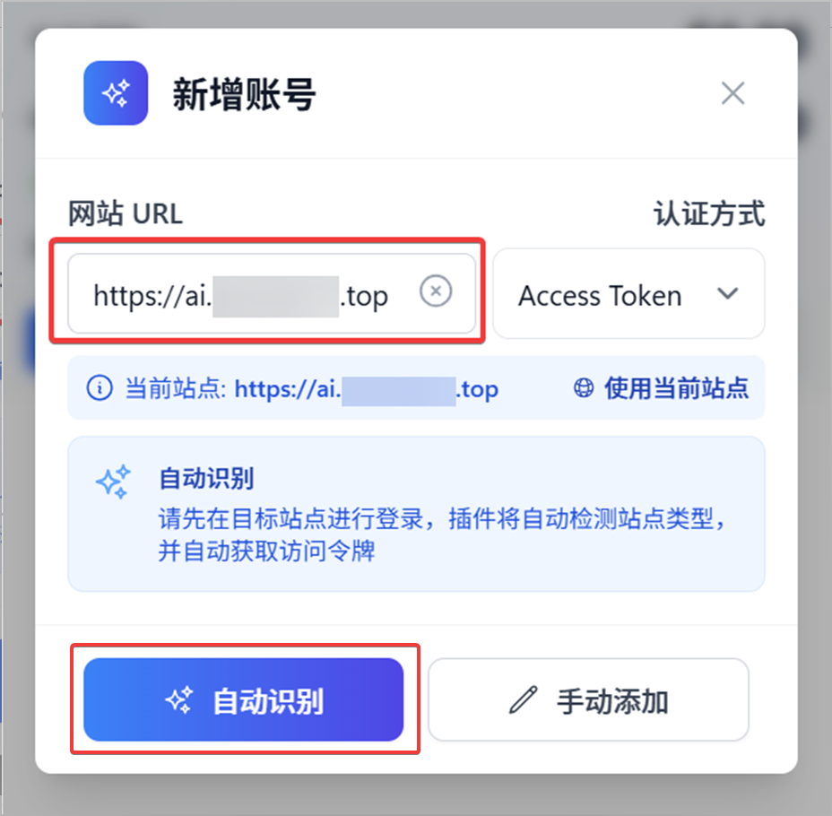

# アカウント管理

> このドキュメントでは、All API Hub で AI サイトのアカウントを効率的に追加、整理、および維持する方法について説明します。

## 1. アカウントの追加

All API Hub は、さまざまなサイトタイプやセキュリティ設定に対応するために、複数のアカウント追加方法をサポートしています。

### 1.1 自動認識 (推奨)
これが最も簡単な方法です。まずブラウザで対象サイトにログインしてから、拡張機能で以下の操作を行います：
1. **「アカウントを追加」**をクリックします。
2. **サイト URL** を入力します。
3. **「自動検出」**をクリックします。
4. 拡張機能がサイト種別と現在ログイン中のアカウントを識別し、アカウント追加に必要な情報を自動補完します。

### 1.2 手動追加

必要な情報とその確認場所はサイト種別によって異なります。以下では New API 系サイトを例に、アカウントを手動で追加する方法を説明します。

1. **「アカウント管理」**を開き、**「アカウントを追加」**をクリックします。
2. **サイト URL** を入力して認証方法を選び、**「手動追加」**をクリックします。
3. 展開されたフォームに以下の情報を入力します：
   - **サイト名**：拡張機能内でアカウントを識別するための任意の名前です。
   - **サイト種別**：`new-api` を選択します。
   - **ユーザー名、ユーザー ID**：通常はサイトの「個人設定」または「パーソナルセンター」で確認できます。
   - **Access Token**：サイトの個人設定にあるシステムアクセストークンを入力します。「トークン管理」でモデル呼び出しに使用する API キーとは異なります。
   - **チャージ金額レート**：0 より大きい `CNY/USD` レートを入力します。不明な場合は、サイトに表示されているチャージレートを確認してください。
4. 入力内容を確認し、**「アカウントを保存」**をクリックします。

::: tip 入力時の推奨設定
**Access Token 認証**を優先してください。保存後にアカウントを更新できない場合は、まずサイト種別、ユーザー ID、Access Token が正しいか確認します。対象サイトで明示的に必要な場合にのみ Cookie 認証を試してください。
:::

::: warning アカウント情報を保護してください
Access Token と Cookie は機密情報です。完全な内容を他人と共有したり、公開スクリーンショットや問題報告に含めたりしないでください。
:::

### 1.3 Cookie モード
インターフェース保護が厳しいサイトや特殊なカスタマイズが施されたサイトで、アクセストークンモードが機能しない場合は、**「Cookie モード」**への切り替えを試すことができます。このモードでは、拡張機能は現在のログインセッション（Cookie）を使用してデータをリクエストします。

---

## 2. 追加体験の最適化

**「設定 -> 基本設定 -> アカウント管理」**で、以下の機能を有効にしてアカウント追加の効率を向上させることができます：

- ⚡ **現在のページ URL を自動入力**：有効にすると、「アカウントを追加」をクリックしたときに現在のブラウザタブの URL が自動的に入力され、手動でコピーする手間が省けます。
- 🔑 **追加後にデフォルトトークンを自動プロビジョニング**：有効にすると、アカウントの追加に成功した後、拡張機能がサイトのバックエンドでデフォルトの API キー（トークン）を自動的に作成しようとします。これにより、すぐにエクスポートして使用できるようになります。
  - **AIHubMix**：AIHubMix の API キーの完全な内容は、作成時に一度だけ表示されます。新しい AIHubMix アカウントを追加した後（「ホスティングサイトへの設定」プロセスを除く）、拡張機能はまず、そのアカウントに既にトークンがあるかどうかを確認します。トークンがある場合は、作成プロンプトをスキップします。トークンがない場合は、確認ダイアログが表示され、デフォルトのキーをすぐに作成して一度だけ表示するかどうかを尋ねます。キャンセルした場合、後で「キー管理」で手動で作成し、すぐに完全なキーを保存する必要があります。
- ⚠️ **重複アカウント追加時の警告**：既存のサイト（同じ URL）を追加しようとすると、拡張機能が確認プロンプトを表示し、誤って重複して追加されるのを防ぎます。あなたは、今回の追加を続行するか、操作をキャンセルするか、または後続の重複アカウント警告を直接閉じて今回の追加を続行するかを選択できます。

---

## 3. 重複アカウントのクリーンアップ

誤って多くの重複アカウントを追加してしまった場合は、組み込みのクリーンアップツールを使用できます：

1. **「設定 -> アカウント管理」**に移動します。
2. ツールバーの**「重複アカウントのクリーンアップ」**をクリックします。
3. 拡張機能が `サイト URL + ユーザー ID` に基づいてすべてのアカウントをスキャンします。
4. 重複項目をプレビューして**「一括クリーンアップ」**を選択できます。システムは、更新時間が最も新しいもの（またはデータが最も完全なもの）を自動的に保持します。

---

## 4. アカウントの整理と並べ替え

アカウントの数が増えても、以下の方法でリストを整理しておくことができます：

### 4.1 タグ
- アカウントにタグを追加します（例：`仕事`, `個人`, `リレー`, `公式サイト`）。
- パネル上部のタグで素早くフィルタリングできます。
- タグシステムはブックマークや API 認証情報庫と共有されており、グローバルな名前変更をサポートしています。

### 4.2 固定
- アカウントカードにホバーして**「固定」**アイコンをクリックします。
- 固定されたアカウントは常にリストの一番上に表示されます。

### 4.3 並べ替えの優先順位
- **「設定 -> 並べ替えの優先順位」**で、グローバルな並べ替えロジックをカスタマイズできます。詳細は[ソート優先度設定](./sorting-priority.md)を参照してください。
- 残高、作成時間、ヘルスステータス、チェックインステータスなどの要素によるマルチレベルの並べ替えをサポートしています。
- アカウントリストでドラッグして手動で順序を調整することもできます（手動並べ替えモードへの切り替えが必要です）。

### 4.4 残高と今日の収益統計
- 新規または編集アカウントの追加時に、**「総残高から除外」**を有効にすると、そのアカウントはポップアップ、アカウントリスト、および共有概要スナップショットの総残高集計に含まれなくなります。これは、アカウントの更新、チェックイン、またはリスト表示には影響しません。
- 特定のアカウントの収益をその日の合計に含めたくない場合は、**「今日の収益から除外」**を有効にすることができます。このスイッチは、ポップアップ、アカウントリスト、および共有概要スナップショットの今日の収益合計にのみ影響し、アカウントを非表示にしたり、更新やチェックインを停止したりすることはありません。

---

## 5. ヘルスステータスとエラーコード

拡張機能はアカウントの接続性をリアルタイムで監視します。アカウントカードに「警告」または「異常」が表示されている場合、通常は以下の理由が考えられます：

- **401 Unauthorized**: ログインが無効であるか、アクセストークンが期限切れです。
- **429 Too Many Requests**: サイトのレート制限（頻度制限）に達しました。拡張機能は自動的にキューに入れ、再試行します。
- **403 Forbidden**: 通常、Cloudflare の保護がトリガーされたことを示します。[Cloudflare バイパスアシスタント](./cloudflare-helper.md)を参照してください。

カードのヘルスステータスアイコンをクリックすると、詳細なエラーメッセージを表示できます。その他の一般的なエラー処理については、[よくある質問](./faq.md)を参照してください。

---

## 6. 一括操作

アカウント管理ページでは、複数のアカウントにチェックを入れて以下の一括操作を実行できます：
- **一括更新**：選択したアカウントの残高と使用状況を即座に更新します。
- **一括チェックイン**：選択したアカウントのチェックインプロセスを手動でトリガーします。
- **一括エクスポート**：複数のアカウントの設定をバックアップ用に JSON ファイルとしてエクスポートします。
- **一括削除**：選択したアカウントを安全に削除します。

---

## 関連ドキュメント

- [クイックスタート](./get-started.md)
- [自動更新とリアルタイムデータ](./auto-refresh.md)
- [自動チェックインとモニタリング](./auto-checkin.md)
- [シェアスナップショット](./share-snapshot.md)
