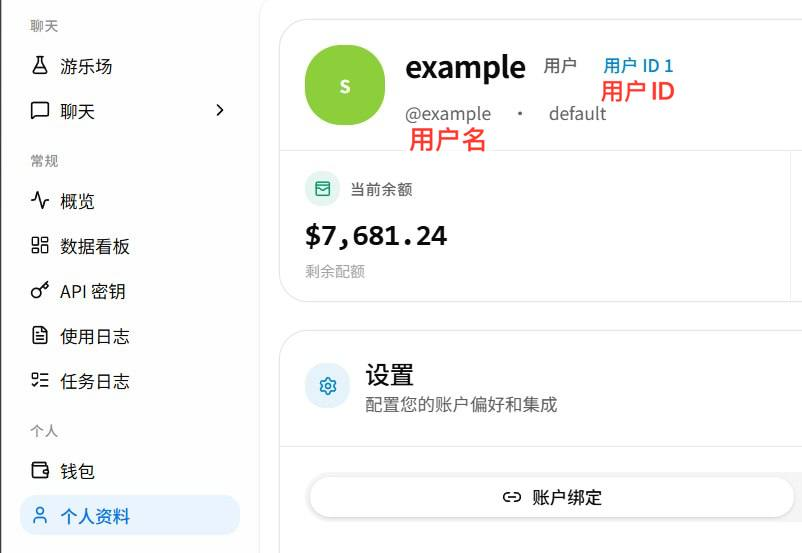
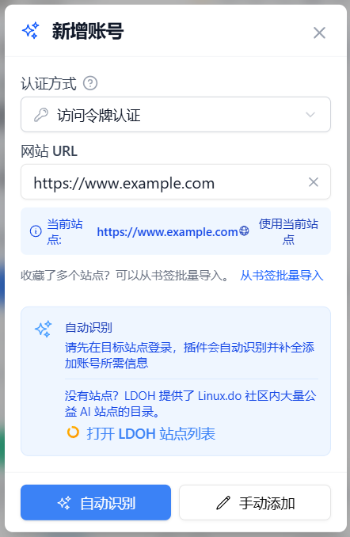
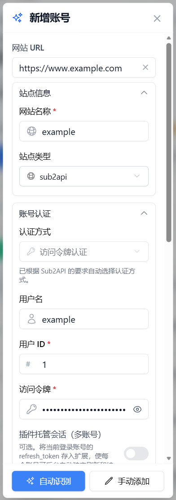
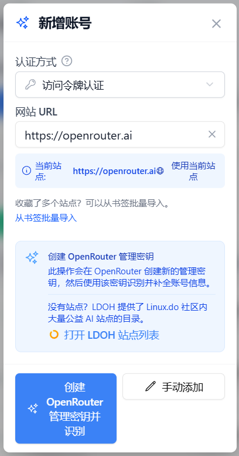
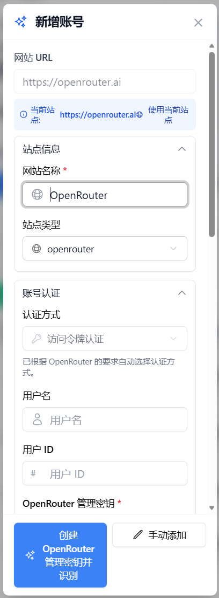

# アカウントの追加

> このガイドでは、自動認識、手動入力、またはブックマークの取り込みを使って、AI サイトのアカウントを All API Hub に追加する方法を説明します。追加後の整理、並べ替え、一括操作については、[アカウント管理](./account-management.md)を参照してください。

## 1. 自動認識（推奨）

最も簡単な追加方法です。まずブラウザで対象サイトにログインしてから、次の操作を行います。

1. **「アカウントを追加」**をクリックします。
2. **サイト URL** を入力します。
3. **「自動認識」**をクリックします。
4. 拡張機能がサイト種別と現在ログイン中のアカウントを識別し、必要な情報を自動入力します。
5. 内容を確認してアカウントを保存します。

サイトで Cloudflare 認証が使われている場合、拡張機能は補助ウィンドウを開き、認証完了後に検出を続行します。自動認識に失敗した場合は、[よくある質問](./faq.md)でログイン状態、認証方法、サイト互換性を確認するか、以下の手動追加を使用してください。

## 2. 手動追加

必要な情報とその確認場所は、サイト種別によって異なります。以下では、サイト種別ごとに手動追加の方法を説明します。

> **サイト種別**は任意です。選択しなくてもアカウントを保存できます。その場合、サイト種別は一旦 `unknown` として記録され、後の更新や認識で自動補完されることがあります。

クイックリンク：

- [New API](#manual-new-api)
- [Sub2API](#manual-sub2api)
- [OpenRouter](#manual-openrouter)

### 2.1 New API

> New API のカスタマイズ版によって、ページ構成、ボタン名、機能の場所が異なる場合があります。実際に利用しているサイトの画面を優先してください。

1. New API サイトにログインします。
2. ブラウザのツールバーにある **All API Hub** 拡張機能アイコンをクリックします。入力内容を見比べやすいように、サイドパネルで開くことを推奨します。
3. **「アカウントを追加」**をクリックし、現在のサイトアドレスを使用するか、アドレスを手動入力します。
4. **「手動追加」**をクリックします。

   

5. 次の項目を入力します。項目名をクリックすると、それぞれの説明に移動できます。

   - [**サイト名**](#manual-new-api-site-name)
   - [**サイト種別**](#manual-new-api-site-type)
   - [**ユーザー名、ユーザー ID**](#manual-new-api-user-id)
   - [**Access Token**](#manual-new-api-access-token)

   

   **サイト名**：拡張機能内でアカウントを区別するための任意の名前です。

   

   **サイト種別**：`new-api` を選択します。

   

   

   **5.1 ユーザー名とユーザー ID の確認方法**

   New API サイトにログインし、「プロフィール」または「個人情報」ページを開きます。ユーザー名とユーザー ID はこのページで確認できます。

   

   

   **5.2 Access Token の確認方法**

   New API のプロフィールページを下にスクロールし、「セキュリティ」欄の Access Token を探します。クリックするとトークンを生成または取得できます。この Access Token は、モデル呼び出しに使う「トークン管理」の API キーとは異なります。

   

6. 0 より大きい **チャージ金額レート**（`CNY/USD`）を入力して、アカウントを保存します。実際に利用するサイトでチャージレートを確認し、そのサイトで使われている値を入力してください。

   

::: tip 入力時の推奨設定
**Access Token 認証**を優先してください。保存後にアカウントを更新できない場合は、まずサイト種別、ユーザー ID、Access Token が正しいか確認します。対象サイトで明示的に必要な場合にのみ Cookie 認証を試してください。
:::

::: warning アカウント情報を保護してください
Access Token と Cookie は機密情報です。完全な内容を他人と共有したり、公開スクリーンショットや問題報告に含めたりしないでください。
:::

### 2.2 Sub2API

> Sub2API サイトによって、ページ構成、ボタン名、機能の場所が異なる場合があります。実際に利用しているサイトの画面を優先してください。
> Sub2API の Access Token はブラウザの Local Storage に保存され、ログイントークンには有効期限があります。**自動認識**（第 1 節）の使用を推奨します。手動で追加する場合は、以下の手順に従ってください。

1. Sub2API サイトにログインします。
2. ブラウザのツールバーにある **All API Hub** 拡張機能アイコンをクリックします。入力内容を見比べやすいように、サイドパネルで開くことを推奨します。
3. **「アカウントを追加」**をクリックし、現在のサイトアドレスを使用するか、アドレスを手動入力します。
4. **「手動追加」**をクリックします。

   

5. 次の項目を入力します。項目名をクリックすると、それぞれの説明に移動できます。

   - [**サイト名**](#manual-sub2api-site-name)
   - [**サイト種別**](#manual-sub2api-site-type)
   - [**ユーザー ID**](#manual-sub2api-user-id)
   - [**Access Token**](#manual-sub2api-access-token)

   

   **サイト名**：拡張機能内でアカウントを区別するための任意の名前です。

   

   **サイト種別**：`sub2api` を選択します。

   

   

   **5.1 ユーザー ID の確認方法**

   Sub2API のプロフィールページにはユーザー名とメールアドレスだけが表示され、数値のユーザー ID は直接表示されません。ブラウザの開発者ツールで確認してください。

   1. Sub2API サイトにログインしてから、`F12` を押して開発者ツールを開きます。
   2. **Network（ネットワーク）**タブに切り替え、`F5` を押してページを再読み込みします。
   3. リクエスト一覧から `auth/me` を見つけて開き、**Response（レスポンス）**を選択します。
   4. `"data"` 内の `"id"` フィールドを探します。この数値がユーザー ID です。

   > 別の方法：開発者ツールで **Application（アプリケーション）** → **Local Storage** → サイトのドメインを開き、`auth_user` を探します。その `id` フィールドもユーザー ID です。

   

   **5.2 Access Token の確認方法**

   Sub2API の Access Token はページに表示されず、ブラウザの Local Storage に保存されています。開発者ツールで取得してください。

   1. Sub2API サイトにログインしてから、`F12` を押して開発者ツールを開きます。
   2. **Application（アプリケーション）** → **Local Storage** → サイトのドメインを開きます。
   3. `auth_token` を探し、通常 `eyJ` で始まる長い文字列をコピーします。これが Access Token です。

   > このトークンはサイトへのログインに使用します。「API キー」ページでモデル呼び出しに使う API キーとは異なります。

   ::: warning トークンの有効期限と拡張機能管理セッション
   Sub2API の Access Token には有効期限があります。拡張機能がバックグラウンドで独立してセッションを更新できるようにするには、次の手順で `refresh_token` を取り込むか入力します。

   1. まずシークレット / プライベートウィンドウで対象の Sub2API サイトにログインすることを推奨します。
   2. アカウントフォームで **「拡張機能管理セッション（複数アカウント）」**を有効にします。
   3. 表示された **「現在ログイン中のアカウントから取り込む」**をクリックします。拡張機能は現在のログインセッションの Local Storage から `refresh_token` を読み取り、取得できる Access Token、ユーザー ID、ユーザー名も補完します。
   4. 自動取り込みに失敗した場合は、開発者ツールで **Application（アプリケーション）** → **Local Storage** → サイトのドメインを開き、`refresh_token` をコピーして、フォームの **「Refresh Token」**入力欄に貼り付けます。
   5. Refresh Token が入力されていることを確認してアカウントを保存し、取り込みに使ったシークレット / プライベートウィンドウを閉じます。サイトのコンソールと拡張機能が同じ Refresh Token を並行してローテーションすることを防げます。

   管理セッションを有効にしたまま Refresh Token が空の場合は保存できません。管理セッションを無効にしている場合、拡張機能は Refresh Token を保存しません。ブラウザで対象アカウントにログインしている間だけ、一時ウィンドウ経由で再同期できることがあります。ログイン状態が失効した後は、再ログインまたは認証情報の更新が必要です。
   :::

6. 0 より大きい **チャージ金額レート**（`CNY/USD`）を入力して、アカウントを保存します。

   自動認識では、まずサイトが返すチャージ換算設定を使用します。サイトから有効な値が得られない場合にのみ、既定値 **7.2** にフォールバックします。実際のチャージレートに合わせて手動で調整することもできます。この値は画面上の残高換算にのみ使われ、アカウント機能には影響しません。

   

::: tip 入力時の推奨設定
Sub2API は **Access Token 認証のみ**をサポートし、Cookie モードには対応していません。トークンを読み取り、ユーザー ID を自動補完できる **自動認識**を優先してください。保存後に更新できない場合は、まずサイト種別、ユーザー ID、Access Token が正しいか確認します。
:::

::: warning アカウント情報を保護してください
Access Token は機密情報です。完全な内容を他人と共有したり、公開スクリーンショットや問題報告に含めたりしないでください。
:::

### 2.3 OpenRouter

1. OpenRouter にログインします。
2. ブラウザのツールバーにある **All API Hub** 拡張機能アイコンをクリックします。入力内容を見比べやすいように、サイドパネルで開くことを推奨します。
3. **「アカウントを追加」**をクリックし、現在のサイトアドレスを使用するか、アドレスを手動入力します。
4. **「手動追加」**をクリックします。

   

5. 次の項目を入力します。項目名をクリックすると、それぞれの説明に移動できます。

   - [**サイト名**](#manual-openrouter-site-name)
   - [**サイト種別**](#manual-openrouter-site-type)
   - [**Access Token**](#manual-openrouter-access-token)

   

   **サイト名**：拡張機能内でアカウントを区別するための任意の名前です。

   

   **サイト種別**：`openrouter` を選択します。

   

   

   **5.1 Access Token の確認方法**

   OpenRouter のコンソールで **「Management Keys」**を開き、右上の **「+ New Key」**をクリックします。フォームに入力して **「Create」**をクリックし、新しい API キーをコピーして、All API Hub の **「OpenRouter 管理キー」**欄に入力します。

   > キーの完全な内容は一度しか表示されません。紛失した場合は、新しいキーを作成して入力し直してください。

   クイックリンク：[https://openrouter.ai/settings/management-keys](https://openrouter.ai/settings/management-keys)

   

6. 0 より大きい **チャージ金額レート**（`CNY/USD`）を入力して、アカウントを保存します。この値は USD 残高を CNY 表示に換算するために使われます。希望する換算レートを入力してください。OpenRouter のアカウントや請求には影響しません。

   

::: tip 入力時の推奨設定
OpenRouter は常に **Management Key（Access Token）**で認証します。ユーザー ID は不要で、Cookie モードにも対応していません。保存後に更新できない場合は、OpenRouter の Management Keys ページで作成したキーか確認してください。既存キーの完全な内容は再表示できないため、新しく作成してすぐにコピーする必要があります。
:::

::: warning アカウント情報を保護してください
Management Key は機密情報です。完全な内容を他人と共有したり、公開スクリーンショットや問題報告に含めたりしないでください。
:::

## 3. Cookie モード

API の保護が厳しいサイトや大幅にカスタマイズされたサイトで Access Token モードが動作しない場合は、**「Cookie モード」**を試してください。このモードでは、拡張機能が現在のログインセッション（Cookie）を使ってデータを取得します。

Cookie には有効期限があり、すべてのサイトで使用できるわけではありません。まず自動認識と Access Token 認証を試し、対象サイトで明示的に必要な場合にのみ Cookie モードへ切り替えてください。

## 4. ブックマークからアカウントを一括取り込み

AI 中継サイトをブラウザのブックマークに保存している場合は、「ブックマークから取り込む」でスキャンし、複数のアカウント候補を作成できます。

- 入口はアカウント管理ページ上部と、「アカウントを追加」ダイアログ内の「ブックマークからアカウントを取り込む」にあります。
- ブックマークへのアクセスは**任意権限**です。ユーザーが許可した場合にのみ、拡張機能がブックマークを読み取れます。
- 処理の流れ：

  > 権限を許可 → ブックマークツリーを読み取り → 範囲を選択 → スキャンして候補を作成 → プレビュー → 取り込み → 結果を集計

- 既存のアカウントは既定でスキップされ、重複して取り込まれません。
- 取り込み後、成功、失敗、スキップが個別に集計されます。既存アカウントは既定でスキップに含まれます。
- 失敗した項目は「アカウント追加を開く」から処理を続けられます。

## 5. アカウント追加を効率化する

**設定 → 基本設定 → アカウント管理**で、次の項目を有効にするとアカウント追加を効率化できます。

- ⚡ **現在のページ URL を自動入力**：オンにすると、「アカウントを追加」をクリックした際に、現在のブラウザタブの URL が自動入力されます。
- 🔑 **アカウント追加後に既定のトークンを自動作成**：アカウントの追加に成功すると、サイト側で既定の API キー（Token）の作成を試み、すぐにエクスポートできるようにします。
  - **AIHubMix**：AIHubMix の完全な API キーは作成時に一度だけ表示されます。新しい AIHubMix アカウントを追加した後（「Managed Site に設定」フローを除く）、拡張機能は既存のキーを確認します。キーがある場合は作成確認を表示しません。ない場合は、既定キーを作成するか確認し、一度だけ完全なキーを表示します。キャンセルした場合は、後でキー管理から作成し、完全なキーをすぐに保存してください。
- ⚠️ **重複アカウント追加時に警告**：同じ URL の既存サイトを追加しようとすると確認が表示されます。今回の追加を続行、キャンセル、または今後の重複警告を無効にして続行できます。

::: tip 新しいプロファイルの既定値
アカウント設定が未構成の新しいプロファイルでは、既定値は次のとおりです。

- URL の自動入力：オフ
- アカウント追加後に既定のトークンを自動作成：オフ
- 重複アカウント追加時に警告：オン
- 並べ替えの優先順位：10 項目すべてオン

これは新しいプロファイルの既定値であり、設定変更後も固定される値ではありません。
:::

## 関連ドキュメント

- [アカウント管理](./account-management.md)
- [クイックスタート](./get-started.md)
- [対応サイトとシステム種別](./supported-sites.md)
- [よくある質問](./faq.md)
