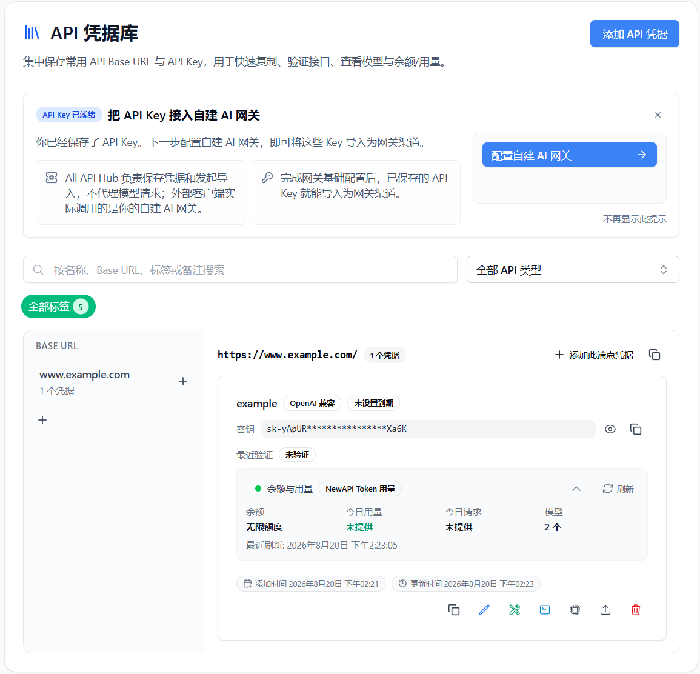
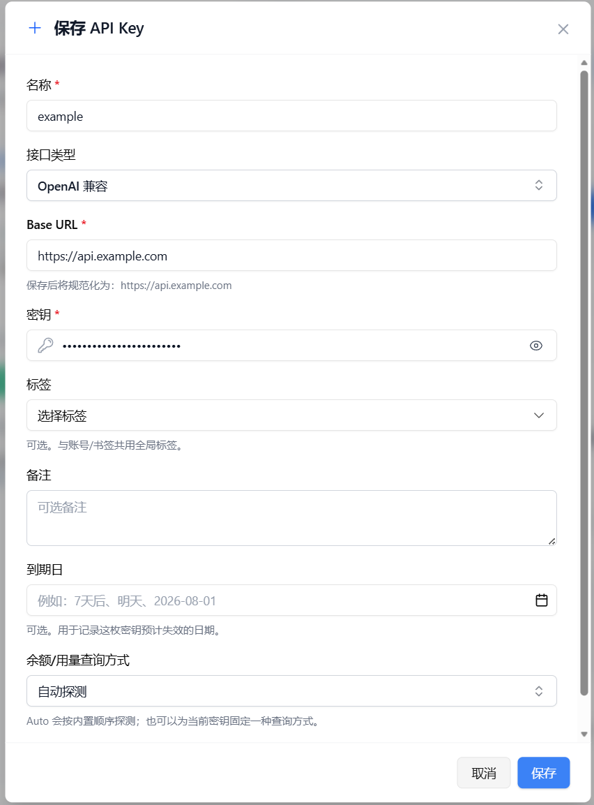
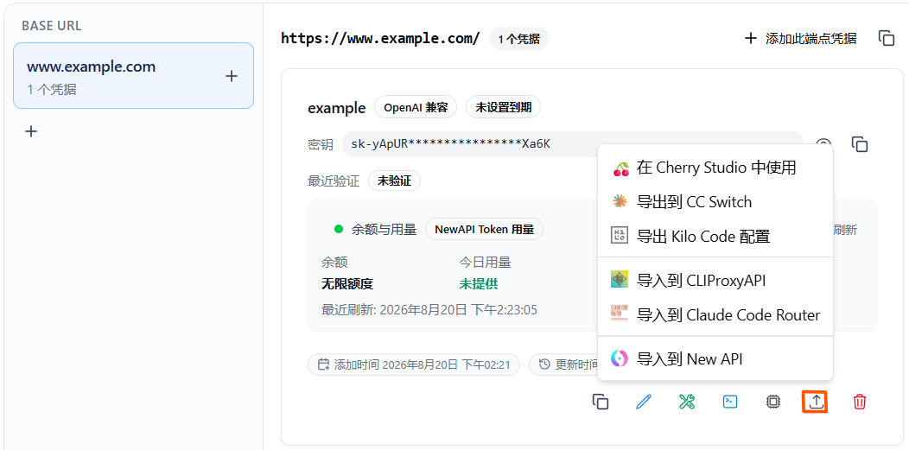

# API 認証情報庫

> 「サイトアカウントがなく、`Base URL + API Key` のみを持つ」シナリオに適しています。よく使う API キーをまとめて保存し、コピー、API 検証、モデル確認、残高/使用量確認に使えます。完全なサイトアカウントを先に作成する必要はありません。

## どのようなシナリオに適していますか

- サードパーティプラットフォームから提供された `Base URL` と `API Key` は持っているが、対応するサイトの管理コンソールアカウントを持っていない場合。
- 一般的なインターフェース設定を一元保存し、複数のクライアントや CLI ツール間でコピー＆ペーストする手間を省きたい場合。
- 複数のキーを「仕事」「テスト」「予備」などの用途別に整理し、後から見つけやすくしたい場合。
- キーが有効かどうか、CLI と互換性があるかどうかを最初に検証してから、下流ツールにインポートするかどうかを決定したい場合。
- 同じインターフェース設定を、モデル表示、インターフェース検証、またはエクスポートの流れで直接使いたい場合。

これらの認証情報は拡張機能内に保存される独立したローカルプロファイルです。サイトアカウントや、サービス側の API キーリソースそのものではありません。ローカルプロファイルを削除しても実際のキーは失効しないため、無効化する場合はサービスの管理画面で取り消してください。

::: warning API キーは機密情報です
完全な API キーは拡張機能のローカル Storage に保存されます。一覧のマスクは画面表示だけを保護するもので、表示、編集、コピー、検証、バックアップ、一部のエクスポートでは完全なキーが使われます。キーやエクスポート内容を公開チャット、Issue、リポジトリへ投稿しないでください。
:::

## 機能概要

- **認証情報庫管理**：サイトアカウントに依存せず、名前、`Base URL`、API Key、タグ、メモを保存します。
- **検索とフィルタリング**：名前、`Base URL`、タグ、メモ、API タイプでフィルタリングできます。
- **健全性と使用状況の概要**：エンドポイントが対応する範囲で、残高、今日の使用量、今日のリクエスト数、利用可能なモデル数、最終更新時間、および健全性を表示できます。
- **インターフェース検証**：API が利用可能かどうか、および CLI との互換性を個別に検証できます。
- **モデル連携**：現在の認証情報をモデルリストで直接開き、モデルディレクトリと検証結果を表示できます。
- **クイックエクスポート**：現在設定されているセルフホスト型サイトへの直接操作を優先表示します。その他の対象は、チャットクライアント、コーディングエージェント、ゲートウェイとルーティングツールに分かれ、Cherry Studio、Kelivo、CC Switch、Kilo Code / Roo Code、Cursor++、CLIProxyAPI、Claude Code Router に対応します。

## アクセス方法

1. プラグイン設定ページを開きます。
2. 左側のメニューから **`API 認証情報庫`** を選択します。
3. 右上隅の **`API 認証情報を追加`** をクリックします。

拡張機能のポップアップにある **`API Key`** からも認証情報へすばやくアクセスできます。`キー管理` でアップストリームサイトのキーを取得した場合は、まずそこで検証または整理してから `API 認証情報庫` に保存すると、後で使いやすくなります。

::: tip 高品質な API インターフェースをお探しですか？
認証情報庫を充実させるために、安定していて CLI にも対応した API インターフェースが必要な場合は、次のパートナーをお試しください。

- [Qiniu Cloud AI](https://s.qiniu.com/qE3eai)：150 以上の主要グローバルモデルへ一括アクセスできる企業向け MaaS プラットフォームです。企業ユーザーは 1,200 万トークンの無料枠を受け取れます。
- [FennoAI](https://api.fenno.ai/s/DCGC)：OpenAI と Anthropic プロトコルに対応した、安定性と効率性の高い Codex 中継サービスです。主要なコーディングツールに接続でき、1 日あたり 1,000 億 Token 規模の企業利用を支えます。All API Hub ユーザーは 1.99 ドルで 50 ドル相当の Coding Plan クレジットを購入でき、友人の購入に対して最大 20% の紹介報酬を受け取れます。[設定ガイド](./service-guides/fenno.md)
- [PackyCode](https://www.packyapi.com/register?aff=all-api-hub)：チャージ時に `all-api-hub` クーポンコードを入力すると 10% オフになります。[設定ガイド](./sponsor-guides/packycode.md)
- [Xingchen AI](https://ai.centos.hk)：1:1 のチャージ比率、請求書対応、Claude は通常価格の 40% 程度から利用できます。[設定ガイド](./sponsor-guides/xingchen.md)
- [XuanShu API](https://www.xuanshuapi.com/register?aff=ALL-API-HUB&promo=ALL-API-HUB)：企業、技術チーム、個人開発者向けの次世代 AI モデルルーティングゲートウェイで、Claude、GPT、Grok など世界トップクラスのモデルへ、エンタープライズ級の安定性を備えた API で一括アクセスできます。モデル料金は通常価格の 10% から 60% まで。こちらのリンクから登録するとチャージ特典が追加され、初回チャージはさらにお得です。法人のお客様は法人銀行振込と請求書発行に対応しています。[設定ガイド](./service-guides/xuanshuapi.md)
- [Atlas Cloud](https://www.atlascloud.ai/console/coding-plan?utm_source=github&utm_medium=link&utm_campaign=all-api-hub)：1 つの AI API で 300 以上の厳選された動画、画像、LLM モデルを利用でき、新しい Coding Plan プロモーションでより手頃に API へアクセスできます。[設定ガイド](./service-guides/atlascloud.md)
- [AICodeMirror](https://www.aicodemirror.ai/register?invitecode=7IQNR8)：Claude Code / Codex / Gemini CLI 向けの公式高安定中継サービスです。このリンクから登録すると初回チャージが 20% オフになり、エンタープライズ顧客は最大 25% オフを受けられます。
- [Suixiang AI Relay](https://sui-xiang.com/)：Claude、Codex、Gemini などの API 中継サービスを提供し、従量課金、毎日のチェックインによるテストクレジット、複数回線冗長、自動フェイルオーバーに対応します。[設定ガイド](./service-guides/suixiang.md)
- [Infistar.ai](https://infistar.ai/register?aff=ALLAPIHUB&ref_source=link)：提供モデルはすべて実際の呼び出しで検証済みです。10,000 本を超える公式 API と公式アカウントプールの供給経路を負荷分散し、テキスト、動画、画像、埋め込み、リランキングなどのフルモーダル機能、透明な料金と利用量、公式価格の 10% からの価格を提供します。[設定ガイド](./service-guides/infistar.md)
- [Dola Seed on BytePlus ModelArk](https://www.byteplus.com/en/product/modelark?utm_campaign=hw&utm_content=all-api-hub&utm_medium=devrel_tool_web&utm_source=OWO&utm_term=all-api-hub)：BytePlus ModelArk から登録すると、各モデルにつき 500,000 トークン分の無料推論枠を受け取れます。
:::

## 認証情報の追加方法

### 基本フィールド

| フィールド | 説明 |
|------|------|
| 名前 | 目的を区別しやすくします。例：「会社の中継ステーション読み取り専用キー」 |
| Base URL | インターフェースの基本アドレス。保存時に自動的に正規化されます。 |
| キー | 対応する API Key。入力欄は既定でマスクされ、一時的に表示できます。 |
| タグ | オプション。アカウントやブックマークとグローバルタグシステムを共有します。 |
| メモ | ソース、目的、モデル制限などの情報を記録できます。 |
| 有効期限 | オプション。ユーザーが入力するリマインダーの日付であり、サービス側がキーの失効日として確認したものではありません。 |

### API タイプ

現在、API タイプによる分類と検証をサポートしています。一般的なタイプは次のとおりです。

- `OpenAI Compatible`
- `OpenAI`
- `Anthropic`
- `Google`

どのタイプを選ぶか分からない場合は、サービスのドキュメントに従ってください。特に指定がなければ、まず `OpenAI Compatible` を試します。一時的に別の API タイプを検証に使用しても、今回だけの上書きであり、保存済みの認証情報タイプは変更されません。

## 残高と使用量の照会

各認証情報カードには、残高と使用量の概要として次のような項目が表示されます。

- 残高
- 今日の使用量
- 今日のリクエスト数
- 今日のトークン数
- 利用可能なモデル数
- 最終更新時間
- 健全性と最後のエラー

これらのデータはサービス側の照会 API から取得します。表示できるか、どの項目を表示できるかはサービスによって異なります。データが取得できなくてもキーが無効とは限らないため、別の照会方法も試してください。

### クエリ方法

各認証情報について、残高/使用量のクエリ方法を選択できます。

- **自動検出**：組み込み順序で互換性のある方法を試します。
- **NewAPI Token**：New API と互換性のあるトークン使用量クエリに適しています。
- **OpenAI Billing**：標準の OpenAI Billing クエリに適しています。
- **Sub2API**：Sub2API スタイルのインターフェースに適しています。
- **カスタム読み取り専用クエリ**：サイトにカスタム読み取り専用クエリインターフェースがある場合に適しています。
- **無効**：残高と使用量をクエリせず、認証情報自体のみを保持します。

「自動検出」は複数の照会方法を順番に試し、利用できるものを使います。API リクエストのフェイルオーバーや負荷分散ではなく、キーやモデルリクエストを自動的に切り替える機能でもありません。

### カスタム読み取り専用クエリ

組み込みの方法でデータを取得できず、サイト独自の照会 API が分かっている場合は **`カスタム読み取り専用クエリ`** を選択します。

1. **`カスタム読み取り専用クエリ`** を選択します。
2. サービスのドキュメントにある使用量 API など、照会先を入力します。
3. 画面の案内に従い、残高や使用量などがレスポンスのどこにあるかを指定します。拡張機能が解析して表示します。

## 安定性とリクエスト制限

あなたのアカウントが上流サイトから異常な呼び出しと判定されるのを防ぐため、All API Hub には**インテリジェントなリクエストリミッター**が組み込まれています：

- **同時実行制御**: 単一サイトへの同時リクエスト数をデフォルトで 2 に制限します。
- **レート制御**: 単一サイトへのリクエストレートを 1 分間に約 18 回に制限します（小規模なバーストをサポート）。
- **自動キューイング**: 複数のアカウントを更新したり、一括検証を実行したりする際、制限を超えるリクエストは自動的にキューに入り、429 Too Many Requests エラーの発生を回避します。

::: tip 説明
この制限は主に拡張機能のバックグラウンドでの更新および検証アクションを対象とします。Cherry Studio などの別ツールから直接 API を呼び出す際の性能には影響しません。
:::

## 一般的な操作

### 1. インターフェースの検証

カードの **`インターフェースを検証`** をクリックすると、次のことを確認できます。

- 現在のキーがまだ呼び出し可能かどうか。
- モデルリストが取得可能かどうか。
- 返信が期待される API タイプと互換性があるかどうか。

キーの交換、ネットワークの切り替え、または「クライアントが接続できないが、サイトは生きているように見える」状況のトラブルシューティングに適しています。

検証結果が示すのは今回の確認結果だけで、キーが永続的に有効または無効であることを保証しません。ネットワークやキーを変更した後、または異常に気付いたときは再度検証できます。

### 2. CLI 互換性の検証

**`CLI 互換性を検証`** をクリックすると、次のことを個別にテストできます。

- 現在のインターフェースが CLI ツールに適しているかどうか。
- モデル ID が CLI シナリオで使用可能かどうか。
- 「Web では動作するが、CLI では動作しない」という互換性の違いがあるかどうか。

この検証では Claude Code、Codex、Gemini CLI などのプログラムを実際に起動しません。各 CLI でよく使われるプロトコルとツール呼び出し方式を模擬し、互換性の事前確認を支援します。

### 3. モデル一覧で開く

**`モデル一覧で開く`** をクリックすると、モデル一覧ページで現在の API 認証情報がデータソースとして直接使用されます。サイトアカウントを作成しなくても、モデルカタログを表示し、モデルの可用性を検証できます。

これは現在の認証情報をモデルカタログのデータソースとして使う機能です。完全な Provider モデル管理ではなく、一覧にある全モデルがあらゆる機能に対応することも保証しません。

### 4. クイックエクスポート

個々の認証情報から次の対象へ直接エクスポートできます。

- **セルフホスト型サイト**：操作エリアに現在設定されているサイトのアイコンが表示されます。クリックすると入力済みの新規チャネル作成画面が開き、確認して送信するまで書き込まれません。同じチャネルが見つかっても重複リスクを警告するだけで、既存チャネルを更新または上書きしません。管理対象サイトによってフィールドや失敗結果が異なり、書き込み失敗時の自動ロールバックもありません。
- **チャットクライアント**：Cherry Studio、Kelivo
- **コーディングエージェント**：CC Switch、Kilo Code / Roo Code、Cursor++
- **ゲートウェイとルーティングツール**：CLIProxyAPI、Claude Code Router

セルフホスト型サイト以外の対象は **`エクスポート`** メニューにまとめられています。受け渡し方法はツールごとに異なり、deeplink、クリップボード、設定内容を使うものに加え、CLIProxyAPI と Claude Code Router はリモート管理 API を呼び出します。統一された「安全な設定ファイルのエクスポート」ではありません。

エクスポート内容には完全な API キーが含まれる場合があります。一部の deeplink やインポートコードは Base64 を使いますが、Base64 は暗号化ではなくエンコードなので、内容を保護してください。

ツールごとにインポート方法とフィールドが異なります。エクスポートダイアログの案内に従い、Kilo Code、Cursor++、Kelivo などの詳細は[サポートされているエクスポートツールと統合ターゲット](./supported-export-tools.md)および[サイト設定のクイックエクスポート](./quick-export.md)を参照してください。

手元の複数のキーを一元保存し、検証してからエクスポートしたいだけなら、完全なサイトアカウントを作成せずに `API 認証情報庫` を直接使えます。

## 使用上の推奨事項

- **用途を含めた命名**：例：「OpenAI 読み取り専用テストキー」「会社の中継ステーション Claude 専用キー」。後でフィルタリングしやすくなります。
- **タグをグループとして使用**：例：`仕事`、`個人`、`本番`、`テスト`、`一時`。
- **エクスポート前に検証**：これにより、無効なキーを複数のクライアントに一括インポートすることを回避できます。
- **制限条件をメモに記載**：例：「Anthropic のみサポート」「残高表示は不正確」「内部ネットワークのみ利用可能」。
- **削除の意味を確認**：ローカルプロファイルを削除しても、サービス側の実際のキーは失効しません。

## バックアップとセキュリティ

API 認証情報庫は通常のバックアップ、復元、WebDAV の選択的同期に含まれます。完全なバックアップには、完全な API キーやカスタム照会で使う Bearer Token が含まれる場合があります。パスワードと同様にバックアップファイルを保護してください。

WebDAV 暗号化はユーザーが明示的に有効化し、暗号化パスワードを設定、保管する必要があります。拡張機能のローカル Storage、通常の JSON バックアップ、クリップボード、外部ツールへのエクスポート内容が既定で暗号化されるという意味ではありません。

API キーをコピーすると完全なキーがシステムのクリップボードに置かれます。外部ツールへエクスポートすると、キーが deeplink、クリップボード、設定内容、リモート管理 API に入る場合があります。公開チャット、Issue、リポジトリへ投稿しないでください。

## よくある質問

| 質問 | 説明 |
|------|------|
| 認証情報のみを保存しましたが、残高データがありません。 | 現在のクエリ方法がサイトに適していないか、サイトが対応する読み取り専用インターフェースを提供していない可能性があります。残高データがなくてもキーが無効とは限りません。クエリ方法を切り替えるか、カスタム読み取り専用クエリを試してください。 |
| モデル関連の検証でモデル ID が要求されるのはなぜですか？ | 一部の CLI 互換性チェックとモデル呼び出し検証ではモデルを指定する必要があります。インターフェースは推奨モデルをできるだけ自動的に取得しようとしますが、手動で入力することもできます。 |
| アカウント管理の代わりになりますか？ | 完全には代替できません。`API 認証情報庫` は、独立した API Key を保存して API 検証、モデル確認、エクスポートに使う用途に向いています。アカウント管理は、サイト識別、残高更新、サインイン、使用量同期などのアカウントレベルの機能を引き続き担当します。 |
| API 認証情報庫はバックアップに含まれますか？ | はい。共有データの一部として、データのエクスポート/インポートおよび WebDAV の選択的同期とともに移行できます。Profile データのインポート時には Merge、Replace、Skip の選択肢が表示される場合があります。 |
| 検証に成功すれば、すべてのツールで使えますか？ | いいえ。検証は 1 回の API 確認結果です。対象ツールでは別のプロトコル、モデル、設定を使う場合があるため、そのツールでもテストしてください。 |
| Profile を削除するとリモートの API キーも失効しますか？ | いいえ。削除されるのはローカル記録だけです。リモートキーはサービスの管理画面で別途取り消してください。 |

## 関連ドキュメント

- [クイックエクスポートサイト設定](./quick-export.md)
- [サポートされているエクスポートツールと統合ターゲット](./supported-export-tools.md)
- [CLIProxyAPI 統合](./cliproxyapi-integration.md)
- [データ管理](./data-management.md)
- [WebDAV バックアップと自動同期](./webdav-sync.md)
