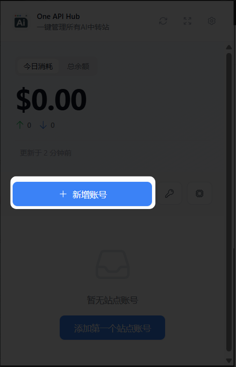
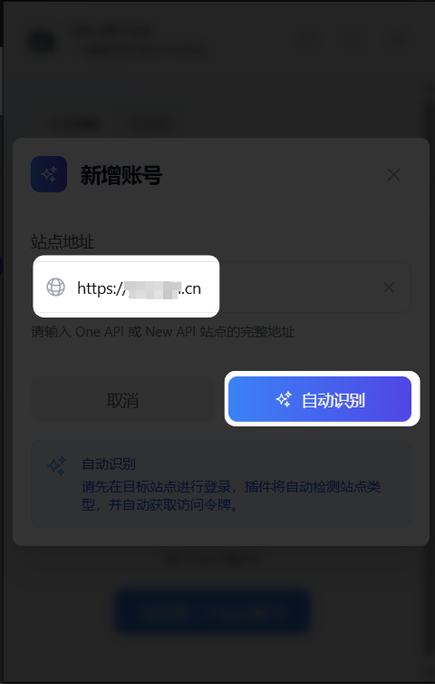
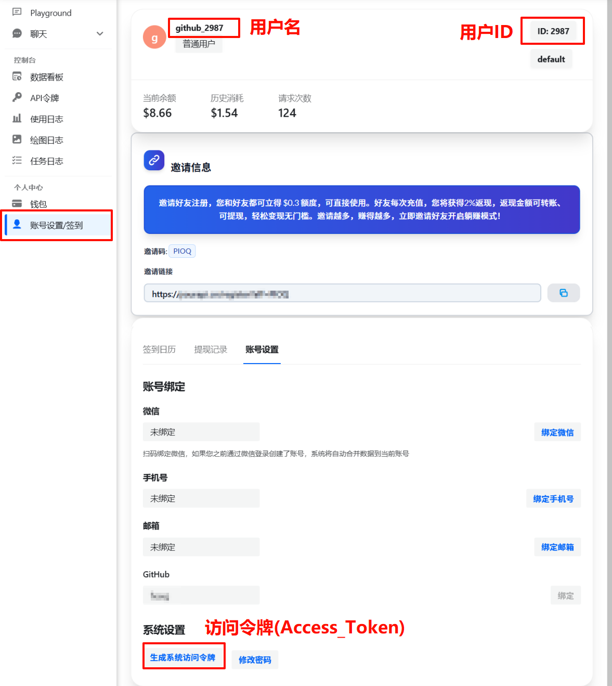

# はじめに

New API などのAI中継ステーションアカウントの管理体験を最適化するために設計されたオープンソースのブラウザ拡張機能です。ユーザーは、アカウント残高、モデル、キーを簡単に一元管理・確認でき、新しいサイトを自動的に追加できます。モバイルデバイスでは、Kiwiまたはモバイル版Firefoxブラウザでの使用をサポートしています。

## 1. ダウンロード

### チャネル版の比較

| チャネル | ダウンロードリンク | 現在のバージョン |
|------|----------|----------|
| GitHub Release | [Release ダウンロード](https://github.com/qixing-jk/all-api-hub/releases) |  |
| Chrome ストア | [Chrome ストア](https://chromewebstore.google.com/detail/lapnciffpekdengooeolaienkeoilfeo) |  |
| Edge ストア | [Edge ストア](https://microsoftedge.microsoft.com/addons/detail/pcokpjaffghgipcgjhapgdpeddlhblaa) |  |
| Firefox ストア | [Firefox ストア](https://addons.mozilla.org/firefox/addon/{bc73541a-133d-4b50-b261-36ea20df0d24}) |  |

::: warning ヒント
ストア版は審査プロセスで1〜3日遅延する場合があります。新機能や修正をいち早く体験したい場合は、GitHub Release版を優先するか、リポジトリのソースコードからビルドすることをお勧めします。
:::

## 2. サポートされているサイト

以下のプロジェクトに基づいてデプロイされた中継ステーションをサポートしています：
- [one-api](https://github.com/songquanpeng/one-api)
- [new-api](https://github.com/QuantumNous/new-api)
- [Veloera](https://github.com/Veloera/Veloera)
- [one-hub](https://github.com/MartialBE/one-hub)
- [done-hub](https://github.com/deanxv/done-hub)
- [VoAPI](https://github.com/VoAPI/VoAPI)
- [Super-API](https://github.com/SuperAI-Api/Super-API)

::: warning
サイトが二次開発され、一部の重要なAPI（例：`/api/user`）が変更された場合、拡張機能はこのサイトを正常に追加できない可能性があります。
:::

## 3. サイトの追加

::: info ヒント
まずブラウザで目的の中継ステーションにログインする必要があります。これにより、拡張機能の自動認識機能がCookieを介してアカウントの[アクセストークン](#_3-3-手動追加)を取得できます。
:::

### 3.1 自動認識による追加

1. 拡張機能のメインページを開き、「アカウントを追加」をクリックします。

2. 中継ステーションのアドレスを入力し、「自動認識」をクリックします。

3. 自動認識が正しいことを確認した後、「追加を確定」をクリックします。

::: info ヒント
拡張機能は、以下のようなアカウントの様々な情報を自動的に認識します：
- ユーザー名
- ユーザーID
- [アクセストークン](#_3-3-手動追加)
- チャージ金額のレート
:::

> 目的のサイトがCloudflareの5秒シールドを有効にしている場合、拡張機能は自動的に独立したウィンドウをポップアップ表示し、シールドを通過するのを助けます。通過後、認識プロセスを続行できます。
> IPの品質が悪い、またはその他の理由により、タイムアウト前にポップアップウィンドウで手動でシールドを通過する必要があります。

### 3.2 Cloudflare シールドバイパスアシスタントの概要

- Cloudflareの5秒シールドが検出された場合、拡張機能は自動的に一時的なウィンドウを起動して検証を完了させます。チャレンジに手動での介入が必要な場合は、ポップアップ内で検証をクリックしてください。
- 検証が完了すると、元のプロセスに自動的に戻り、アクセストークンとサイト情報の取得を続行します。
- 詳細については、[Cloudflare保護と一時ウィンドウのフォールバック](#_5-8-cloudflare-防护与临时窗口降级)を参照してください。

### 3.3 手動追加

::: info ヒント
自動認識が成功しなかった場合、手動でサイトアカウントを追加できます。以下の情報を事前に取得する必要があります。（各サイトのUIは異なる場合があるため、ご自身で探してください）
:::

目的のサイトがカスタマイズ版（AnyRouterなど）の場合、アカウント追加時に手動で**Cookieモード**に切り替えてから、自動認識または手動入力を実行してください。厳重な保護が施されたサイトに遭遇した場合でも、Cloudflareシールドバイパスアシスタントと組み合わせて使用できます。詳細については、[よくある質問](./faq.md#anyrouter-网站报错怎么办)を参照してください。

## 4. サイトのクイックエクスポート

この拡張機能は、追加済みのサイトAPI設定を[CherryStudio](https://github.com/CherryHQ/cherry-studio)、[CC Switch](https://github.com/ccswitch/ccswitch)、および[New API](https://github.com/QuantumNous/new-api)にワンクリックでエクスポートすることをサポートしており、これらのプラットフォームでアップストリームプロバイダーを追加するプロセスを簡素化します。

### 4.1 設定

クイックエクスポート機能を使用する前に、拡張機能の**基本設定**ページで、ターゲットプラットフォーム（New API）の**サーバーアドレス**、**管理者トークン**、および**ユーザーID**を設定する必要があります。

### 4.2 エクスポートプロセス

1. **キー管理への移動**：拡張機能の**キー管理**ページで、エクスポートしたいサイトに対応するAPIキーを見つけます。
2. **エクスポートをクリック**：キー操作メニューで、**「CherryStudio / CC Switch / New APIにエクスポート」**を選択します。
3. **自動処理**：
   * **New APIの場合**：拡張機能は、ターゲットプラットフォームに同じ`Base URL`のチャネルが既に存在するかどうかを自動的に検出し、重複追加を回避します。存在しない場合は、新しいチャネルを作成し、サイト名、`Base URL`、APIキー、および利用可能なモデルリストを自動的に入力します。
   * **CherryStudio / CC Switchの場合**：拡張機能は、ターゲットアプリケーションのプロトコルに従って、サイトとキーをローカルプログラムまたはクリップボードに直接送信し、項目ごとの貼り付けの手間を省きます。

この機能により、APIプロバイダーの設定を他のプラットフォームに簡単にインポートでき、手動でのコピー＆ペーストが不要になり、作業効率が向上します。

## 5. 機能の概要

### 5.1 自動更新と健康状態

- **設定 → 自動更新**を開くと、アカウントデータの定期的な更新を有効にできます。デフォルトの間隔は6分（360秒）で、最短60秒をサポートしています。
- **「拡張機能を開いたときに自動更新」**にチェックを入れると、ポップアップを開いたときにデータを同期できます。
- **「健康状態を表示」**を有効にすると、アカウントカードに健康状態のインジケーター（正常/警告/エラー/不明）が表示されます。

### 5.2 チェックイン検出

- アカウント情報で**「チェックイン検出を有効にする」**にチェックを入れると、サイトのチェックイン状態を追跡できます。
- **カスタムチェックインURL**と**カスタムチャージURL**の設定をサポートし、カスタマイズされたサイトに対応します。
- チェックインが必要なアカウントはリストにヒントが表示され、クリックするとチェックインページにジャンプします。

### 5.3 WebDAVバックアップと多端末同期

- **設定 → WebDAVバックアップ**に進み、WebDAVアドレス、ユーザー名、パスワードを設定します。
- 同期ポリシー（マージ/アップロードのみ/ダウンロードのみ）を選択し、自動同期間隔を設定できます。
- JSONインポート/エクスポートと組み合わせて、二重バックアップを実現することをお勧めします。

### 5.4 ソート優先順位

- **設定 → ソート優先順位設定**でアカウントのソートロジックを調整します。
- 現在のサイト、健康状態、チェックイン要件、カスタムフィールドなどの条件を組み合わせて並べ替えることをサポートします。
- ドラッグ＆ドロップで優先順位を調整でき、不要なソートルールはいつでも無効にできます。

### 5.5 データインポート/エクスポート

- **設定 → データとバックアップ**の「インポートとエクスポート」領域で、現在のアカウント設定をすべてJSONとしてワンクリックでエクスポートできます。
- 旧バージョンまたは他のデバイスからエクスポートされたデータのインポートをサポートしており、迅速な移行や復元に便利です。

### 5.6 New API モデルリスト同期

New APIモデルリスト同期機能の詳細については、[New API モデルリスト同期](./new-api-model-sync.md)を参照してください。

### 5.7 New API チャネル管理（ベータ版）

拡張機能内で直接チャネルを作成/編集/削除でき、モデルホワイトリストとシングルチャネル同期デバッグを組み合わせることで、New APIのバックエンドを行き来する頻度を大幅に削減できます。詳細な操作と注意事項については、[New API チャネル管理](./new-api-channel-management.md)を参照してください。

### 5.8 Cloudflare保護と一時ウィンドウのフォールバック

- Cloudflareによって認識またはAPI呼び出しがブロックされた場合（一般的なステータスコード401/403/429）、自動的に一時ウィンドウに切り替えて再試行し、ターゲットドメインのCookieを保持します。通常、手動操作は不要です。原理の詳細については、[Cloudflare シールドバイパスアシスタント](./cloudflare-helper.md)を参照してください。
- 人間による検証が必要なシナリオに遭遇した場合は、ポップアップ表示されるアシスタントウィンドウでチャレンジを完了してください。頻繁に失敗する場合は、ネットワークを変更するか、リクエスト頻度を下げてみてください。

## 6. 詳細ドキュメント

- [Cloudflare シールドバイパスアシスタント](./cloudflare-helper.md)
- [サイト設定のクイックエクスポート](./quick-export.md)
- [自動更新とリアルタイムデータ](./auto-refresh.md)
- [自動チェックインとチェックイン監視](./auto-checkin.md)
- [WebDAVバックアップと自動同期](./webdav-sync.md)
- [データインポート/エクスポート](./data-management.md)
- [New API モデルリスト同期](./new-api-model-sync.md)
- [New API チャネル管理](./new-api-channel-management.md)
- [CLIProxyAPI統合](./cliproxyapi-integration.md)
- [モデルリダイレクト](./model-redirect.md)
- [ソート優先順位設定](./sorting-priority.md)
- [権限管理（オプション権限）](./permissions.md)

## 7. よくある質問とサポート

- 認証方法、AnyRouterへの対応、機能の使用方法など、より詳細な[よくある質問](./faq.md)をご覧ください。
- 問題が発生した場合や新機能が必要な場合は、[GitHub Issues](https://github.com/qixing-jk/all-api-hub/issues)までフィードバックをお寄せください。
- 過去の更新については、[更新履歴](https://github.com/qixing-jk/all-api-hub/blob/main/CHANGELOG.md)をご覧ください。

::: tip 次のステップ
基本設定が完了したら、自動更新、チェックイン検出、またはWebDAV同期を続けて設定し、より完全な使用体験を得ることができます。
:::