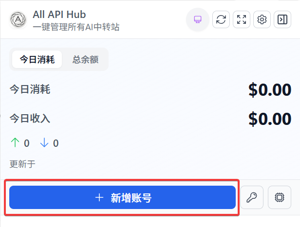
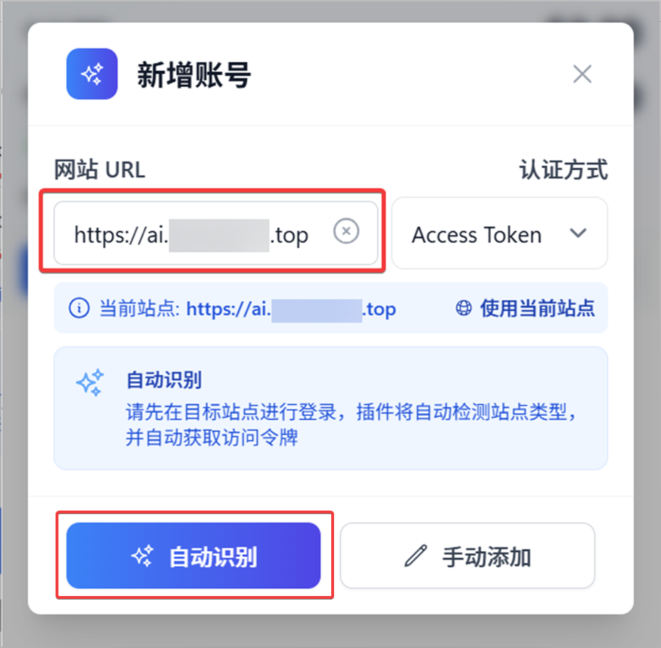
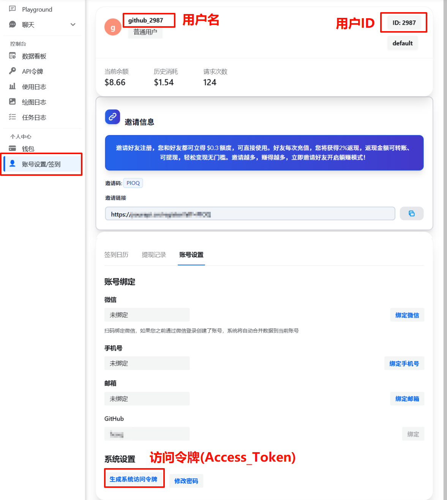

# はじめに

New API などの AI 中継ステーションアカウントの管理体験を最適化するために設計された、オープンソースのブラウザ拡張機能です。ユーザーは、アカウント残高、モデル、キーを一元的に管理・表示し、新しいサイトを自動的に追加できます。Kiwi またはモバイル版 Firefox ブラウザ経由でモバイルデバイスでの使用をサポートしています。

## 1. ダウンロード

### チャネルバージョンの比較

| チャネル | ダウンロードリンク | 現在のバージョン | ユーザー数 |
|---|---|---|---|
| Chrome ウェブストア | [Chrome ウェブストア](https://chromewebstore.google.com/detail/lapnciffpekdengooeolaienkeoilfeo) |  |  |
| Edge ウェブストア | [Edge ウェブストア](https://microsoftedge.microsoft.com/addons/detail/pcokpjaffghgipcgjhapgdpeddlhblaa) |  |  |
| Firefox ウェブストア | [Firefox ウェブストア](https://addons.mozilla.org/firefox/addon/{bc73541a-133d-4b50-b261-36ea20df0d24}) |  |  |
| GitHub Releases | [すべてのリリースを見る](https://github.com/qixing-jk/all-api-hub/releases) |  |  |

### GitHub Release のダウンロード選択肢

| タイプ | ダウンロードリンク | 対象者 | 説明 |
|---|---|---|---|
| 正式版 Stable | [最新の正式版をダウンロード](https://github.com/qixing-jk/all-api-hub/releases/latest) | 多くのユーザー | 正式リリース版です。リリースノートがより充実しており、安定性も高く、日常利用に向いています。 |
| Nightly プレリリース | [Nightly をダウンロード](https://github.com/qixing-jk/all-api-hub/releases/tag/nightly) | 新機能を早めに試したい、修正を確認したい、またはフィードバックに協力したいユーザー | `main` の最新コミットから自動生成されるため更新が最も速い一方、十分に検証されていない変更を含む場合があります。添付ファイル名には通常 `nightly` が含まれます。 |

::: tip 選択方法
- 長く安定して使える版を入れたい場合は、まず正式版 Stable を選んでください。
- 最新の修正をすぐ試したい、特定の不具合が解消されたか確認したい、またはフィードバックに協力したい場合は、Nightly を選んでください。
- ストア版は審査の都合で通常 1～3 日遅れます。GitHub の正式版はそれより早く公開されることが多く、Nightly はさらに先行した内容を含みます。
:::

## 2. サポートされているサイト

以下のプロジェクトに基づいてデプロイされた中継ステーションをサポートしています：
- [one-api](https://github.com/songquanpeng/one-api)
- [new-api](https://github.com/QuantumNous/new-api)
- [Veloera](https://github.com/Veloera/Veloera)
- [one-hub](https://github.com/MartialBE/one-hub)
- [done-hub](https://github.com/deanxv/done-hub)
- WONG公益站
- [Sub2API](https://github.com/Wei-Shaw/sub2api)
- [AnyRouter](https://anyrouter.top)
- [VoAPI](https://github.com/VoAPI/VoAPI)
- [Super-API](https://github.com/SuperAI-Api/Super-API)
- Neo-API
- RIX_API（基本機能サポート）

互換性のあるサイトの完全なリストについては、[サポートされているサイトとシステムタイプ](./supported-sites.md) を参照してください。

::: warning
サイトが二次開発され、一部の重要なインターフェース（例: `/api/user`）が変更された場合、拡張機能はこのサイトを正常に追加できない可能性があります。
:::

## 3. サイトの追加

::: info ヒント
拡張機能の自動認識機能がログイン情報を読み取り、アカウント情報を取得できるように、必ず事前にブラウザで対象ウェブサイトにログインしてください。
:::

### 3.1 自動認識による追加

1. 拡張機能のメインページを開き、「`新規アカウント`」をクリックします。

2. 中継ステーションのアドレスを入力し、「`自動認識`」をクリックします。

3. 自動認識が正しいことを確認したら、「`追加を確定`」をクリックします。

::: info ヒント
拡張機能は、アカウントのさまざまな情報を自動的に認識します。例：
- ユーザー名
- ユーザー ID
- [アクセス トークン](#manual-addition)
- チャージ金額の倍率
:::

> 対象サイトで Cloudflare 5 秒ルールが有効になっている場合、拡張機能は自動的に独立したウィンドウを表示して、ルール通過を支援します。通過後、認識プロセスを続行できます。
> IP の品質が低い場合やその他の理由で、タイムアウト前にポップアップウィンドウで手動でルールを通過させる必要がある場合があります。

### 3.2 Cloudflare ルール通過アシスタントの概要

- Cloudflare 5 秒ルールが認識された場合、拡張機能は自動的に一時ウィンドウを起動して検証を完了します。チャレンジに手動介入が必要な場合は、ポップアップウィンドウで検証をクリックしてください。
- 検証が完了すると、元のプロセスに戻り、アクセス トークンとサイト情報の取得を続行します。
- 詳細については、[Cloudflare 保護と一時ウィンドウのダウングレード](#cloudflare-window-downgrade) を参照してください。

### 3.3 手動追加

::: info ヒント
自動認識が成功しなかった場合は、サイトアカウントを手動で入力して追加できます。事前に以下の情報を取得する必要があります。（各サイトの UI は異なる場合があるため、ご自身で探してください。）
:::

対象サイトがカスタマイズ版（例: AnyRouter）の場合は、アカウントを追加する際に手動で **Cookie モード** に切り替えてから、自動認識または手動入力を実行してください。厳格な保護が施されたサイトに遭遇した場合は、Cloudflare ルール通過アシスタントと組み合わせて使用することもできます。詳細は [よくある質問](./faq.md#anyrouter-error) を参照してください。

## 4. クイックエクスポートと統合

この拡張機能は、追加されたサイトの API 設定をローカルクライアント、CLI ツール、およびセルフホスト型サイトにエクスポートすることをサポートしており、`Base URL`、キー、モデル設定の繰り返し入力を削減します。現在の完全なリストについては、[サポートされているエクスポートツールと統合ターゲット](./supported-export-tools.md) を参照してください。

### 4.1 設定

エクスポート/統合機能を使用する前に、ターゲットタイプに応じて対応する設定を完了してください：

- **CherryStudio / CC Switch**：Deeplink を介してインポートを呼び出せるように、ターゲットクライアントを起動したままにします。
- **Kilo Code / Roo Code**：各キーに対応するモデル ID を事前に確認することをお勧めします。
- **CLIProxyAPI / Claude Code Router**：基本設定に対応する管理アドレスと認証情報を入力します。
- **セルフホスト型サイト（New API / DoneHub / Veloera / Octopus）**：`設定 -> 基本設定 -> セルフホスト型サイト管理` でバックエンド設定を完了します。

### 4.2 エクスポートプロセス

1. **キー管理に移動**：拡張機能の **キー管理** ページで、エクスポートしたいサイトに対応する API キーを見つけます。
2. **対応する操作をクリック**：キー操作メニューで、「**CherryStudio にエクスポート**」、「**CC Switch にエクスポート**」、「**Kilo Code JSON にエクスポート**」、「**CLIProxyAPI にインポート**」、「**Claude Code Router にインポート**」、または「**現在のセルフホスト型サイトにインポート**」を選択します。
3. **自動処理**：
   * **CherryStudio / CC Switch の場合**：拡張機能は、ターゲットアプリケーションの Deeplink プロトコルに従って、サイト情報と API キーを自動的に渡します。
   * **Kilo Code / Roo Code の場合**：拡張機能は、コピーまたはダウンロード可能な設定 JSON を生成し、手動インポートを容易にします。
   * **CLIProxyAPI / Claude Code Router / セルフホスト型サイトの場合**：拡張機能は、対応する管理インターフェースを呼び出して、Provider / Channel を作成または更新します。

これらの統合機能により、同じアップストリームサイトを複数のダウンストリームツールまたはバックエンドシステムに同期でき、手動での繰り返し貼り付けが不要になります。

## 5. 機能概要

### 5.1 自動リフレッシュとヘルスステータス

- **設定 → 自動リフレッシュ** を開くと、アカウントデータの定期的なリフレッシュを有効にできます。デフォルトの間隔は 6 分（360 秒）で、最短 60 秒までサポートします。
- **「拡張機能を開いたときに自動リフレッシュ」** にチェックを入れると、ポップアップウィンドウを開いたときにデータを同期できます。
- **「ヘルスステータスを表示」** を有効にすると、アカウントカードにヘルスステータスインジケーター（正常/警告/エラー/不明）が表示されます。

### 5.2 チェックイン検出

- アカウント情報で **「チェックイン検出を有効にする」** にチェックを入れると、サイトのチェックインステータスを追跡できます。
- **カスタムチェックイン URL** と **カスタムチャージ URL** を設定して、カスタマイズされたサイトに対応できます。
- チェックインが必要なアカウントはリストに表示され、クリックするとチェックインページにジャンプします。

### 5.3 WebDAV バックアップとマルチデバイス同期

- **設定 → WebDAV バックアップ** に移動し、WebDAV アドレス、ユーザー名、パスワードを設定します。
- 同期ポリシー（マージ/アップロードのみ/ダウンロードのみ）を選択し、自動同期間隔を設定できます。
- JSON のインポート/エクスポートと組み合わせて、二重バックアップを実現することをお勧めします。

### 5.4 ソート優先度

- **設定 → ソート優先度設定** でアカウントのソートロジックを調整します。
- 現在のサイト、ヘルスステータス、チェックイン要件、カスタムフィールドなどの条件を組み合わせて並べ替えることができます。
- ドラッグアンドドロップで優先度を調整し、不要なソートルールはいつでも無効にできます。

### 5.5 データインポート/エクスポート

- **設定 → データとバックアップ** の「インポートとエクスポート」セクションで、現在のすべてのアカウント設定を JSON にワンクリックでエクスポートできます。
- 旧バージョンまたは他のデバイスからエクスポートされたデータをインポートして、迅速な移行または復元を容易にできます。

### 5.6 New API モデルリスト同期

New API モデルリスト同期機能の詳細については、[New API モデルリスト同期](./new-api-model-sync.md) を参照してください。

### 5.7 New API チャネル管理（Beta）

拡張機能内で直接チャネルを作成/編集/削除し、モデルホワイトリストと単一チャネル同期デバッグと組み合わせることで、New API バックエンドへの往復回数を大幅に削減できます。詳細な操作と注意事項については、[New API チャネル管理](./new-api-channel-management.md) を参照してください。

### 5.8 Cloudflare 保護と一時ウィンドウのダウングレード

- Cloudflare によってブロックされた（一般的なステータスコード 401/403/429）認識または API 呼び出しは、自動的に一時ウィンドウに切り替えて再試行され、ターゲットドメインの Cookie が保持されます。通常、手動操作は不要です。原理については、[Cloudflare ルール通過アシスタント](./cloudflare-helper.md) を参照してください。
- 人間による検証が必要なシナリオに遭遇した場合は、表示されるアシスタントウィンドウでチャレンジを完了してください。頻繁に失敗する場合は、ネットワークを変更するか、リクエスト頻度を下げることを試みてください。

## 6. 詳細ドキュメント

- [サポートされているエクスポートツールと統合ターゲット](./supported-export-tools.md)
- [サポートされているサイトとシステムタイプ](./supported-sites.md)
- [Cloudflare ルール通過アシスタント](./cloudflare-helper.md)
- [サイト設定のクイックエクスポート](./quick-export.md)
- [自動リフレッシュとリアルタイムデータ](./auto-refresh.md)
- [自動チェックインとチェックイン監視](./auto-checkin.md)
- [WebDAV バックアップと自動同期](./webdav-sync.md)
- [データ管理](./data-management.md)
- [New API モデルリスト同期](./new-api-model-sync.md)
- [New API チャネル管理](./new-api-channel-management.md)
- [CLIProxyAPI 統合](./cliproxyapi-integration.md)
- [モデルリダイレクト](./model-redirect.md)
- [ソート優先度設定](./sorting-priority.md)
- [権限管理（オプション権限）](./permissions.md)

## 7. よくある質問とサポート

- より詳細な [よくある質問](./faq.md) を参照して、認証方法、AnyRouter の適合性、機能使用のヒントなどを確認してください。
- 問題が発生した場合や新機能が必要な場合は、[GitHub Issues](https://github.com/qixing-jk/all-api-hub/issues) でフィードバックをお寄せください。
- 過去の更新については、[更新ログ](./changelog.md) を参照してください。

::: tip 次のステップ
基本設定が完了したら、自動リフレッシュ、チェックイン検出、または WebDAV 同期を設定して、より完全な使用体験を得ることができます。
:::
