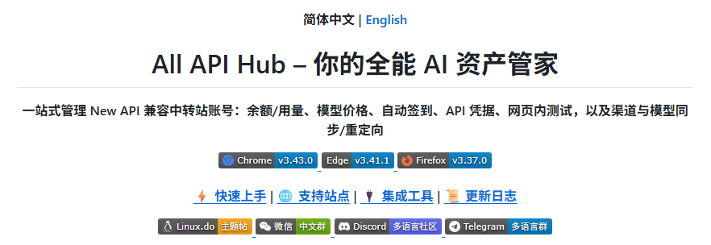
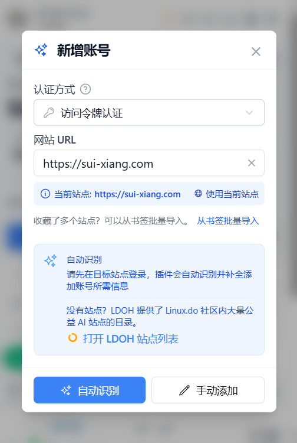
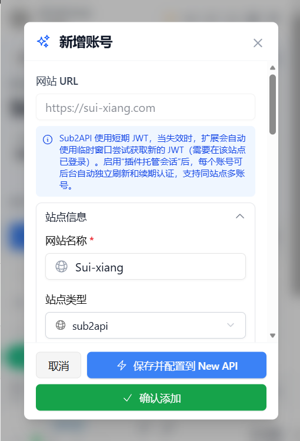
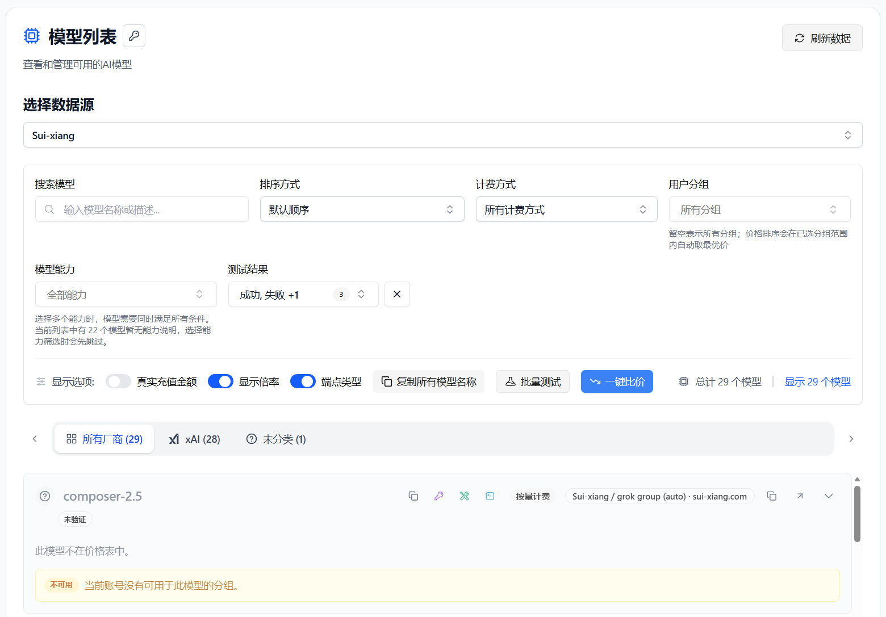
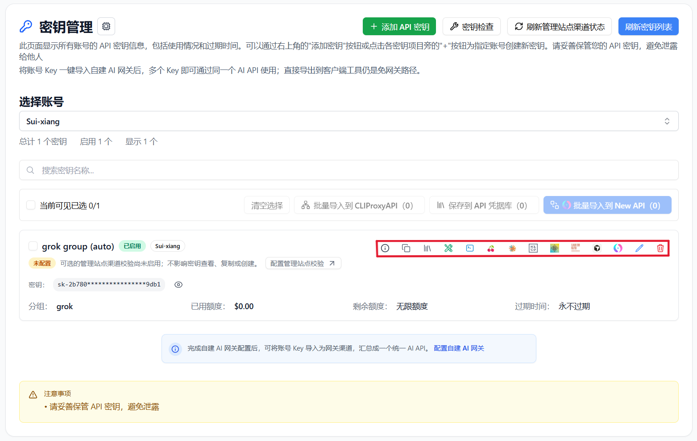

# 随想AI中转站の API 資産を All API Hub で管理する

> 随想AI中转站 と All API Hub を組み合わせて、残高確認、モデル価格比較、API キー管理、よく使う AI ツールへのエクスポートを行います。

随想AI中转站 は Claude、Codex、Gemini などの API 中継サービスを提供し、従量課金、毎日のサインインテスト枠、複数ルート、自動フェイルオーバーに対応しています。複数のアカウントや AI API プラットフォーム、クライアントを使う場合、All API Hub で情報を 1 つのローカル管理画面にまとめられます。

アカウントを追加すると、残高確認、API キー管理、モデル価格確認、Cherry Studio、CC Switch、Kilo Code、CLIProxyAPI、Claude Code Router、セルフホスト型バックエンドへのエクスポートができます。

---

## 1. All API Hub でできること

**All API Hub**（[GitHub で公開](https://github.com/qixing-jk/all-api-hub)）は、複数の AI API アカウント、サイト、クライアント設定を管理するブラウザ拡張機能です。随想AI中转站 ユーザーは、アカウント状態、API キー、モデル価格、エクスポートを 1 つの流れで扱えます。

- **複数アカウントの一元ダッシュボード**：随想AI中转站 と他の AI API アカウントをまとめて確認できます。
- **アカウント間の価格比較**：モデル価格を追加済みの他アカウントと比較できます。
- **API キーの集中管理**：キーの表示、作成、編集、削除、コピーを行えます。
- **認証情報の再利用**：`Base URL + API Key` をクライアント、CLI ツール、セルフホスト型チャネルへエクスポートできます。
- **複数端末での継続利用**：インポート / エクスポートや WebDAV 同期で設定を移行できます。

随想AI中转站 がモデル API を提供し、All API Hub がアカウント、キー、価格、下流ツール設定を整理します。

---

## 2. All API Hub をインストールする

利用中のブラウザに対応した公式ストアからインストールしてください：[Chrome ウェブストア](https://chromewebstore.google.com/detail/lapnciffpekdengooeolaienkeoilfeo)、[Microsoft Edge Add-ons](https://microsoftedge.microsoft.com/addons/detail/pcokpjaffghgipcgjhapgdpeddlhblaa)、[Firefox Add-ons](https://addons.mozilla.org/firefox/addon/{bc73541a-133d-4b50-b261-36ea20df0d24})。その他のブラウザ、Safari、モバイルブラウザ、手動インストールは [インストールガイド](../get-started.md) と [GitHub Releases](https://github.com/qixing-jk/all-api-hub/releases/latest) を参照してください。

---

## 3. 随想AI中转站 アカウントを追加する

All API Hub は随想AI中转站 アカウントの自動認識に対応しています。先にブラウザでログインし、拡張機能で現在のサイトを読み取ってアカウントを保存します。

### 3.1 自動認識で追加する

1. ブラウザで [随想AI中转站](https://sui-xiang.com/) にログインします。
2. ブラウザ右上の All API Hub 拡張機能アイコンをクリックします。
3. **アカウントを追加** をクリックし、現在のサイトアドレスを使うかアドレスを手動入力します。

   

4. **自動認識** をクリックします。
5. アカウント情報を確認し、**アカウントを保存** をクリックします。

   

:::: tip
保存後、拡張機能はインポートされたトークンを使って残高、API キー、モデル価格を読み取ります。
::::

### 3.2 API キーを管理する

アカウント追加後は **キー管理** でキーを確認、作成、編集、削除、コピーできます。後で再利用するキーは **API 認証情報プロファイル** に保存し、必要なときにエクスポートします。

---

## 4. 随想AI中转站 ユーザー向けの主な使い方

### 4.1 残高とアカウント状態を確認する

All API Hub のダッシュボードでは、随想AI中转站 と他の AI API アカウントをまとめて表示できます。残高、状態、更新結果が 1 か所に集まります。

### 4.2 モデル価格を比較する

**モデル価格** を開き、随想AI中转站 アカウントを選択します。モデル一覧の確認、検索、利用可能性のテスト、入出力価格の確認、他アカウントとの比較ができます。

### 4.3 AI クライアントへエクスポートする

1. **キー管理** でキーを見つけます。
2. エクスポート操作を選びます。
3. **Cherry Studio**、**CC Switch**、**Kilo Code**、**CLIProxyAPI**、**Claude Code Router**、または設定済みのセルフホスト型チャネルを選びます。

`Base URL + API Key` のコピー、API / CLI 互換性確認、利用可能モデル一覧の確認、複数クライアントへの出力、セルフホスト型サイトへのインポート、WebDAV 同期による移行も可能です。

::: warning 認証情報の転送範囲
ブラウザのローカルストレージはデフォルトの保存場所にすぎません。認証情報を信頼できる宛先にのみ送信し、不要になったキーは失効させてください。
:::

### 4.4 セルフホスト型チャネルへインポートする

**基本設定 → セルフホスト型サイト管理** でバックエンドを設定し、**キー管理** から随想AI中转站 のキーを現在のサイトへインポートします。複数キーの一括インポートも可能です。

### 4.5 バックアップと端末移行

データは既定では現在のブラウザ内に保存されます。複数端末で使う場合はデータのインポート / エクスポートまたは明示的に設定した WebDAV 同期を利用してください。

---

## 5. All API Hub と API クライアントの違い

| 項目 | All API Hub（管理側） | Cherry Studio / NextChat など（利用側） |
| --- | --- | --- |
| 主な役割 | 随想AI中转站 と他の AI API アカウント、残高、キー、価格、チャネルを管理する | チャット、推論、プロンプトや Agent ワークフローを実行する |
| 主な操作 | ダッシュボード、キー管理、価格比較、認証情報エクスポート、チャネルインポート | チャット、ファイル分析、Agent ワークフロー |
| 関係 | 元設定を整理する | 管理済みの認証情報を使ってモデルを呼び出す |

おすすめの使い方は、All API Hub で随想AI中转站 のアカウント、キー、価格、エクスポート設定を管理し、実際のリクエストは普段のクライアントから送ることです。

---

## 6. FAQ

**Q: All API Hub は API キーをアップロードしますか？**

A: 既定では、アカウントとキーの情報はブラウザ内に保存されます。エクスポート、セルフホスト型サイトへのインポート、API / CLI テスト、WebDAV 同期では認証情報が対応する宛先へ送信されます。信頼できる宛先にのみキーを送信し、不要になったら失効させてください。

**Q: どのようなユーザーに適していますか？**

A: 複数の随想AI中转站 アカウントや他の AI API プラットフォームを使う場合、または複数のクライアントや端末に設定する場合に便利です。

**Q: セルフホスト型バックエンドがなくても使えますか？**

A: はい。アカウントを追加すれば、残高確認、キー管理、価格比較、クライアントへのエクスポートを利用できます。

**Q: エクスポート後、クライアントは単独で動作しますか？**

A: はい。実際のモデル呼び出しは対象クライアントが行います。

**Q: コンソールとの関係は？**

A: 公式のアカウント、チャージ、サービス操作は随想AI中转站 のコンソールが担当し、All API Hub は日常的なアカウント状態、キー、価格、クライアント設定を管理します。

---

## リンク

- [随想AI中转站](https://sui-xiang.com/)
- [All API Hub GitHub リポジトリ](https://github.com/qixing-jk/all-api-hub)
- [All API Hub ドキュメント](https://all-api-hub.qixing1217.top/ja/)
