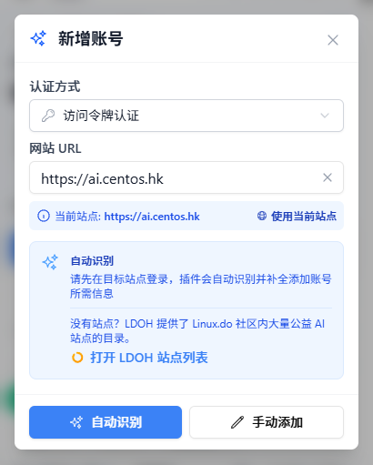
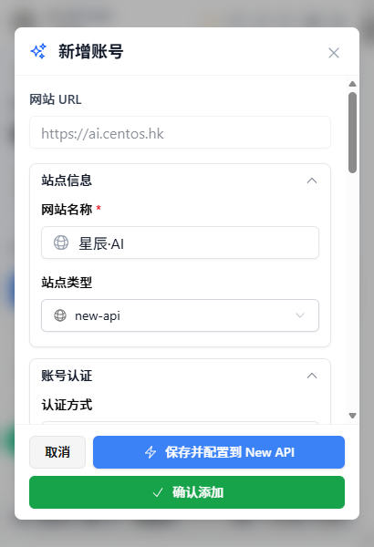
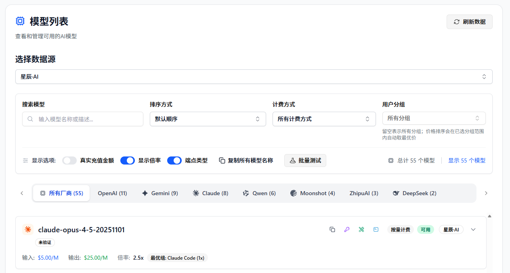
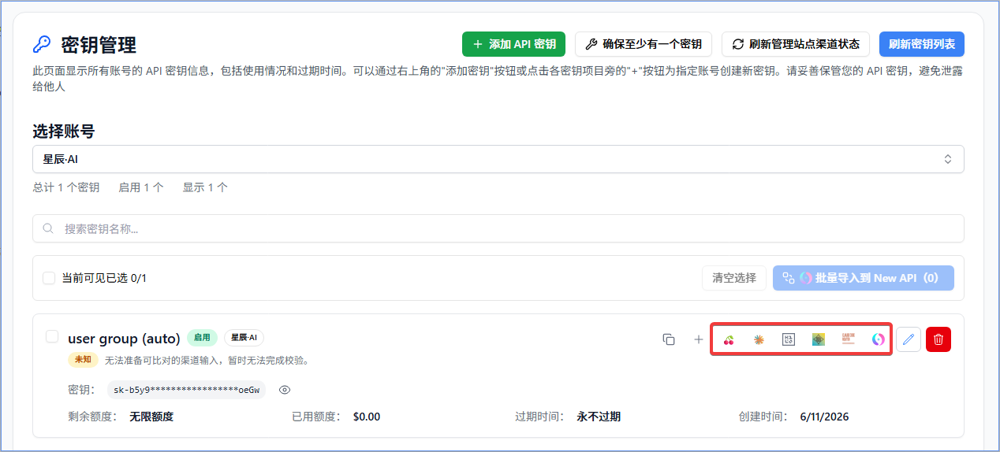

# Xingchen AI の API 資産を All API Hub で管理する

> Xingchen AI と All API Hub を組み合わせて、残高確認、モデル価格比較、API キー管理、よく使う AI ツールへの認証情報エクスポートを行います。

Xingchen AI は AI API ユーザー向けに安定した中継アクセスを提供します。複数の Xingchen AI アカウントを使っている場合、複数の AI API プラットフォームを併用している場合、または Xingchen AI を複数のクライアントに設定することが多い場合、**All API Hub** を使うとアカウントと認証情報を 1 つのローカル管理画面にまとめられます。

Xingchen AI アカウントを追加すると、All API Hub で残高確認、API キー管理、モデル価格確認、Cherry Studio、CC Switch、Kilo Code、CLIProxyAPI、Claude Code Router、またはセルフホスト型バックエンドへの認証情報エクスポートができます。

---

## 1. All API Hub でできること

**All API Hub**（[GitHub で公開](https://github.com/qixing-jk/all-api-hub)）は、複数のアカウント、サイト、クライアント設定を管理したい AI API ユーザー向けのブラウザ拡張機能です。Xingchen AI ユーザーは、アカウント状態、API キー、モデル価格、エクスポート操作を 1 つの流れで扱えます。

Xingchen AI と組み合わせると、次の用途に役立ちます。

- **複数アカウントの一元ダッシュボード**：Xingchen AI と他の AI API アカウントをまとめて確認できます。
- **アカウント間の価格比較**：Xingchen AI のモデル価格を、追加済みの他アカウントと比較できます。
- **API キーの集中管理**：Xingchen AI API キーの表示、作成、編集、削除、コピーを行えます。
- **認証情報の再利用**：管理済みの `Base URL + API Key` をクライアント、CLI ツール、セルフホスト型チャネルにエクスポートできます。
- **複数端末での継続利用**：インポート / エクスポートや WebDAV 同期で設定を移行できます。

Xingchen AI がモデル API を提供し、All API Hub がアカウント、キー、価格、下流ツール設定を整理します。

---

## 2. All API Hub をインストールする

自動更新と安定した利用のため、可能であれば利用中のブラウザに対応した公式ストアからインストールしてください。

- **Chrome**：[Chrome ウェブストア](https://chromewebstore.google.com/detail/lapnciffpekdengooeolaienkeoilfeo)
- **Edge**：[Microsoft Edge Add-ons](https://microsoftedge.microsoft.com/addons/detail/pcokpjaffghgipcgjhapgdpeddlhblaa)
- **Firefox**：[Firefox Add-ons](https://addons.mozilla.org/firefox/addon/{bc73541a-133d-4b50-b261-36ea20df0d24})
- **QQ / 360 / Brave / Vivaldi / Opera など**：Brave、Vivaldi、Opera は通常まず Chrome ウェブストアを試せます。QQ、360、チーターブラウザなどは利用可能なストア経路がない場合、Chromium の手動読み込みを使えます。詳しくは [その他のブラウザへのインストールガイド](../other-browser-install.md) を参照してください。
- **Mac の Safari**：[Safari インストールガイド](../safari-install.md) を参照してください。
- **モバイルブラウザ**：[モバイルブラウザ FAQ](../faq.md#mobile-browser-support) を参照してください。
- **代替手段**：ブラウザがストア版または Chrome ウェブストア互換版を利用できず、上記ガイドでも解決しない場合は、[GitHub Releases](https://github.com/qixing-jk/all-api-hub/releases/latest) から Stable パッケージをダウンロードできます。手動インストール版は自動更新されません。

---

## 3. Xingchen AI アカウントを追加する

All API Hub は Xingchen AI アカウントの自動認識に対応しています。先にブラウザで Xingchen AI にログインし、拡張機能で現在のサイトを読み取ってアカウントを保存します。

### 3.1 自動認識で追加する

1. ブラウザで [Xingchen AI](https://ai.centos.hk) にログインします。
2. ブラウザ右上の All API Hub 拡張機能アイコンをクリックします。
3. **アカウントを追加** をクリックし、現在のサイトアドレスを使うか Xingchen AI のアドレスを手動入力します。

   

4. **自動認識** をクリックします。
5. アカウント情報を確認し、**アカウントを保存** をクリックします。

   

:::: tip
保存後、拡張機能はインポートされたアカウントトークンを使って残高、API キー、モデル価格などを読み取ります。
::::

### 3.2 Xingchen AI API キーを管理する

アカウント追加後は **キー管理** で Xingchen AI API キーを管理できます。

- 現在のアカウントにある API キーを確認する。
- 新しいキーを作成し、既存キーを編集または削除する。
- よく使うキーをコピーし、後で再利用するために **API 認証情報プロファイル** に保存する。
- 他のツールへ設定する場合は、キー一覧または認証情報プロファイルからエクスポートする。

---

## 4. Xingchen AI ユーザー向けの主な使い方

### 4.1 残高とアカウント状態を確認する

All API Hub のダッシュボードでは、Xingchen AI と他の AI API アカウントをまとめて表示できます。残高、状態、更新結果が 1 か所に集まります。

### 4.2 モデル価格を比較する

**モデル価格** を開き、Xingchen AI アカウントをデータソースとして選択します。返されたモデル一覧の確認、モデル検索、入力 / 出力価格の確認、他アカウントとの価格比較ができます。

### 4.3 AI クライアントへエクスポートする

1. **キー管理** で Xingchen AI キーを見つけます。
2. 必要なエクスポート操作を選択します。
3. **Cherry Studio**、**CC Switch**、**Kilo Code**、**CLIProxyAPI**、**Claude Code Router**、または設定済みのセルフホスト型サイトを選びます。

`Base URL + API Key` のコピー、API の疎通確認、利用可能モデル一覧の確認、複数クライアントへのエクスポート、セルフホスト型サイトへのチャネル追加、インポート / エクスポートや WebDAV 同期による移行もできます。

### 4.4 セルフホスト型チャネルへインポートする

AI 分配バックエンドを運用している場合、**基本設定 → セルフホスト型サイト管理** でバックエンドを設定し、**キー管理** に戻って Xingchen AI キーを現在のセルフホスト型サイトへインポートします。

### 4.5 バックアップと端末移行

All API Hub のデータは既定では現在のブラウザ内に保存されます。WebDAV への同期は、ユーザーが明示的に設定した場合のみ行われます。

---

## 5. All API Hub と API クライアントの違い

| 項目 | All API Hub（管理側） | Cherry Studio / NextChat など（利用側） |
| --- | --- | --- |
| 主な役割 | Xingchen AI と他の AI API アカウント、残高、キー、価格、チャネルを管理する | チャット、推論、プロンプトや Agent ワークフローを実行する |
| 主な操作 | ダッシュボード、キー管理、価格比較、認証情報エクスポート、チャネルインポート | チャット、ファイル分析、Agent ワークフロー |
| 関係 | キー、Base URL、価格、アカウント状態などの元設定を整理する | 管理済みの認証情報を使ってモデルを呼び出す |

おすすめの使い方は、All API Hub で Xingchen AI アカウント、キー、価格、エクスポート設定を管理し、実際のリクエストは普段使っているクライアントから送ることです。

---

## 6. FAQ

**Q: All API Hub は API キーをアップロードしますか？**

A: 既定では、アカウントとキーの情報はブラウザ内に保存されます。WebDAV 同期を明示的に有効化し、自分の WebDAV ストレージを設定した場合のみ同期されます。

**Q: セルフホスト型バックエンドがなくても使えますか？**

A: はい。Xingchen AI アカウントを追加すれば、残高確認、キー管理、価格比較、クライアントへのエクスポートを利用できます。

**Q: エクスポート後、クライアントは単独で動作しますか？**

A: はい。All API Hub は設定の生成や入力を支援するだけです。実際のモデル呼び出しは対象クライアントが行います。

**Q: All API Hub と Xingchen AI コンソールの関係は？**

A: 両者は併用するものです。アカウント、チャージ、公式サービスの操作は Xingchen AI が担当します。All API Hub は日常的なアカウント状態、API キー、価格、クライアント設定の管理に向いています。

---

## リンク

- [Xingchen AI](https://ai.centos.hk)
- [All API Hub GitHub リポジトリ](https://github.com/qixing-jk/all-api-hub)
- [All API Hub ドキュメント](https://all-api-hub.qixing1217.top/ja/)
