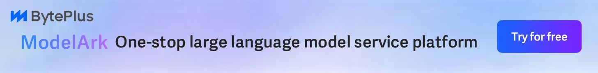

# サポートされているサイトのリスト

> All API Hub は主に 2 種類のオブジェクトをサポートしています。1 つは日常的にログインして使用するプロキシ / 管理パネル、もう 1 つは自分で構築し、プラグインで引き続き管理したいバックエンドシステムです。

## 日常的に追加および管理できるサイト

以下は、ユーザーが最も一般的で、All API Hub を通じて一元管理するのに最も適したサイトの種類です。

| サイト / システム | 公式説明 | 公式リンク |
|-------------------|----------|----------|
| OpenRouter | 独立した AI モデル集約プラットフォーム。拡張機能ではアカウント残高、ネイティブキー管理、モデルカタログに対応します。 | [公式サイト](https://openrouter.ai/) / [ドキュメント](https://openrouter.ai/docs) / [設定ガイド](./service-guides/openrouter.md) |
| New API | 統一された AI モデル集約および配布センター。 | [公式サイト](https://www.newapi.ai/) / [GitHub](https://github.com/QuantumNous/new-api) |
| one-api | LLM API 管理および配布システム。OpenAI、Azure、Anthropic Claude、Google Gemini、DeepSeek などの主要モデルをサポートし、API を統一的にアダプトします。キー管理および二次配布に使用できます。 | [GitHub](https://github.com/songquanpeng/one-api) |
| Sub2API | Sub2API-CRS2 ワンストップオープンソースプロキシサービス。Claude、OpenAI、Gemini、Antigravity のサブスクリプションを統一的に接続し、共同利用による効率的なコスト分担とネイティブツールのシームレスな利用に対応します。 | [GitHub](https://github.com/Wei-Shaw/sub2api) |
| AnyRouter | Claude Code プロキシ · ゼロしきい値 · 無料 $50 | [ドキュメント](https://docs.anyrouter.top/) / [公式サイト](https://anyrouter.top) |
| one-hub | OpenAI インターフェース管理および配布システム。songquanpeng/one-api から改変され、より多くのモデルをサポートし、統計ページを追加し、OpenAI 以外のモデルの関数呼び出しを改善しました。 | [公式サイト](https://one-hub.xiao5.info/) / [GitHub](https://github.com/MartialBE/one-hub) |
| Veloera | このプロジェクトはメンテナンスを停止しました。 | [GitHub](https://github.com/Veloera/Veloera) |
| VoAPI | 旧バージョンの互換デプロイのみ対応しています。新しい VoAPI バージョンは、現在の拡張機能の互換範囲外です。 | [GitHub](https://github.com/VoAPI/VoAPI) |
| done-hub | このプロジェクトは one-hub をベースに二次開発されました。 | [GitHub](https://github.com/deanxv/done-hub) |
| AIHubMix | 独立した AI API 集約サイト。拡張機能では専用のアカウント種別として、残高、キー、モデル API に対応します。 | [公式サイト](https://aihubmix.com/?aff=W3DN) / [API ドキュメント](https://docs.aihubmix.com/cn/api/Cli) / [設定ガイド](./sponsor-guides/aihubmix.md) |
| Super-API | Super-Api 新しい AI モデルインターフェース管理および配布システム。個人学習目的のみに使用し、商業目的には絶対に使用しないでください。このプロジェクトは NewAPI をベースに開発されています。 | [公式サイト](https://api.cngov.top/) / [GitHub](https://github.com/SuperAI-Api/Super-API) |
| v-api | one-api をベースにした、高機能なプロキシプラットフォーム。 | 該当なし |
| WONG公益站 | 安定した公開された公式説明はありません。 | 安定した公開された公式リンクはありません |

## ❤️ 推奨スポンサーサイト

安定していて効率的かつ互換性の高い AI プロキシサービスをお探しなら、次のパートナーをお試しください。

  <section class="sponsor-item">
    
    

      <strong>Qiniu Cloud AI</strong> は Qiniu Cloud のエンタープライズ向け MaaS プラットフォームで、世界の主要 150 以上のモデルへワンストップでアクセスでき、主要モデルプロバイダーのプロトコルと互換性があります。テキスト、画像、音声、動画、ファイル処理まで対応します。エンタープライズユーザーは <a href="https://s.qiniu.com/qE3eai">こちらのリンク</a> から <strong>1,200 万 Token</strong> を無料で受け取れ、紹介特典では最大で百億 Token 規模の報酬を獲得できます。
    

  </section>

  

  <section class="sponsor-item">
    
    

      <strong>FennoAI</strong> は、Codex 中継サービスを中心に提供する安定性と効率性に優れた API 中継サービスプロバイダーです。OpenAI と Anthropic のプロトコルに対応し、Codex、Claude Code、OpenCode などの主要なコーディングツールへ接続できます。1 日あたり 1,000 億 Token 規模の企業利用を安定して支え、中国国内および海外法人との企業間決済と請求書発行にも対応しています。<a href="https://api.fenno.ai/s/DCGC">専用リンク</a>からわずか <strong>1.99 ドル</strong>で、50 ドル相当の Coding Plan クレジットを購入できます。友人の購入に対して最大 20% の紹介報酬を受け取ることができ、紹介人数に応じて報酬も増えます（<a href="./service-guides/fenno.md">設定ガイド</a>）。
    

  </section>

  

  <section class="sponsor-item">
    
    

      <strong>PackyCode</strong> は、Claude Code、Codex、Gemini などの多様なプロキシサービスを提供しています。<a href="https://www.packyapi.com/register?aff=all-api-hub">こちらのリンク</a>から登録し、初回チャージ時に "all-api-hub" クーポンコードを入力すると、<strong>10% オフ</strong>になります（<a href="./sponsor-guides/packycode.md">設定ガイド</a>）。
    

  </section>

  

  <section class="sponsor-item">
    
    

      <strong>Xingchen AI</strong> は、Claude Code、Codex、Gemini などに対応した安定性と効率性の高い API 中継サービスプロバイダーです。1:1 のチャージ比率に対応し、請求書も発行でき、Claude は通常価格の 40% 程度から利用できます。詳細と利用開始は <a href="https://ai.centos.hk">こちらのリンク</a>をご覧ください（<a href="./sponsor-guides/xingchen.md">設定ガイド</a>）。
    

  </section>

  

  <section class="sponsor-item">
    
    

      <strong>XuanShu API</strong> は、企業、技術チーム、個人開発者向けの次世代 AI モデルルーティングゲートウェイです。Claude、GPT、Grok など世界トップクラスのモデルへ、エンタープライズ級の安定性を備えた API で一括アクセスできます。チャージは 20% オフ、モデル料金は通常価格の 20% から。登録で 5 米ドル分のクレジットを受け取れ、法人向け請求書にも対応します。<a href="https://www.xuanshuapi.com/register?aff=ALL-API-HUB&promo=ALL-API-HUB">こちらのリンク</a>から登録すると、さらに 5 米ドル分の追加クレジットを受け取れます（<a href="./service-guides/xuanshuapi.md">設定ガイド</a>）。
    

  </section>

  

  <section class="sponsor-item">
    
    

      <strong>Atlas Cloud</strong> はフルモーダル AI 推論プラットフォームです。1 つの AI API から動画生成、画像生成、LLM API にアクセスでき、300 以上の厳選モデルを横断して利用できます。より手頃な API 利用に向けた新しい Coding Plan プロモーションは、<a href="https://www.atlascloud.ai/console/coding-plan?utm_source=github&utm_medium=link&utm_campaign=all-api-hub">こちらのリンク</a>をご覧ください（<a href="./service-guides/atlascloud.md">設定ガイド</a>）。
    

  </section>

  

  <section class="sponsor-item">
    
    

      <strong>AICodeMirror</strong> は Claude Code / Codex / Gemini CLI 向けの公式高安定中継サービスを提供し、エンタープライズ級の高同時実行、迅速な請求書発行、24 時間 365 日の専任技術サポートに対応しています。Claude Code / Codex / Gemini の公式チャネルを通常価格の 38% / 2% / 9% 程度から利用でき、チャージ時の追加割引もあります。<a href="https://www.aicodemirror.ai/register?invitecode=7IQNR8">こちらのリンク</a>から登録すると<strong>初回チャージが 20% オフ</strong>になり、エンタープライズ顧客は最大 25% オフを受けられます。
    

  </section>

  

  <section class="sponsor-item">
    
    

      <strong>Suixiang AI Relay</strong> は、Claude、Codex、Gemini などに対応した信頼性と効率性の高い API 中継サービスプロバイダーです。1:1 チャージ、従量課金、毎日のチェックインによるテストクレジット、複数回線冗長、リージョン間 DR、自動フェイルオーバーに対応します。詳しくは <a href="https://sui-xiang.com/">こちらのリンク</a>をご覧ください（<a href="./service-guides/suixiang.md">設定ガイド</a>）。
    

  </section>

  

  <section class="sponsor-item">
    
    

      モデル品質の低下、性能制限、料金の不透明さが気になりますか？<strong>Infistar.ai</strong> で提供するすべてのモデルは実際の API 呼び出しで検証済みです。供給元は公式 API と公式アカウントプールで、10,000 本を超える供給経路を負荷分散し、低遅延とピーク時の安定性を確保しています。ChatGPT、Claude、Gemini、Grok、GLM、DeepSeek、Kimi、Qwen、MiniMax など国内外の主要モデルに対応し、テキスト、動画、画像、埋め込み、リランキングなどのフルモーダル機能をカバーします。料金と利用量は明確に確認でき、モデルは公式価格の 10% から利用できます。All API Hub ユーザーは<a href="https://infistar.ai/register?aff=ALLAPIHUB&ref_source=link">専用リンク</a>から登録してお試しいただけます（<a href="./service-guides/infistar.md">設定ガイド</a>）。
    

  </section>

  

  <section class="sponsor-item sponsor-item-featured">
    
    

      <strong>Dola Seed on BytePlus ModelArk</strong> は ByteDance がグローバル市場向けに開発したフルモーダル汎用大規模モデルです。BytePlus ModelArk から、マルチモーダル理解と生成、エージェント協調、推論、ツール連携、コーディング機能を利用できます。<a href="https://www.byteplus.com/en/product/modelark?utm_campaign=hw&utm_content=all-api-hub&utm_medium=devrel_tool_web&utm_source=OWO&utm_term=all-api-hub">BytePlus ModelArk のリンク</a>から登録すると、各モデルにつき 500,000 トークン分の無料推論枠を受け取れます。
    

  </section>

  

## 互換性はあるが公開資料が少ないバリアント

以下の互換性のあるタイプは、現在プラグインのサポート範囲内ですが、公開された公式資料は比較的限られています。通常、プライベートデプロイメント、クローズドソースブランチ、または特定のサイトのブランド化バージョンで見られます。

- `Neo-API`
- `RIX_API`

これらのシステムには安定した公開ホームページがないため、ここに追加のリンクは記載しません。利用可能かどうかは、通常、ターゲットサイトが一般的な互換性のあるバージョンであるかどうかに依存します。

## 接続して引き続き管理できるカスタムバックエンド

ご自身でバックエンドシステムを構築している場合、All API Hub は現在のサイトを、選択したバックエンドにインポートして、後続の管理を容易にすることもサポートしています。

| バックエンドシステム | 公式説明 | 公式リンク |
|--------------------|----------|----------|
| New API | 統一された AI モデル集約および配布センター。 | [公式サイト](https://www.newapi.ai/) / [GitHub](https://github.com/QuantumNous/new-api) |
| Sub2API | Sub2API-CRS2 ワンストップオープンソースプロキシサービス。Claude、OpenAI、Gemini、Antigravity のサブスクリプションを統一的に接続し、共同利用とネイティブツールに対応します。 | [GitHub](https://github.com/Wei-Shaw/sub2api) |
| AxonHub | オープンソース AI Gateway。任意の SDK を通じて 100 以上の LLM を呼び出すことができ、フェイルオーバー、ロードバランシング、コスト管理、およびエンドツーエンドの追跡が組み込まれています。 | [公式サイト](https://axonhub.onrender.com/) / [GitHub](https://github.com/looplj/axonhub) |
| Claude Code Hub | チーム向けのマルチベンダー AI API プロキシおよび運用プラットフォーム。Claude、OpenAI Compatible、Codex、Gemini を統一的に統合し、弾力的なスケジューリング、監視、および価格管理をサポートします。 | [GitHub](https://github.com/ding113/claude-code-hub) |
| Octopus | 個人向けの LLM API 集約サービス。 | [GitHub](https://github.com/bestruirui/octopus) |
| Veloera | このプロジェクトはメンテナンスを停止しました。 | [GitHub](https://github.com/Veloera/Veloera) |
| DoneHub | このプロジェクトは one-hub をベースに二次開発されました。 | [GitHub](https://github.com/deanxv/done-hub) |

## 関連ドキュメント

- [サポートされているエクスポートツールのリスト](./supported-export-tools.md)
- [スポンサー設定ガイド](./sponsor-guides.md)
- [サイト構成のエクスポートを迅速に行う](./quick-export.md)
- [セルフホスト型サイト管理](./self-hosted-site-management.md)
- [セルフホスト型サイトモデル同期](./managed-site-model-sync.md)
