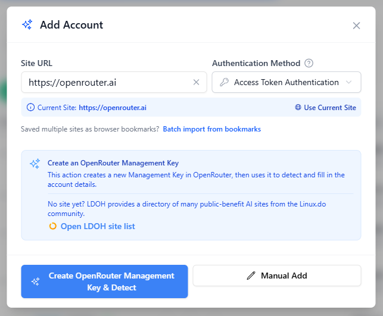
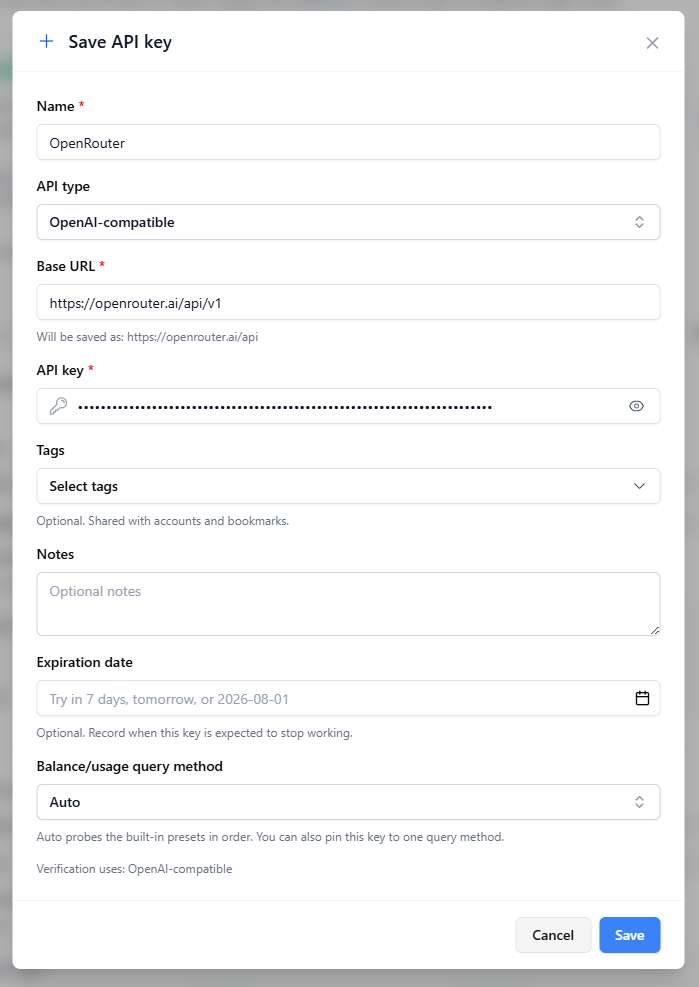
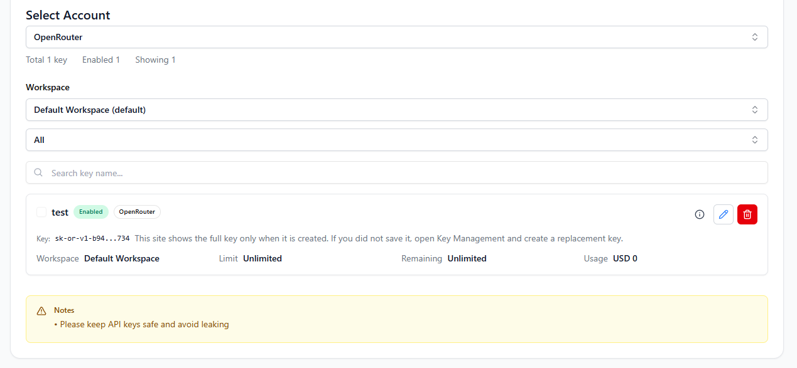
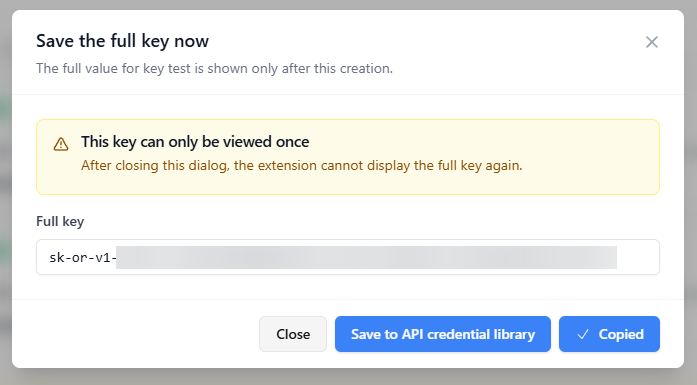
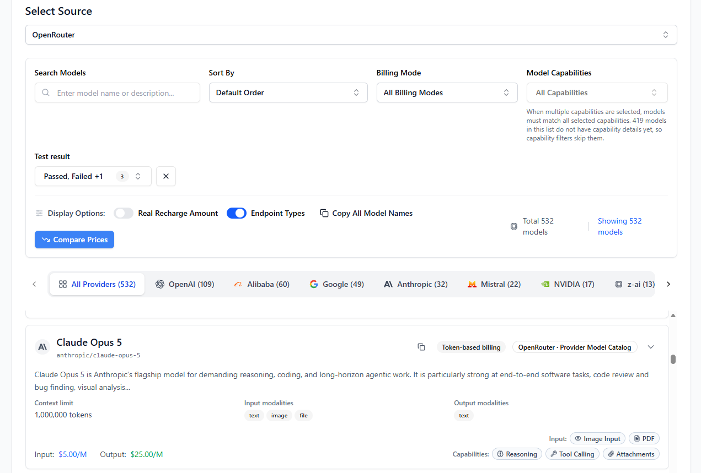

# OpenRouter 用户如何用 All API Hub 管理账号、API Key 和模型

> 把 OpenRouter 的余额、API Key、模型价格和客户端配置放到一个地方管理。

**All API Hub** 是一款面向 AI API 用户的开源浏览器扩展。配合 OpenRouter 使用后，你可以少开几个控制台，少找几次 API Key，也不用在不同工具中反复填写相同配置。

添加 OpenRouter 账号后，你可以查看余额和账号状态，按工作区管理 API Key，浏览模型与价格，并把新建的完整 API Key 保存到凭据库，继续用于常用 AI 工具。

## 为什么适合 OpenRouter 用户

使用多个 OpenRouter 工作区、多个 AI API 平台或多个客户端时，余额容易分散，API Key 不好整理，模型价格也难比较，同一份配置还要重复填写。

- **查看余额与状态**：把 OpenRouter 和其他 AI API 账号放在同一个看板中。
- **管理工作区 API Key**：集中查看、创建、修改、停用或删除 API Key。
- **比较模型与价格**：搜索 OpenRouter 模型，也可以和其他账号中的模型一起比较。
- **保存完整 API Key**：在新建 Key 仍然可见时存入 API 凭据库，避免之后无法找回。
- **快速配置常用工具**：导出到 Cherry Studio、CC Switch、Kilo Code、CLIProxyAPI、Claude Code Router 等工具，减少重复录入。

比较顺手的用法是：先自动添加 OpenRouter 账号，平时在 All API Hub 中看余额、管理 API Key 和比较模型；需要在 AI 工具中使用时，再从 API 凭据库复制或导出配置。

## 推荐使用方式

| 顺序 | 添加方式 | 适合的情况 |
| --- | --- | --- |
| 1 | 自动添加账号 | 已经登录 OpenRouter，希望快速完成添加 |
| 2 | 手动添加账号 | 自动添加无法完成 |
| 3 | 只保存 API Key | 不需要账号管理，只想保存、检查或导出已有的 API Key |

::: tip Management Key 和 API Key 有什么区别？
Management Key 用来添加账号和管理 OpenRouter 中的 API Key；API Key 则用于配置到 AI 客户端。使用自动添加时，All API Hub 会帮你创建 Management Key，通常不需要提前准备。
:::

## 开始前

1. 安装 All API Hub。推荐使用[浏览器商店版本](../get-started.md)。
2. 注册并登录 [OpenRouter](https://openrouter.ai/)。
3. 请勿在公开截图、问题反馈或聊天记录中显示 Management Key 或 API Key 的完整内容。

## 自动添加 OpenRouter 账号

这是推荐方式。开始前不需要自己创建 Management Key，All API Hub 会在添加过程中帮你完成。

1. 先在当前浏览器中登录 [OpenRouter](https://openrouter.ai/)。
2. 在 All API Hub 中点击 `添加账号`，输入 `https://openrouter.ai`。
3. 点击 `创建 OpenRouter 管理密钥并识别`。
4. All API Hub 会打开 OpenRouter 页面并自动完成 Management Key 的创建。请保持页面打开，等待账号信息自动带回。
5. 检查账号信息后保存。

::: warning 中途关闭页面后先检查
如果新打开的页面中途关闭、超时或没有返回结果，不要立即重试。请先打开 [Management Keys](https://openrouter.ai/settings/management-keys) 页面，看看是否已经出现 All API Hub 使用的 Management Key，再决定重试还是手动添加。
:::

## 自动添加失败时手动添加

1. 打开 OpenRouter 的 [Management Keys](https://openrouter.ai/settings/management-keys) 页面。
2. 创建用于 All API Hub 的 Management Key，并在完整内容仍可见时立即复制。离开页面后将无法再次查看完整内容。
3. 在 All API Hub 的添加账号窗口中输入 `https://openrouter.ai`，切换到手动添加。
4. 将站点类型选择为 `OpenRouter`，粘贴 Management Key，并填写窗口中其余必填信息。
5. 点击保存。如果 Management Key 无法使用，页面会提示你检查后重试。

## 不添加账号，只保存已有 API Key

如果不需要查看余额、工作区或管理 OpenRouter 中的 API Key，可以跳过账号添加，直接把已有 API Key 保存到 API 凭据库。

1. 打开 OpenRouter 的 [API Keys](https://openrouter.ai/settings/keys) 页面，新建 API Key 并立即复制；如果你已经安全保存过现有密钥，也可以直接使用。
2. 在 All API Hub 中进入 `设置 → API 凭据库`，点击添加凭据。
3. 填写以下信息：
   - **名称**：例如 `OpenRouter`。
   - **API 类型**：选择 `OpenAI 兼容`。
   - **Base URL**：填写 `https://openrouter.ai/api/v1`。
   - **API Key**：粘贴刚才准备的 API Key。
4. 保存后，可以查询可用模型、检查 API Key 是否可用、复制配置，或导出到支持的客户端。

这种方式不能查看账号余额、工作区，也不能管理 OpenRouter 中的密钥。如果之后需要这些功能，请按前面的步骤添加账号。

## 集中管理 OpenRouter API Key

添加账号后，进入 `设置 → 密钥管理`，选择 OpenRouter 账号和工作区。你可以：

- 查看每个 API Key 是否可用，以及限额、用量和到期时间。
- 创建 API Key，并按需要设置工作区、用量上限和到期时间。
- 修改、停用或重新启用 API Key。
- 永久删除不再使用的 API Key。

### 创建 API Key 后立即保存

OpenRouter 只会在新建后显示一次完整 API Key。创建成功时：

1. 不要先关闭显示完整 API Key 的窗口。
2. 点击复制，或选择保存到 API 凭据库。
3. 保存到凭据库后，再使用它查询模型、验证接口或导出到其他客户端。

关闭窗口后，All API Hub 无法重新找回完整内容。如果没有保存，只能删除该 API Key 并重新创建。

## 查看和比较 OpenRouter 模型

进入 `设置 → 模型列表`，选择 OpenRouter 账号，即可搜索模型，并查看模型名称、模型 ID、价格、上下文长度和支持的输入输出类型等信息。

选择 `全部账号` 时，也可以把 OpenRouter 模型和其他账号中的模型放在一起查看和比较。

如果把 OpenRouter API Key 保存在 API 凭据库中，也可以从凭据卡片查询可用模型，并检查 API Key 是否可用。

## 从管理到实际使用

### 导出到常用 AI 工具

如果需要在其他工具中使用 OpenRouter，可以把保存到 API 凭据库中的配置直接导出到支持的客户端，减少重复填写 Base URL、API Key 和模型信息。

### All API Hub 和 AI 客户端如何配合

| | All API Hub | Cherry Studio、NextChat 等 AI 客户端 |
| --- | --- | --- |
| 主要用途 | 管理账号、余额、API Key 和模型价格 | 聊天、代码辅助、文件分析等 |
| 使用方式 | 整理并导出 OpenRouter 配置 | 使用导入的配置连接 OpenRouter |

OpenRouter 提供模型和 API 服务；All API Hub 负责整理账号与配置；实际聊天、代码辅助和其他模型调用仍由你选择的客户端完成。

## 使用时注意

- 账号和 Key 默认保存在当前浏览器中。只有启用 WebDAV 同步后，才会同步到你配置的 WebDAV 存储。
- 建议为 All API Hub 单独创建 Management Key，不要与其他工具共用。
- 在密钥管理中修改或删除密钥，会同时修改 OpenRouter 中的数据。删除后无法恢复。
- 如果创建、修改或删除后没有看到明确结果，请先刷新列表确认，不要连续重复操作。
- 某些个人工作区无法选择成员。如果页面允许继续，可以不选择创建者。

## 常见问题

### 为什么提示 Management Key 不可用？

打开 OpenRouter 的 Management Keys 页面，确认该 Management Key 仍然存在。如果已经无法找到或复制完整内容，请重新创建，然后更新或重新添加账号。

### 为什么可以查看工作区，却不能管理其中的密钥？

当前账号可能没有管理该工作区的权限。请确认工作区是否选对，并检查 Management Key 的权限。

### 为什么无法选择工作区成员？

个人或默认工作区可能不提供成员列表。创建者不是必填项；如果页面允许继续，请保持不选择。

### 为什么已有 API Key 不能复制或导出？

OpenRouter 不会再次显示已经创建的完整密钥。只有在创建时复制或保存到 API 凭据库，之后才能继续复制、检查或导出。

### 保存 API Key 后，为什么账号管理中没有 OpenRouter？

API 凭据库只保存 `Base URL + API Key`，不会添加 OpenRouter 账号。要查看账号余额或管理 OpenRouter 中的密钥，请按本文前面的步骤添加账号。

## OpenRouter 相关页面

- [OpenRouter API Keys](https://openrouter.ai/settings/keys)
- [OpenRouter Management Keys](https://openrouter.ai/settings/management-keys)
- [Management Key 说明](https://openrouter.ai/docs/guides/overview/auth/management-api-keys)

## 相关文档

- [服务使用指南](../service-guides.md)
- [账号管理](../account-management.md)
- [API 凭据库](../api-credential-profiles.md)
- [密钥管理](../key-management.md)
- [模型列表与价格对比](../model-list.md)
- [数据隐私说明](../privacy.md)
