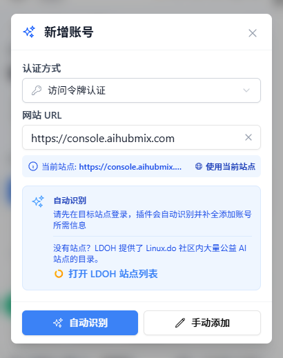
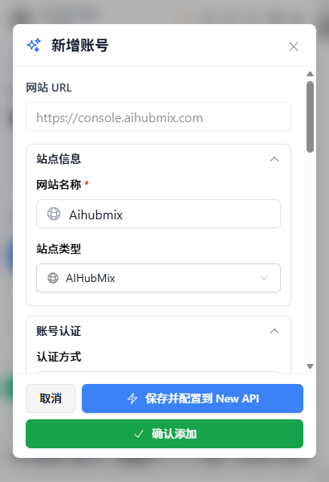
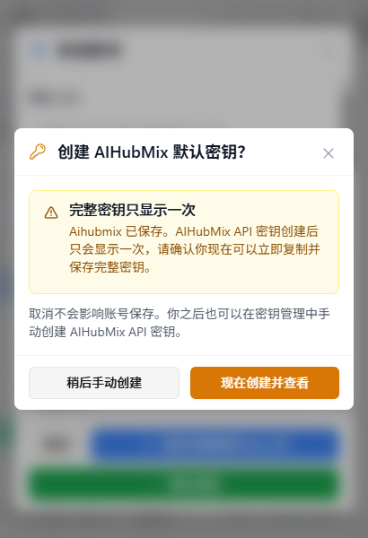
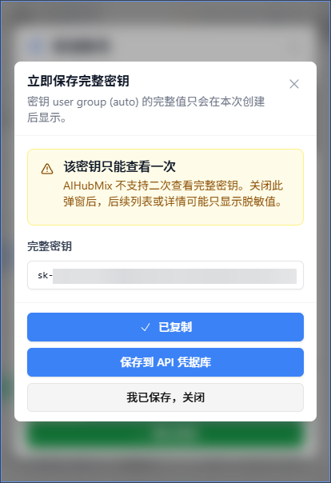
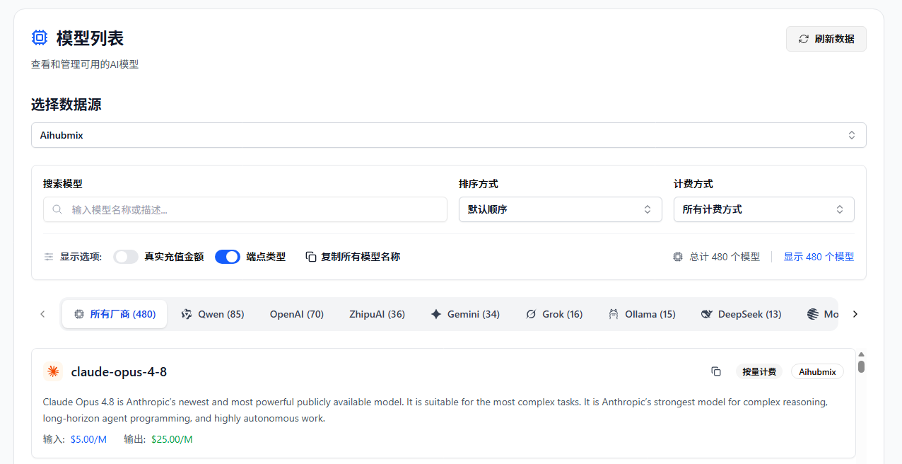
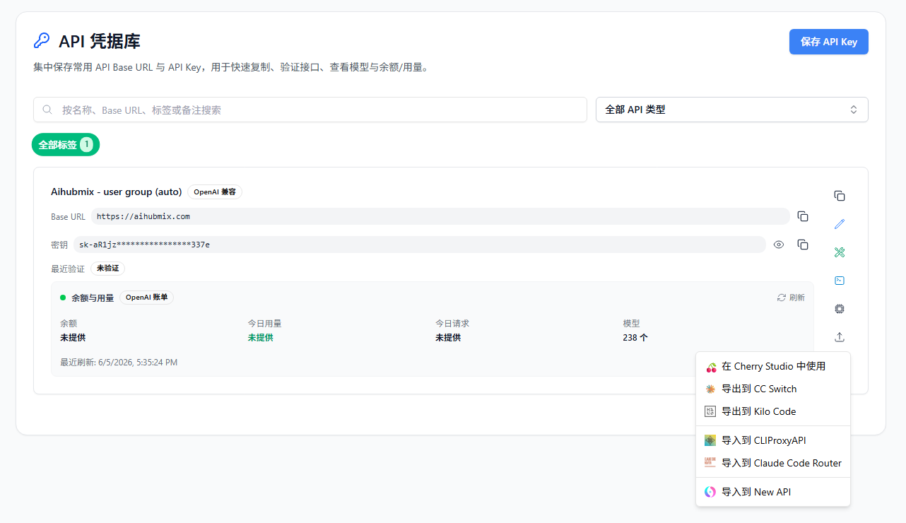

# AIHubMix 用户如何用 All API Hub 管理 API 密钥和模型价格

> All API Hub x AIHubMix 配置指南：管理 AIHubMix 账号余额、API 密钥与模型价格

**All API Hub** 是一款面向 AI API 用户的开源浏览器扩展，可用于管理 AIHubMix 账号余额、API 密钥、模型列表和价格信息。配合 AIHubMix 使用后，你可以在创建密钥时及时保存完整 Key，并将保存后的凭据继续导出到常用 AI 工具中，减少手动复制和重复配置。

---

## 一、All API Hub 是什么？

在同时使用多个 AI 模型或 API 平台时，开发者常面临“余额分散、密钥易丢、价格难查”的问题。**All API Hub**（[GitHub 开源](https://github.com/qixing-jk/all-api-hub)）提供了一个统一的管理入口，方便集中查看和整理这些信息。

对于 AIHubMix 用户，它主要提供以下价值：
*   **余额查看**：无需频繁打开控制台，即可在扩展面板内查看 AIHubMix 账户余额。
*   **密钥安全管家**：AIHubMix 的密钥为安全起见仅显示一次，All API Hub 能在创建时为你自动保存至“API 凭据库”。
*   **模型价格查询**：查看 AIHubMix 模型列表和输入、输出价格，便于在调用前做成本比较。
*   **快捷导出**：保存的密钥可继续导出至 Cherry Studio、CC Switch、Kilo Code、CLIProxyAPI、Claude Code Router 等工具。

如果你已经在多个 AI 工具中使用 AIHubMix，All API Hub 可以把“账号余额”“密钥保存”“模型价格”“下游工具配置”这些日常操作连起来：先把 AIHubMix 账号添加进扩展，再把新创建的密钥保存到凭据库，后续需要配置到其他客户端时直接从凭据库导出即可。

---

## 二、安装 All API Hub

为了获得自动更新和最稳定的体验，建议优先通过与你的浏览器匹配的官方商店安装：

### 1. 桌面端浏览器
*   **Chrome 浏览器**：[Chrome Web Store](https://chromewebstore.google.com/detail/lapnciffpekdengooeolaienkeoilfeo)
*   **Edge 浏览器**：[Microsoft Edge Add-ons](https://microsoftedge.microsoft.com/addons/detail/pcokpjaffghgipcgjhapgdpeddlhblaa)
*   **Firefox 浏览器**：[Firefox Add-ons](https://addons.mozilla.org/firefox/addon/{bc73541a-133d-4b50-b261-36ea20df0d24})

### 2. 其他环境
*   **QQ / 360 / Brave / Vivaldi / Opera 等浏览器**：Brave、Vivaldi、Opera 可优先尝试 Chrome Web Store；QQ、360、猎豹等浏览器如果找不到可用商店入口，再使用 Chromium 手动加载方式，详见 [其他浏览器安装指南](https://all-api-hub.qixing1217.top/other-browser-install.html)。
*   **Safari (Mac)**：需要通过 Xcode 或 Safari 专用包安装，详见 [Safari 安装指南](https://all-api-hub.qixing1217.top/safari-install.html)。
*   **手机端**：支持 Edge 手机版、Firefox Android、Kiwi 等，详见 [移动端使用指南](https://all-api-hub.qixing1217.top/faq.html#mobile-browser-support)。
*   **最后备选方案**：如果你的浏览器无法使用商店版或 Chrome Web Store 兼容版本，也无法通过上面的安装指南完成安装，可从 [GitHub Releases](https://github.com/qixing-jk/all-api-hub/releases/latest) 下载 Stable 包手动安装。手动安装版本不会像商店版一样自动更新，后续升级需要重新下载并安装。

---

## 三、配置 AIHubMix 账号

All API Hub 支持自动并添加 AIHubMix 账号，添加账号时不需要手动填写复杂配置。

### 为什么适合 AIHubMix 用户？

AIHubMix 支持的模型较多，用户在使用前经常需要确认模型名称、价格和是否适合当前工具；同时，AIHubMix 的 API Key 创建后只显示一次，如果没有及时保存，后续通常需要重新创建。

All API Hub 主要解决这两类日常问题：
*   添加账号后，集中查看余额和模型价格。
*   创建密钥后，及时保存完整 Key，后续可继续复制、验证或导出到其他工具。

### 3.1 自动识别并添加
1.  在浏览器中登录 [AIHubMix 控制台](https://console.aihubmix.com/?aff=W3DN)。
2.  点击浏览器右上角的 All API Hub 扩展图标。
3.  点击 **“添加账号”**，使用当前站点地址或手动填写 AIHubMix 地址。

    

4.  点击 **“自动识别”**，插件将识别到 `AIHubMix` 账号类型。
5.  确认账号信息后，点击 **“保存账号”**。

    

:::: tip 提示
添加成功后，扩展会使用已导入的账号令牌读取余额、密钥和模型价格等信息。
::::

### 3.2 保护“仅显示一次”的 API 密钥
由于 AIHubMix 的 API Key 在创建后不会再次显示完整内容，All API Hub 为此设计了专项保护流程：

1.  **保存账号后提示**：添加完账号后，插件会询问你是否立即创建默认密钥。

    

2.  **即刻保存**：点击“现在创建并查看”，插件将调用接口生成新密钥，并弹出完整密钥窗口。
3.  **存入凭据库**：点击 **“保存到 API 凭据库”**，该密钥会保存到浏览器本地，后续可继续复制、验证或导出到其他工具。

    

---

## 四、核心使用场景

### 4.1 查看余额与账号状态
在 All API Hub 的首页看板中，你可以看到 AIHubMix 的账户状态和余额。如果余额异常或账号刷新失败，插件会通过状态图标提示你检查账号。

### 4.2 查询模型价格
进入 **“模型价格”** 页面，选择你的 AIHubMix 账号作为数据源。你可以：
*   查看 AIHubMix 返回的模型列表。
*   查询每个模型的输入/输出价格（折合为每 1M tokens 的美金价格）。
*   搜索特定模型，确认是否适合当前使用场景。

### 4.3 导出到 AI 客户端
如果你需要将 AIHubMix 接入其他工具，无需手动复制 Key：
1.  在 **“API 凭据库”** 找到已保存的 AIHubMix 密钥。
2.  选择需要的导出入口。
3.  选择目标工具，例如 **Cherry Studio**、**CC Switch**、**Kilo Code**、**CLIProxyAPI**、**Claude Code Router**，或导入到当前已配置的自建托管站点渠道。

保存到 API 凭据库后，还可以继续完成这些操作：
*   复制 `Base URL + API Key`，手动填入其他工具。
*   验证接口是否可用，也可以测试 CLI 工具兼容性。
*   在模型列表中查看该凭据可使用的模型列表。
*   将同一份凭据导出到多个常用客户端，减少重复录入。
*   将凭据导入到已配置的自建托管站点，作为新的渠道配置使用。
*   随数据导入导出或 WebDAV 同步一起迁移，便于多设备使用。

---

## 五、All API Hub vs API 客户端

| 维度 | All API Hub (管理端) | Cherry Studio / NextChat 等 (调用端) |
| --- | --- |----------------------------------|
| **核心定位** | 账号、余额、密钥、价格管理 | 发起对话、模型推理、提示词工程                  |
| **主要功能** | 看板查看、密钥保存、价格查询 | 聊天对话、文件分析、Agent 工作流              |
| **协同关系** | **提供源头数据**：管理好 API 密钥和价格 | **消费数据**：使用由 All API Hub 管理的密钥   |

**建议用法**：使用 All API Hub 管理账号、密钥和价格信息；使用你常用的调用客户端发起请求。

---

## 六、常见问题 FAQ

**Q: All API Hub 会上传我的 API Key 吗？**
A: 默认情况下，账号和密钥信息保存在你的浏览器本地。只有当你主动开启 WebDAV 同步时，数据才会同步到你配置的 WebDAV 存储中。

**Q: 为什么我添加账号后看不到某些模型？**
A: All API Hub 会根据 AIHubMix 接口返回的数据展示模型。如果暂时无法确认账号实际可用范围，插件可能会回退显示完整模型目录，并提示部分模型可能无法通过当前账号调用。

**Q: 我已经在 AIHubMix 创建过 Key 了，能找回吗？**
A: AIHubMix 的完整密钥默认只在创建时显示一次。如果创建时没有保存到 API 凭据库，All API Hub 无法在事后恢复这个 Key。建议你在 AIHubMix 重新创建一个 Key，并在完整密钥仍然可见时立即保存到凭据库。

**Q: All API Hub 可以替代 AIHubMix 控制台吗？**
A: 不能完全替代。充值、账号设置、官方密钥创建等操作仍以 AIHubMix 控制台为准。All API Hub 更适合做日常查看、保存密钥和导出配置。

---

## 结语

All API Hub 为 AIHubMix 用户提供了一个更集中的账号与密钥管理入口。通过它，你可以更方便地查看余额、保存密钥、比较模型价格，并把已保存的凭据继续用于其他 AI 工具。

*   [AIHubMix 官网](https://aihubmix.com/?aff=W3DN)
*   [All API Hub GitHub 仓库](https://github.com/qixing-jk/all-api-hub)
*   [All API Hub 文档](https://all-api-hub.qixing1217.top)
