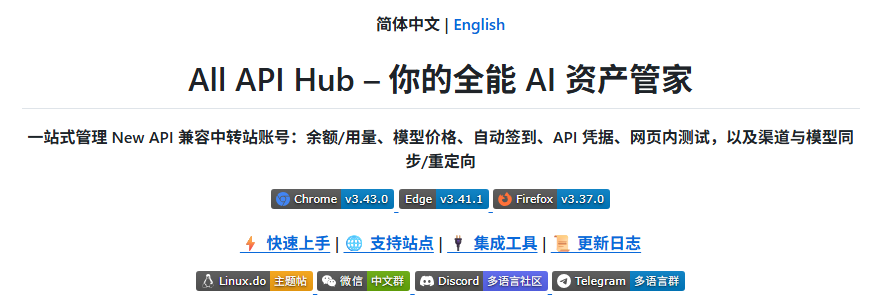
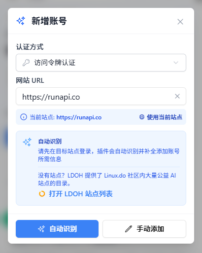
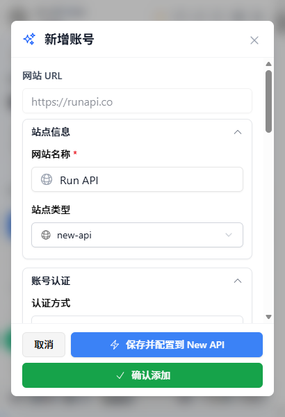
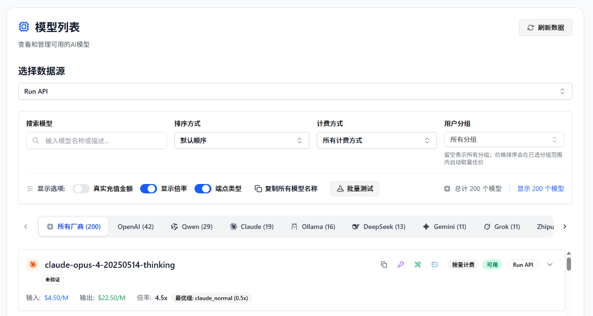
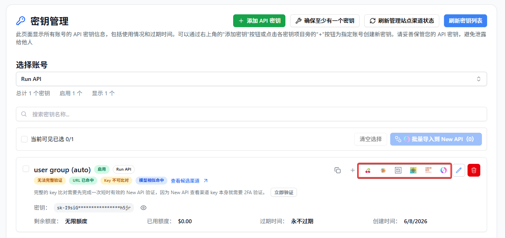

# RunAPI 用户如何用 All API Hub 统一管理 AI API 资产

> 在 All API Hub 中管理 RunAPI 账号：统一看余额、对比价格、管理密钥，并快速配置到常用 AI 工具

RunAPI 提供了丰富的 AI 模型和稳定的 API 调用入口。如果你同时使用多个 RunAPI 账号、多个 AI API 平台，或经常把 RunAPI 配置到不同客户端里，**All API Hub** 可以作为一个本地管理助手，帮你把这些信息放到同一个入口里查看和复用。

添加 RunAPI 账号后，你可以在 All API Hub 中查看余额、管理 API 密钥、查询模型价格，并快速导出到 Cherry Studio、CC Switch、Kilo Code、CLIProxyAPI、Claude Code Router 或自己的自建后台。这样，RunAPI 可以自然接入你的多账号、多工具 API 使用流程。

---

## 一、All API Hub 是什么？

**All API Hub**（[GitHub 开源](https://github.com/qixing-jk/all-api-hub)）是一款面向 AI API 用户的开源浏览器扩展，适合用来集中管理多个账号、多个站点和多个客户端配置。对 RunAPI 用户来说，它可以把 RunAPI 的账号信息、API 密钥、模型价格和导出配置纳入统一工作流。

配合 RunAPI 使用时，核心优势在于：

*   **多账号统一看板**：把 RunAPI 与其他 AI API 账号放在同一页，集中查看余额、状态和刷新结果。
*   **跨账号价格对比**：在模型价格页查看 RunAPI 模型价格，并与其他已添加账号的数据一起比较。
*   **API 密钥集中管理**：在密钥管理中查看、创建、编辑、删除和复制 RunAPI API Key。
*   **凭据快速复用**：把已管理的 `Base URL + API Key` 导出到常用客户端、CLI 工具或自建站点渠道。
*   **多设备更好衔接**：配合数据导入导出或 WebDAV 同步，把常用配置迁移到其他设备继续使用。

一句话：RunAPI 提供模型和接口，All API Hub 帮你把多账号管理、价格对比和下游工具配置串起来。

---

## 二、安装 All API Hub

为了获得自动更新和最稳定的体验，建议优先通过与你的浏览器匹配的官方商店安装：

### 1. 桌面端浏览器
*   **Chrome 浏览器**：[Chrome Web Store](https://chromewebstore.google.com/detail/lapnciffpekdengooeolaienkeoilfeo)
*   **Edge 浏览器**：[Microsoft Edge Add-ons](https://microsoftedge.microsoft.com/addons/detail/pcokpjaffghgipcgjhapgdpeddlhblaa)
*   **Firefox 浏览器**：[Firefox Add-ons](https://addons.mozilla.org/firefox/addon/{bc73541a-133d-4b50-b261-36ea20df0d24})

### 2. 其他环境
*   **QQ / 360 等浏览器**：支持 QQ 浏览器、360 浏览器、猎豹浏览器、Brave、Vivaldi、Opera 等 Chromium 内核浏览器手动加载，详见 [QQ / 360 等浏览器安装指南](https://all-api-hub.qixing1217.top/other-browser-install.html)。
*   **Safari (Mac)**：需要通过 Xcode 或 Safari 专用包安装，详见 [Safari 安装指南](https://all-api-hub.qixing1217.top/safari-install.html)。
*   **手机端**：支持 Edge 手机版、Firefox Android、Kiwi 等，详见 [移动端使用指南](https://all-api-hub.qixing1217.top/faq.html#mobile-browser-support)。
*   **最后备选方案**：如果你的浏览器无法使用商店版，也无法通过上面的安装指南完成安装，可从 [GitHub Releases](https://github.com/qixing-jk/all-api-hub/releases/latest) 下载 Stable 包手动安装。手动安装版本不会像商店版一样自动更新，后续升级需要重新下载并安装。

---

## 三、添加 RunAPI 账号

All API Hub 支持自动识别 RunAPI 账号。你只需要先在浏览器里登录 RunAPI，再让插件读取当前站点并保存账号。

### 为什么适合 RunAPI 用户？

RunAPI 适合接入多种模型和客户端。加入 All API Hub 后，你可以把 RunAPI 放进统一的 AI API 管理流程：

*   与其他账号一起查看余额、状态和模型价格。
*   在模型价格页对比不同账号下的模型成本。
*   在插件中直接管理 RunAPI API 密钥，包括创建、编辑、删除和复制。
*   将 RunAPI 密钥继续导出到 AI 客户端，或导入到你自己的自建站点渠道中。

对于已经在多个 AI 工具中使用 RunAPI 的用户，这相当于把“账号状态、模型价格、API Key、客户端配置”整理成一条更顺的使用链路。

### 3.1 自动识别并添加
1.  在浏览器中登录 [RunAPI](https://runapi.co/register?aff=cvDm)。
2.  点击浏览器右上角的 All API Hub 扩展图标。
3.  点击 **“添加账号”**，使用当前站点地址或手动填写 RunAPI 地址。

    

4.  点击 **“自动识别”**。
5.  确认账号信息后，点击 **“保存账号”**。

    

:::: tip 提示
添加成功后，扩展会使用已导入的账号令牌读取余额、API 密钥和模型价格等信息。
::::

### 3.2 管理 RunAPI API 密钥
账号添加成功后，你可以进入 **“密钥管理”** 页面，集中管理 RunAPI API 密钥：

*   查看当前账号下已有的 API 密钥。
*   创建新密钥，或编辑、删除已有密钥。
*   复制常用密钥，或将它保存到 **“API 凭据库”** 方便后续复用。
*   需要配置到其他工具时，直接从密钥列表或 API 凭据库发起导出。

如果你的目标只是日常查看和整理 RunAPI 密钥，使用 **“密钥管理”** 就足够；当你要把同一份密钥继续配置到其他客户端、CLI 工具或自建后台时，再使用导出能力。

---

## 四、RunAPI 用户常用场景

### 4.1 查看余额与账号状态
在 All API Hub 的首页看板中，你可以把 RunAPI 与其他 AI API 账号放在一起查看。余额、账号状态和刷新结果集中展示，适合多账号用户快速了解当前可用情况。

### 4.2 对比模型价格
进入 **“模型价格”** 页面，选择 RunAPI 账号作为数据源。你可以：

*   查看 RunAPI 返回的模型列表。
*   搜索指定模型，测试模型是否可用。
*   查看每个模型的输入/输出价格。
*   与其他已添加账号的模型价格一起比较，选择更适合当前任务的调用方案。

### 4.3 导出到 AI 客户端
如果你需要将 RunAPI 接入其他工具，可以直接从 All API Hub 导出：

1.  在 **“密钥管理”** 中找到你的 RunAPI 密钥。
2.  选择需要的导出入口。
3.  选择目标工具，例如 **Cherry Studio**、**CC Switch**、**Kilo Code**、**CLIProxyAPI**、**Claude Code Router**，或导入到当前已配置的自建托管站点渠道。

此外还支持以下功能：

*   复制 `Base URL + API Key`，手动填入其他工具。
*   验证接口是否可用，也可以测试 CLI 工具兼容性。
*   在模型列表中查看该凭据可使用的模型列表。
*   将同一份凭据导出到多个常用客户端，减少重复录入。
*   将凭据导入到已配置的自建托管站点，作为新的渠道配置使用。
*   随数据导入导出或 WebDAV 同步一起迁移，便于多设备使用。

### 4.4 导入到自建站点渠道
如果你自己有 AI 分发后台，可以把 RunAPI 作为其中一个上游供应商。All API Hub 可以把 RunAPI 密钥作为上游渠道直接导入进去，减少手动创建渠道、填写地址和复制 Key 的步骤。

使用时只需要先在 **“基础设置” → “自建站点管理”** 完成后台配置，然后回到 **“密钥管理”**，在 RunAPI 密钥管理中选择导入到当前自建站点；如果要一次处理多个密钥，也可以先勾选后批量导入。

### 4.5 多设备迁移和备份
如果你经常在多台电脑之间切换，可以使用 All API Hub 的数据导入导出或 WebDAV 同步能力迁移配置。默认情况下，数据保存在当前浏览器本地；只有你主动配置 WebDAV 同步时，才会同步到你指定的 WebDAV 存储。

---

## 五、All API Hub vs API 客户端

| 维度 | All API Hub (管理端) | Cherry Studio / NextChat 等 (调用端) |
| --- | --- |----------------------------------|
| **核心定位** | 统一管理 RunAPI 与其他 AI API 账号、余额、密钥、价格和渠道 | 发起对话、模型推理、提示词工程 |
| **主要功能** | 多账号看板、密钥管理、价格对比、凭据导出、渠道导入 | 聊天对话、文件分析、Agent 工作流 |
| **协同关系** | **整理源头配置**：让 Key、Base URL、价格和账号状态集中可用 | **使用这些配置**：拿管理好的凭据去调用模型 |

**建议用法**：用 All API Hub 管理 RunAPI 账号、密钥、模型价格和导出配置；用你常用的客户端实际发起请求。一个负责管配置，一个负责用模型。

---

## 六、常见问题 FAQ

**Q: All API Hub 会上传我的 API Key 吗？**

A: 默认情况下，账号和密钥信息保存在你的浏览器本地。只有当你主动开启 WebDAV 同步时，数据才会同步到你配置的 WebDAV 存储中。

**Q: All API Hub 最适合哪些 RunAPI 用户？**

A: 如果你有多个 RunAPI 账号、同时使用其他 AI API 平台，或经常把 RunAPI 配置到多个客户端和设备里，All API Hub 可以把这些账号与凭据集中起来管理。即使只从 RunAPI 开始使用，也可以先用它查看余额、管理密钥和对比模型价格。

**Q: 没有自建后台，也能使用 All API Hub 吗？**

A: 可以。添加 RunAPI 账号后，就可以使用余额查看、密钥管理、模型价格对比和客户端导出；自建站点管理适合已经维护 AI 分发后台的用户继续扩展使用。

**Q: 导出到客户端后，客户端还能正常独立使用吗？**

A: 可以。All API Hub 只是帮你生成或填入配置；真正的模型调用仍由 Cherry Studio、CC Switch、Kilo Code、CLIProxyAPI、Claude Code Router 等目标工具完成。

**Q: All API Hub 和 RunAPI 控制台是什么关系？**

A: 两者是配合关系。RunAPI 控制台负责账号、充值和官方服务；All API Hub 更适合把 RunAPI 的账号状态、API Key、模型价格和客户端配置纳入你的日常管理流程。

---

## 结语

RunAPI 提供丰富的模型与 API 调用入口，All API Hub 则让这些账号、密钥、价格和客户端配置更容易统一管理。

安装插件并添加 RunAPI 账号后，你可以先从三个最常用的动作开始：查看余额、对比模型价格、管理密钥与导出到常用客户端。后续如果你需要接入自建后台、多设备同步或批量管理，再逐步启用更完整的管理能力。

*   [RunAPI 官网](https://runapi.co/register?aff=cvDm)
*   [All API Hub GitHub 仓库](https://github.com/qixing-jk/all-api-hub)
*   [All API Hub 文档](https://all-api-hub.qixing1217.top)
