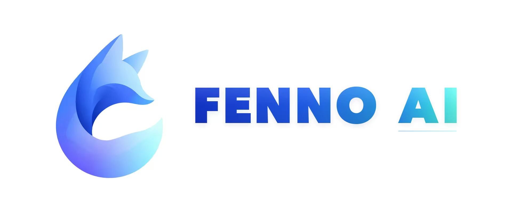
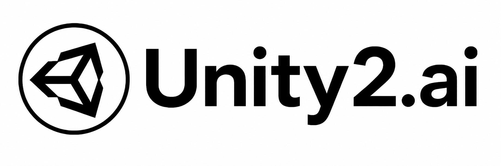

# 支持的站点列表

> All API Hub 主要支持两类对象：一类是你日常登录和使用的中转站 / 管理面板，另一类是你自己搭建、希望在插件里继续管理的后台系统。

## 日常可添加和管理的站点

下面这些是用户最常见、也最适合通过 All API Hub 统一管理的站点类型。

| 站点 / 系统 | 官方描述 | 官方链接 |
|-------------|----------|----------|
| one-api | LLM API 管理与分发系统，支持 OpenAI、Azure、Anthropic Claude、Google Gemini、DeepSeek 等主流模型，统一 API 适配，可用于 Key 管理与二次分发。 | [GitHub](https://github.com/songquanpeng/one-api) |
| New API | 统一的 AI 模型聚合与分发中心。 | [官网](https://www.newapi.ai/) / [GitHub](https://github.com/QuantumNous/new-api) |
| Sub2API | Sub2API-CRS2 一站式开源中转服务，让 Claude、Openai、Gemini、Antigravity 订阅统一接入，支持拼车共享，更高效分摊成本，原生工具无缝使用。 | [GitHub](https://github.com/Wei-Shaw/sub2api) |
| one-hub | OpenAI 接口管理与分发系统，改自 songquanpeng/one-api，支持更多模型，加入统计页面，并完善非 OpenAI 模型的函数调用。 | [官网](https://one-hub.xiao5.info/) / [GitHub](https://github.com/MartialBE/one-hub) |
| done-hub | 本项目是基于 one-hub 二次开发而来的。 | [GitHub](https://github.com/deanxv/done-hub) |
| AnyRouter | Claude Code 中转站 · 零门槛 · 免费 $50 | [文档](https://docs.anyrouter.top/) / [官网](https://anyrouter.top) |
| WONG公益站 | 暂无稳定公开官方描述。 | 暂无稳定公开官方链接 |
| AIHubMix | 独立 AI API 聚合站点，插件以独立账号类型适配余额、密钥和模型接口。 | [官网](https://aihubmix.com/?aff=W3DN) / [API 文档](https://docs.aihubmix.com/cn/api/Cli) / [使用教程](./sponsor-guides/aihubmix.md) |
| Veloera | 本项目已停止维护。 | [GitHub](https://github.com/Veloera/Veloera) |
| VoAPI | 仅支持老版本兼容部署；新版 VoAPI 的接口和行为与当前插件兼容范围不一致。 | [GitHub](https://github.com/VoAPI/VoAPI) |
| Super-API | Super-Api 全新 AI 模型接口管理与分发系统，仅供个人学习使用，请勿用于任何商业用途，本项目基于 NewAPI 开发。 | [官网](https://api.cngov.top/) / [GitHub](https://github.com/SuperAI-Api/Super-API) |
| v-api | 基于 one-api 二开的功能强大的中转平台。 | 暂无 |

## ❤️ 推荐赞助站点

如果你正在寻找稳定、高效且兼容性良好的 AI 中转服务，可以尝试我们的合作伙伴：

  <section class="sponsor-item sponsor-item-featured">
    
    

      <strong>火山引擎方舟 Coding-Plan</strong> 字节跳动旗下开发者生产力计划，Lite 套餐 <strong>9.9 元/月</strong>起，支持豆包、DeepSeek、GLM 等主流模型，适配 Cursor、Claude Code、Windsurf 等 IDE 工具。通过<a href="https://dis.chatdesks.cn/chatdesk/hsyqallapihub.html">活动链接</a>加入，可享受好友邀请返利及首单优惠。
    

  </section>

  

  <section class="sponsor-item">
    
    

      <strong>七牛云AI</strong> 七牛云（02567.HK）旗下企业级大模型 MaaS 平台，一站式调用全球 150+ 主流模型，兼容全球主流模型厂商协议，覆盖文本、图像、音频、视频、文件处理等全模态处理能力。企业用户可通过<a href="https://s.qiniu.com/qE3eai">此链接</a>免费领取 <strong>1200 万 Token</strong>，邀请好友最高可得百亿 Token。
    

  </section>

  

  <section class="sponsor-item">
    
    

      <strong>Fenno.ai</strong> 稳定、高效的 API 中转服务商，主要提供 Codex 中转服务，兼容 OpenAI 及 Anthropic 协议，可接入 Codex、Claude Code、OpenCode 等主流编程工具。通过<a href="https://api.fenno.ai/register?redirect=/purchase?tab=subscription%26group=16&aff=VS3FMCGW4XK4">此链接</a>可订阅 <strong>9.9 元 / 150 刀额度</strong>的 Coding Plan，邀请好友最高可享 20% 奖励。
    

  </section>

  

  <section class="sponsor-item">
    
    

      <strong>PackyCode</strong> 提供 Claude Code、Codex、Gemini 等多种中转服务。使用<a href="https://www.packyapi.com/register?aff=all-api-hub">此链接</a>注册并在充值时填写 "all-api-hub" 优惠码，首次充值可享 <strong>9 折优惠</strong>（<a href="./sponsor-guides/packycode.md">使用教程</a>）。
    

  </section>

  

  <section class="sponsor-item">
    
    

      <strong>星辰AI</strong> 稳定、高效的 API 中转服务商，提供 Claude Code、Codex、Gemini 等多种中转服务。充值比例 1:1，可开发票；Claude 低至 4 折。欢迎通过<a href="https://ai.centos.hk">此链接</a>了解和使用（<a href="./sponsor-guides/xingchen.md">使用教程</a>）。
    

  </section>

  

  <section class="sponsor-item">
    
    

      <strong>Atlas Cloud</strong> 全模态 AI 推理平台，一个 AI API 即可访问视频生成、图像生成和 LLM API，覆盖 300+ 精选模型。新推出的 Coding Plan 优惠适合需要更高性价比 API 访问的开发者，欢迎通过<a href="https://www.atlascloud.ai/console/coding-plan?utm_source=github&utm_medium=link&utm_campaign=all-api-hub">此链接</a>了解。
    

  </section>

  

  <section class="sponsor-item">
    
    

      <strong>AICodeMirror</strong> 提供 Claude Code / Codex / Gemini CLI 官方高稳定中转服务，支持企业级高并发、极速开票、7×24 专属技术支持。Claude Code / Codex / Gemini 官方渠道低至 3.8 / 0.2 / 0.9 折，充值更有折上折。通过<a href="https://www.aicodemirror.com/register?invitecode=7IQNR8">此链接</a>注册，可享受首充 <strong>8 折优惠</strong>，企业客户最高可享 7.5 折。
    

  </section>

  

  <section class="sponsor-item">
    
    

      <strong>RunAPI</strong> 高效稳定的 API OpenRouter 平替平台，一个 API Key 可访问 OpenAI、Claude、Gemini、DeepSeek、Grok 等 150+ 主流模型，低至 1 折，兼容 Claude Code、OpenClaw 等工具。使用<a href="https://runapi.co/register?aff=cvDm">此链接</a>注册并联系 RunAPI 管理员，即可领取 <strong>￥7 免费额度</strong>（<a href="./sponsor-guides/runapi.md">使用教程</a>）。
    

  </section>

  

  <section class="sponsor-item">
    
    

      <strong>Unity2.ai</strong> 面向个人开发者、团队和企业提供高性能 AI 模型 API 中转服务，日均承载超 300 亿 token 调用，支持 5000 RPM 级高并发、余额计费、首充赠额、组合订阅、企业开票和专属对接。通过<a href="https://unity2.ai/register?ref=9NjKJ86j&source=allapihub">此链接</a>注册可领取 <strong>$2 余额</strong>，加入官方群再送 $10，最高可领 $12 免费额度。
    

  </section>

  

  <section class="sponsor-item">
    
    

      <strong>随想AI中转站</strong> 可靠高效的 API 中继服务提供商，提供 Claude、Codex、Gemini 等中继服务，支持 1:1 按量充值、每日签到测试额度、多线路冗余、跨区域容灾和自动故障切换。欢迎通过<a href="https://sui-xiang.com/">此链接</a>了解和使用。
    

  </section>

  

## 已兼容但公开资料较少的变体

以下兼容类型目前也在插件支持范围内，但公开官方资料相对有限，通常见于私有部署、闭源分支或特定站点品牌化版本：

- `Neo-API`
- `RIX_API`

这类系统如果没有稳定公开主页，这里就不额外给出链接；是否可用通常取决于目标站点是不是常见兼容版本。

## 你可以接入并继续管理的自建后台

如果你自己也在搭建后台系统，All API Hub 还支持把当前站点导入到你选中的后台里，便于继续做后续管理。

| 后台系统 | 官方描述 | 官方链接 |
|----------|----------|----------|
| New API | 统一的 AI 模型聚合与分发中心。 | [官网](https://www.newapi.ai/) / [GitHub](https://github.com/QuantumNous/new-api) |
| DoneHub | 本项目是基于 one-hub 二次开发而来的。 | [GitHub](https://github.com/deanxv/done-hub) |
| Veloera | 本项目已停止维护。 | [GitHub](https://github.com/Veloera/Veloera) |
| Octopus | 面向个人的 LLM API 聚合服务。 | [GitHub](https://github.com/bestruirui/octopus) |
| AxonHub | 开源 AI Gateway，可通过任意 SDK 调用 100+ LLM，内置故障切换、负载均衡、成本控制与全链路追踪。 | [官网](https://axonhub.onrender.com/) / [GitHub](https://github.com/looplj/axonhub) |
| Claude Code Hub | 面向团队的多供应商 AI API 代理与运营平台，统一接入 Claude、OpenAI Compatible、Codex 与 Gemini，并支持弹性调度、监控与价格管理。 | [GitHub](https://github.com/ding113/claude-code-hub) |

## 相关文档

- [支持的导出工具列表](./supported-export-tools.md)
- [赞助商使用教程](./sponsor-guides.md)
- [快速导出站点配置](./quick-export.md)
- [自建站点管理](./self-hosted-site-management.md)
- [自建站点模型同步](./managed-site-model-sync.md)
